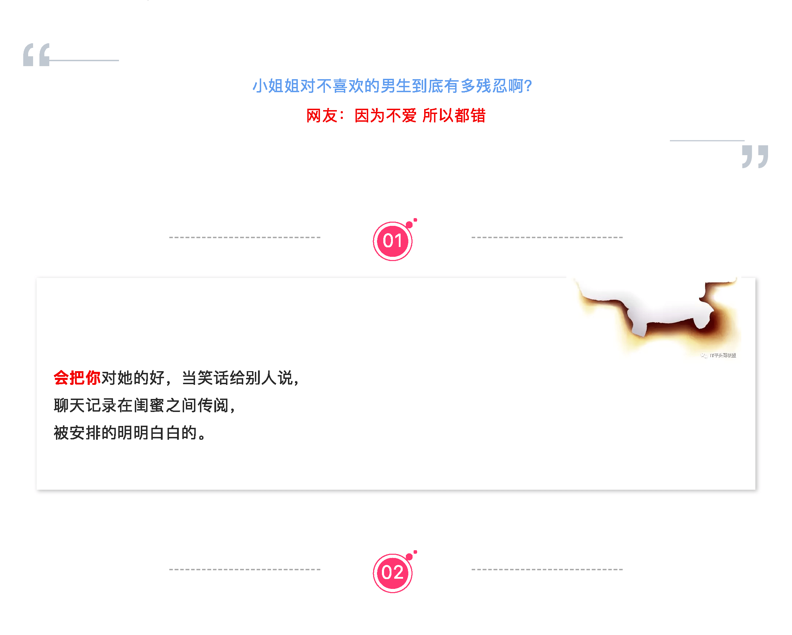
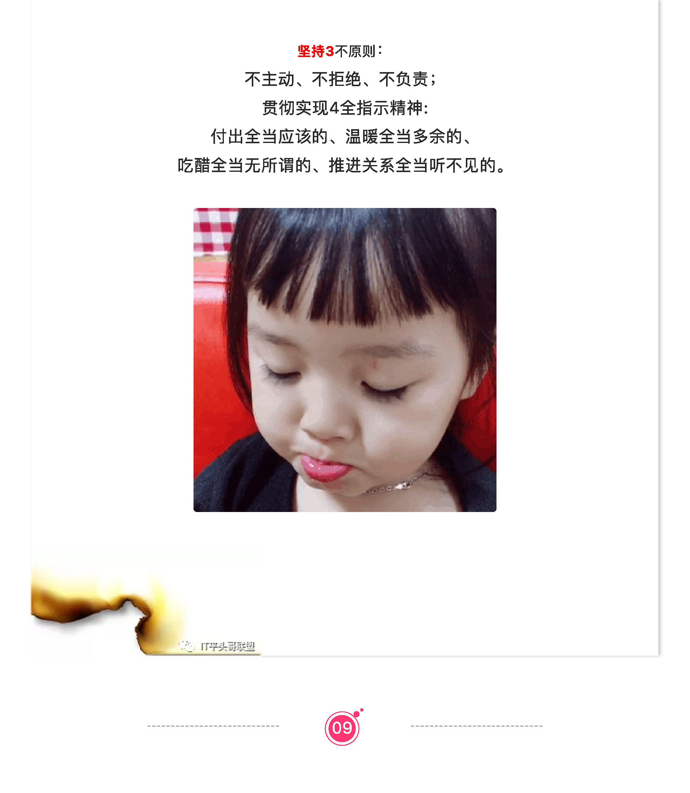

## 小姐姐对不喜欢的男生到底有多残忍？

又到周五，轻松一刻时间， 
读本本文约预计需要3.6分钟， 
如果戳到你的痛点，时间未知～

### 女生对不喜欢的男生到底有多残忍？
#### 网友：因为不爱 所以都错

#### 网友说：
记得自己有点儿明白事理的时候，妈妈说过：“这个世界不是有人有义务对你好，所以长大了如果有男孩喜欢你而你没办法回馈他时，你至少应该感谢他对你平白无故的喜爱，坚定并以保护好自己的提前去拒绝他，不要恶语相向，若干年后想起你或许还能是个美好回忆”。

~~

**以上为本周五 `IT平头哥联盟` 为你带来的轻松一刻，今天不求你笑、但求别哭～，**  
如果你喜欢的话，欢迎点赞、关注（**IT平头哥联盟**）， 
分享给你的好友们就更棒了，谢谢支持～

### 其他
+ [vue/react/java/面试等学习资源共享 ](https://www.susouth.com/other/2018/12/05/shared/ "苏南的专栏")
+ [团队解散，我们该何去何从？](https://www.susouth.com/other/2018/11/28/layoffs/ "苏南的专栏")
+ [月入三万 还能少了你一个鸡蛋](https://www.susouth.com/other/2018/12/08/egg/ "苏南的专栏")
+ [如何给localStorage设置一个有效期？](https://www.susouth.com/js/2018/11/06/local-storage/ "苏南的专栏")
+ [Eruda 一个可能被人遗忘的调试神器](https://www.susouth.com/js/2018/12/16/eruda-debug/ "苏南的专栏")

> 作者：[苏南 - 首席填坑官](http://susouth.com/ "@IT·平头哥联盟-首席填坑官")
>
> 链接：http://susouth.com/
> 
> 交流：912594095、公众号：`honeyBadger8`
>
> 本文原创，著作权归作者所有。商业转载请联系`@IT·平头哥联盟`获得授权，非商业转载请注明原链接及出处。 