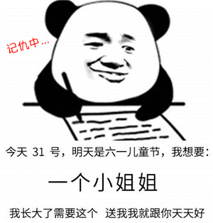
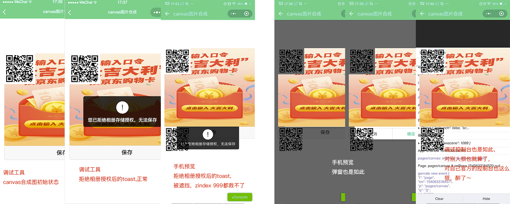
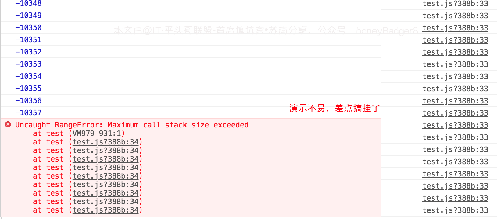
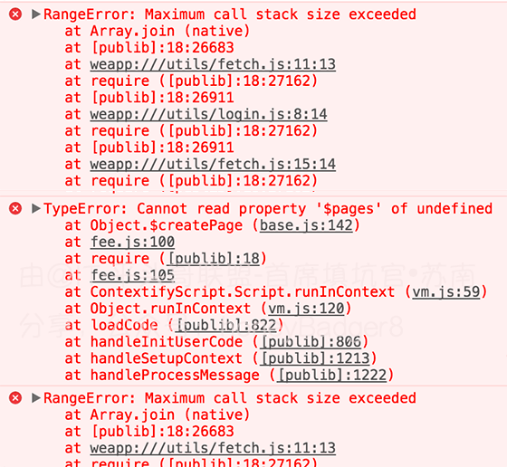
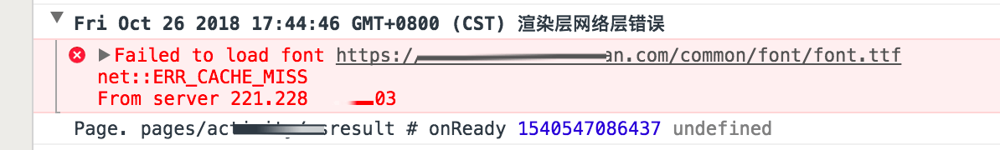

# 做不完小程序项目可能要走人了～填坑小记


> 作者：[首席填坑官∙苏南](https://github.com/meibin08/ "首席填坑官∙苏南")<br/>
> 交流群：912594095[`资源获取/交流群`]、公众号：`honeyBadger8`，本文原创，著作权归作者所有，转载请注明原链接及出处。

## 简诉

　　是的，真的，你没有看错，我就是上次那个加薪的，但是现在问题来了，最近又搞了个小程序的需求，又填了不少坑，其中的辛酸就不说了，说多了都是泪🤪😭，此处省略三千字 ………^……，说重点吧，反正最后就是差点这让老板叫走人了，你说优秀不优秀～。


　　前段时间网上一直说的“<u>[你可以骂那些中年人，尤其是有车有房的……](https://blog.csdn.net/weixin_43254766/article/details/82811714)</u>”，虽然我没有房、也没有车，但也坚决不做那个可以随便骂的中年人（人到中年不如狗？？），不存在的啦，这个仇宝宝已经记下了🤫，先分享一下最近遇到的几个坑吧。 —— 我是`首席填坑官`——[苏南](https://honeybadger8.github.io/blog/ "首席填坑官∙苏南")，早上好，新的一周加油。




## 填坑一，canvas遮挡问题：
+ 随着小程序的API调整，很多东西都要用户`手动授权`，不能直接调用后，toast、弹窗这种提示的场景越来越多了，
+ 下图就是公司活动的canvas合成，现在微信API不让直接调用授权了，某些场景要多一个弹窗来提示用户开启设置，但当遇上`canvas` API这个大佬后,一切都变了，谁都只能站在它后面，
+ **场景一** ：如之前拒绝授权了，后续引导用户打开设置页，即 `wx.openSetting`,下图就是：



> 坑一 **小结** ：当遇上这种情况，我的第一思路是 设置样式：`visibility: hidden;opacity:0;`，但是结果是让人失望的，`canvas` 大佬就是大佬，这两属性在手机上失效了,该显示还是显示，你阻挡不了它的光辉，真的，不信可以去测试！
> 
###### 解决思路：
> + canvas 图片合成，获取到图片的地址后，隐藏canvas,改用image标签显示，这种场景有局限性，如果你的需求是`echart`交互的,显示挂了；
> + cover-view 貌似也是有局限，`<cover-view /> 内只能嵌套 <cover-view /> 和 <cover-image />，view 标签的子节点树在真机上都会被忽略`，这是我测试后的浏览器给出的警告，如果自定modal，要加button按钮让用户点击后授权某功能，肯定也就挂了 ；
> + 当弹窗出现的时候，隐藏canvas，这种比较暴力，但覆盖面广，任何场景都能照顾到，却也影响体验；
> + 把`canvas`定位移动到屏幕之外绘制内容；
> + 有同学可能说直接使用原生的 `wx.showModal`,但官方目前，button还不支持设置`open-type`属性；
> + 等**微信小程序**官方修复😫，好吧，看到这里你肯定笑了～，这不是一个方法，估计还没等到老板真叫你走人了，欢迎大佬们补充！！！


## 填坑二，Maximum call stack size exceeded

+ 发现这个bug，要从最近换了个手机说起，用了3年的5S终于歇菜了(再也买不起iphone了～)，换了个android vivo x23, 以为从此走上人生巅峰了，现实却给了我一个响亮的耳光，又是一个记忆深刻的梗～，被组里的同事笑话好久！！
+ 话说，堆栈溢出，是怎么造成的呢？—— `循环引用`；
+ 同时我又有些疑惑了，为什么其他手机都正常，就vivo 报了这个错，同样的代码，希望有大神看到能给于解惑！
+ **先来看个示例,简单演示一下** ：

``` js
let sum = 20;
	(function test(){
		sum--;
		console.log(sum);
		test();
		/*
		if( sum > 0 ){
			test();
		}*/
	})()
```



+ ** # 而项目中的报错是这样的 # **：

```js

	//fetch.js
	import wepy from 'wepy'
	import _login_ from './login';
	……省略N行

	//login.js
	import {fetch} from "./fetch.js";
	import Storage from "./storage.js";
	……省略N行

	//更改后 login.js ,避免了循环引用
	loginFn = ()=>{
		require("./fetch.js").fetch({
			url:"/wabApi/login/login",

		});
	}


```


> 坑二 **小结** ：循环引用，可以理解为 a.js内调用了b.js，b.js里又引用了a.js，所以在项目开发中要注意一下，看了下网上的讨论，这个问题需要等官方解决，貌似h5里是可以这样写的。

## 填坑三，canvasGetImageData、canvasToTempFilePath
+ 这两个方法，之间的调用，要做一定的延时，不明白是为什么，如果不做延时，也不会报错，也不提示，方法执行完，canvas上还是空白的;
+ 但是让人尴尬的是，此在写总结的我，又验证了一下，不加`setTimeout`，调试器上可以，真机挂了！目测跟绘制的目标对象大小有关系！


## 其他
+ 微信API的调整，如：「 wx.getUserInfo」「 wx.getSetting」「 wx.openSetting」「 wx.getPhoneNumber」等这些现在需要添加按钮，用户手动来点击，带来的不便大家都知道了，就不再多说；
+ `字体文件` ,加载报错，但也能正常显示，而且只有第一次报错哦；
+ 其他还有待发现的坑……

```css
	@font-face {
	  font-family: 'test';
	  src: url("https://cdn-xx.xxx.com/common/font/font.ttf") format('truetype');
	  font-weight: normal;
	  font-style: normal;
	}

```


## 扯淡段子
　　小明公司之前上线的小程序项目，好久没有迭代了，产品说有个需求要改一下，很快，就一点点东西，比如一个按钮UI调整一下，改了赶紧发上去，嗯，最好今天就发了审核吧；

　　这话，是你会怎么接呢？？小明说要一天，产品就惊呆了🤒，这家伙没有发烧吧？？小明后来经过半天的努力，终于让产品知道了小程序API更新后，再发布的相关流程都要改的；

　　有谁能理解小明的痛苦？有谁能理解小程序的API更新机制？更新过的API没有向下兼容的余地，已经发布过的就放过你了，但是你再改动，所有它改过的流程，你都要改一遍。

## 结尾
　　开心一笑，给自己找点乐，为今天的分享画上圆满的句号，以上就是我最近的一次小小填坑记整理，希望能给其他同学带来些许帮助，文中如有理解不足之处，请指正👇。


> 作者：苏南 - [首席填坑官](https://github.com/meibin08/ "@IT·平头哥联盟-首席填坑官")
>
> 链接：https://honeybadger8.github.io/blog/
> 
> 交流群：912594095[`资源获取/交流群`]、公众号：`honeyBadger8`
>
> 本文原创，著作权归作者所有。商业转载请联系`@IT·平头哥联盟`获得授权，非商业转载请注明原链接及出处。 


