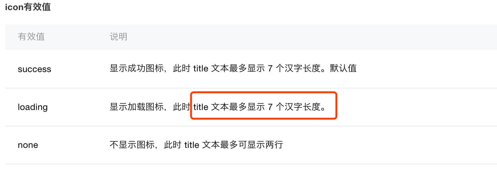
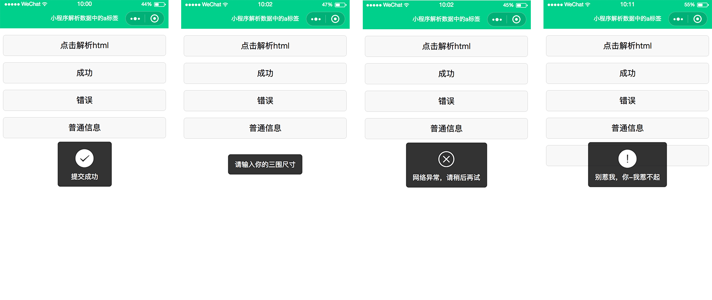
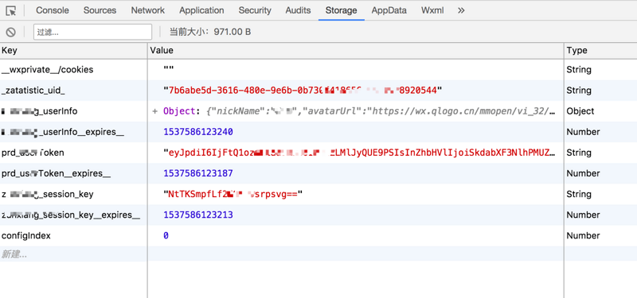
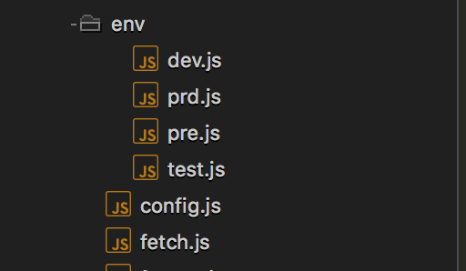
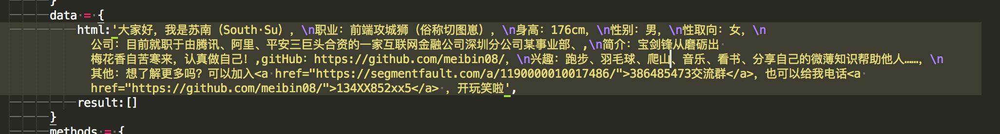

# 做完小程序项目、老板给我加了6k薪资～


　　大家好，这里是平头哥联盟，我是首席填坑官——[苏南](https://github.com/meibin08)(South·Su)，今天要给大家分享的是最近公司做的一个小程序项目，过程中的一些好的总结和遇到的坑，希望能给其他攻城狮带来些许便利，更希望能像标题所说，做完老板给你加薪～


　　今天是中秋节的第一天，假日的清晨莫名的醒的特别早，不知道为什么，也许是因为，昨晚公司上线的项目回来的路上，发现了个小bug，心里有些忐忑吧，一会偷偷先改了，让领导发现这个月绩效就没了～～～～


​　　以上纯为扯淡，现在开始一本正经的装逼，请系好安全带，中间过程有可能会开车，请注意安全！！！！！

　　最近这个项目跟团队小伙伴沟通在众多框架中最后选择了`wepy`，没有直接用原生的，小程序原生就……，大家都懂的，用`wepy`框架，给自己带来了便利，也带来了不少坑，但纵是如此，我还是怀着：“[纵你虐我千百遍，我仍待你如初恋](https://github.com/meibin08/)”的心态去认真把项目做好。

## toast组件

+ **toast**组件，大家都知道，官方的api **wx.showToast** 是满足不了我们的需求的，因为它只支持 "success", "loading"两种状态，同时“ title 文本最多显示 7 个汉字长度”，这是官方原话，有图有真相哦，样式巨丑～


```
wx.showToast({
  title: '成功',
  icon: 'success',
  duration: 2000
})
wx.showModal({
  title: '提示',
  content: '这是一个模态弹窗',
  success: function(res) {
    if (res.confirm) {
      console.log('用户点击确定')
    } else if (res.cancel) {
      console.log('用户点击取消')
    }
  }
})

```

**wx.showModal**的content的文字是不会居中的（现在不确定有没有扩展，可以设置），依稀记得有一次因为问题差点跟产品经理吵起来，让文字居中，我说最少要两小时，当时产品就炸了，什么鬼？？？让文字居中一下要两小时？？两小时？？两小时？？呵呵～走了，后来就下决定自己封装了一个属于自己的toast组件，**以下为部分核心代码**:

```javascript
<template lang="wxml">
    
    <view class="ui-toast  {{ className }}" hidden="{{ !visible }}">
        <view class="ui-toast_bd">
            <icon wx:if="{{ options.icon}}" type="{{ options.icon }}" size="40" color="{{ options.color }}" class="ui-toast_icon" />
            <view class="ui-toast_text">{{ options.text }}</view>
        </view>
    </view>
</template>

<script>
    import wepy from 'wepy';
    const __timer__ =1900;
    //方法以 ： __XX__ 命名，因并入其他组件中后，可能引起方法名重复
    class Toast extends wepy.component {
            
        /**
         * 默认数据
         */
        data={
             list:[
                {
                    type: `success`,
                    icon: `success`,
                    className: `ui-toast-success`,
                },
                {
                    type: `cancel`,
                    icon: `cancel`,
                    className: `ui-toast-cancel`,
                },
                {
                    type: `forbidden`,
                    icon: `warn`,
                    className: `ui-toast-forbidden`,
                },
                {
                    type: `text`,
                    icon: ``,
                    className: `ui-toast-text`,
                },
            ],
            timer:null,
            scope: `$ui.toast`, 
            animateCss:'animateCss',
            className:'',
            visible:!1,
            options:{
                type: ``, 
                timer: __timer__, 
                color: `#fff`, 
                text: `已完成`, 
            }
        }
        /**
         * 默认参数
         */
        __setDefaults__() {
            return {
                type: `success`, 
                timer: __timer__, 
                color: `#fff`, 
                text: `已完成`, 
                success() {}, 
            }
        }
        /**
         * 设置元素显示
         */
        __setVisible__(className = `ui-animate-fade-in`) {
            this.className = `${this.animateCss} ${className}`;
            this.visible = !0;
            this.$apply();
        }

        /**
         * 设置元素隐藏
         */
        __setHidden__(className = `ui-animate-fade-out`, timer = 300) {
            this.className = `${this.animateCss} ${className}`;
            this.$apply();
            setTimeout(() => {
                this.visible = !1;
                this.$apply();
            }, timer)
        }
        /**
         * 显示toast组件
         * @param {Object} opts 配置项
         * @param {String} opts.type 提示类型
         * @param {Number} opts.timer 提示延迟时间
         * @param {String} opts.color 图标颜色
         * @param {String} opts.text 提示文本
         * @param {Function} opts.success 关闭后的回调函数
         */
        __show__(opts = {}) {
            let options = Object.assign({}, this.__setDefaults__(), opts)
            const TOAST_TYPES = this.list;
            TOAST_TYPES.forEach((value, key) => {
                if (value.type === opts.type) {
                    options.icon = value.icon;
                    options.className = value.className
                }
            })
            this.options = options;
            if(!this.options.text){
                return ;
            };
            clearTimeout(this.timer);
            this.__setVisible__();
            this.$apply();
            this.timer = setTimeout(() => {
                this.__setHidden__()
                options.success&&options.success();
            }, options.timer);

        }
        __info__(args=[]){
            let [ message, callback, duration ]  = args;
            this.__show__({
                type: 'text',
                timer: (duration||__timer__),
                color: '#fff',
                text: message,
                success: () => {callback&&callback()}
            });
        }
        __success__(args=[]){
            let [ message, callback, duration ]  = args;
            this.__show__({
                type: 'success',
                timer: (duration||__timer__),
                color: '#fff',
                text: message,
                success: () => {callback&&callback()}
            });
        }
        __warning__(args){
            let [ message, callback, duration ]  = args;
            this.__show__({
                type: 'forbidden',
                timer: (duration||__timer__),
                color: '#fff',
                text: message,
                success: () => {callback&&callback()}
            });
        }
        __error__(args){
            let [ message, callback, duration ]  = args;
            this.__show__({
                type: 'cancel',
                timer: (duration||__timer__),
                color: '#fff',
                text: message,
                success: () => {callback&&callback()}
            });
        }
        __showLoading__(options){
            wx.showLoading({
                title: (options&&options.title||"加载中"),
            });
        }
        __hideLoading__(){
            wx.hideLoading();
        }
        onLoad(){
            this.$apply()
        }
    }

    export default Toast;
</script>
```

> 调用示例：

```
<template>
    <view class="demo-page">
        <Toast />
        <Modals />
    </view>
</template>

<script>
    import wepy from 'wepy'
    import Toast from '../components/ui/Toast'
    import Modals from '../components/ui/Modals'
    import {fetchJson} from '../utils/fetch';

    export default class Index extends wepy.page {
        config = {
            navigationBarBackgroundColor: "#0ECE8D",
      navigationBarTextStyle:"white",
            navigationBarTitleText: ''
        }
        components = {
            Toast: Toast,
            Modals: Modals
        }
        methods = {
            tapToast(){
                this.$invoke("Toast","__success__",[`您已提交成功，感谢您的支持与配合`]);
            }   
        }
    }
</script>
```



## Storage (数据存储)

**Storage** （存储）在前端我们存储的方式，`cookie`、`localStorage`、`sessionStorage`等这些，特性就不一一说明了，小程序里大家都知道，数据存储只能调用 wx.setStorage、wx.setStorageSync，相当于h5的`localStorage`，而 `localStorage`是不会过期的，这个大家都知道，而且在很多的面试中，面试官都会问到这个问题，怎么让localStorage像`cookie`一样，只存两小时、两天、甚至只存两分钟呢？今天带你解惑，让你在职场面试中又减少一个难题，这也是我们项目中一直在用的方式，小程序中也同样实用：



```javascript
class storage {

  constructor(props) {
    this.props = props || {}
    this.source =  wx||this.props.source;

  }

  get(key) {
    const data = this.source,
          timeout = (data.getStorageSync(`${key}__expires__`)||0)

    // 过期失效
    if (Date.now() >= timeout) {
      this.remove(key)
      return;
    }
    const value = data.getStorageSync(key)
    return value
  }

  // 设置缓存
  // timeout：过期时间（分钟）
  set(key, value, timeout) {
    let data = this.source
    let _timeout = timeout||120;
    data.setStorageSync(key,(value));
    data.setStorageSync(`${key}__expires__`,(Date.now() + 1000*60*_timeout));
 
    return value;
  }

  remove(key) {
    let data = this.source
        data.removeStorageSync(key)
        data.removeStorageSync(`${key}__expires__`)
    return undefined;
  }
}
module.exports = new storage();

```
　　其实很简单，大家看了之后就都 “哦，原来还可以这样”  懂了，只是一时没想到而已，就是个小技巧，每次在存储的时候同时也存入一个时效时间戳，而在获取数据前，先与当前时间比较，如果小于当前时间则过期了，直接返回空的数据。


## 接口API维护

+ **接口API的维护，**在没有`nodejs`之前，前端好像一直都在为处理不同环境(dev、test、uat、prd)下调用对应的API而烦恼，做的更多的就是用域名来进行判断，当然也有些高级一点的做法，后端在页面渲染的时候，存一个变量到`cookie`里或者在页面输出一个全局的api变量(建立在没有前后端分离的基础上)，到了小程序同样也是如此，每次都要手动改环境，那么一个项目可能有不同的业务，要调用不同域名api，又有不同的环境区分，怎么维护会比较好呢？？

```javascript
env/dev.js
//本地环境
module.exports = {
    wabApi:{
        host:"https://dev-ali.southsu.com/XX/api/**",
    },
    questionApi:{
        host:"https://dev-ali.bin.com/question/api/**/question",
    },
    mockApi:{
        host:"https://easy.com/mock/594635**c/miniPrograms"
    },
    inWelApi: {
        host: "https://dev.**.com/Wab/api/escene/v2"   
    }
};

```

```javascript
 
import dev from './env/dev'; //本地或开发
import uat from './env/pre'; //体验环境
import prd from './env/prd'; //线上


var ENV = "prd"; //'dev | uat | prd';
let _base_ = {
  dev,
  uat,
  prd
}[ENV];
var config = {
  ENV,
  baseAPI:{..._base_, env : ENV },
  appID:"wx*****b625e", //公司账号（指数）appid
  isAuthorization:true,
  'logId': 'gVDSMH****HAas4qSSOTb-gzGzoHsz',
  'logKey': 'pxFOg****Jn3JyjOVr',
  questionnaireNo:'z**Insu' // 问卷调查编号
};
export const __DEBUG__ = (ENV!="prd");
export default  config;

```

```javascript
请求调用api处理的示例

import wepy from 'wepy'
import _login_ from './login';
import config,{__DEBUG__} from './config';
import 'wepy-async-function';
export const  fetchJson = (options)=>{
    /*
     *  请求前的公共数据处理
     * @ param {String}     url 请求的地址
     * @ param {String}     Type 请求类型
     * @ param {String}     sessionId 用户userToken
     * @ param {Boolean}    openLoad 开启加载提示，默认开启，true-开，false-关
     * @ param {function} StaticToast 静态提示方法 ,详细说明请参考 components/ui/Toast
     * @ param {Object}     header 重置请求头
     * @ param {Boolean}    isMandatory 是否强制用户授权，获取用户信息
    */

    StaticToast = getCurrentPages()[getCurrentPages().length - 1];
    let { url,openLoad=true, type, data={},header={}, ...others } = options||{};
    let sessionId = (Storage.get(__login__.server+'_userToken')||"");
    /*Start */
       
        var regExp = /\/(.*?)\//,
        hostkey = url.match(regExp)[1];
    let baseUrl = config.baseAPI[hostkey].host;
    url = url.replace(regExp, '/');

    /*End */

    __DEBUG__&&console.log('#--baseUrl:', baseUrl);
    __DEBUG__&&console.log('#--请求地址:', `${baseUrl}${url}`);
    __DEBUG__&&console.log('----------分割线---------------');
    openLoad&&StaticToast.__showLoading__();
    return new Promise((resolve, reject) => {
        return wepy.request({
            url:`${baseUrl}${url}`,
            method:(type || 'POST'),
            data,
            header:{
                "t9oken":sessionId,
                'content-type': 'application/json',
                // 'Content-Type': 'application/x-www-form-urlencoded; charset=UTF-8',
                ...header
            },
            success:(res)=>{
                StaticToast.__hideLoading__();
                return resolve(resHandler(res,options));
            },
            error:(err,status)=>{
                StaticToast.__hideLoading__();
                return reject(errorHandler(err,options,err.statusCode));
            }
        });
    })
    
```
> 业务调用示例:

```javascript
fetchJson({
	type:"post",
	// url:"/mockApi/service/XXX", 最后请求得到的地址是 https://easy.com/mock/594635**c/miniPrograms/service/XXX (域名不同环境不一样，在config里的 ENV baseAPI控制)
	data:{
		name:"苏南"
	},
	success:res=>{
		console.log("大家好，我是苏南",res)
	}
})
```




## 填坑时间了

**填坑时间了**，`wepy`框架中每个组件内的生命周期回调 onload,只要是引入了组件，不管你视图有没有渲染，他都会执行，导致某些业务逻辑用不上它的时候也执行了产生异常（当然为个锅< 小程序 >肯定说我不背～^～ ），详细看链接：[github.com/Tencent/wep…](https://link.juejin.im?target=https%3A%2F%2Fgithub.com%2FTencent%2Fwepy%2Fissues%2F975) ， https://github.com/Tencent/wepy/issues/1386   ，不知道后面有没有人解决。

## rich-text组件

+ **rich-text,**小程序的一个组件，虽然有那么一点点用处，但又不得不说到底要它何用啊？其它的我就忍了，`a`标签，`a`标签啊，属性没有，那还要它何用啊？？你都不要我跳转，我还要用你吗？b、i、span、em……哪个我不能用？不知道设计这个组件的人是不是脑被驴踢了(愿老天保佑，我在这骂他，可千万别被看到了，哈哈～)，又是业务需求后台配置的内容有链接，没办法，来吧，搞吧，往死里搞吧，一切的推脱都是你技术low的借口(你看，你看，别人的怎么可以跳转啊，别人怎么做到的？给我一刀，我能把产品砍成渣)，所以有了后面的填坑：




```javascript

<template>
	<view class="test-page">
			<button @tap="cutting">点击解析html</button>
			<view wx:if="{{result.length>0}}" class="parse-list">
					<view  class="parse-view" wx:for="{{result}}" wx:key="unique" wx:for-index="index" wx:for-item="items">
							<block wx:if="{{items.children&&items.children.length}}">
									<block wx:for="{{items.children}}" wx:for-item="child" >
											<text wx:if="{{child.type == 'link'}}" class="parse-link" @tap="goToTap({{child.link}})">{{child.value}}</text>
											<text class="parse-text" wx:else>{{child.value}}</text>
									</block>
							</block>
							<text class="parse-text" wx:else>{{items.value}}</text>
					</view>
			</view>
			<Toast />
			<Modals />
	</view>
</template>

<script>
	import wepy from 'wepy'
	import { connect } from 'wepy-redux'
	import Toast from '../components/ui/Toast'
	import Modals from '../components/ui/Modals'
	import {fetchJson} from '../utils/fetch';
	import Storage from "../utils/storage";

	function wxHtmlParse(htmlStr=''){
		if(!htmlStr){
				return []
		};
		const httpExp  =/(http:\/\/|https:\/\/)((\w|=|\?|\.|\/|\&|-)+)/g;//提取网址正则
		const aExp=/<a.[^>]*?>([(^<a|\s\S)]*?)<\/a>/ig; //a标签分割正则
		let cuttingArr = htmlStr.split(/[\n]/);
		let result = [];
		//有a标签的html处理
		let itemParse = (itemHtml='')=>{
				let itemCutting = itemHtml.split(aExp)||[];
				let itemResult = [];
				for(var i = 0;i<itemCutting.length;i++){
						let _html = itemCutting[i];
						if(_html!==''){
								let itemData = {
										value:_html,
										type:'text',
										class:"parse-text"
								};
								let matchTag = itemHtml.match(aExp)||[]; //再次匹配有 a 标签的
								if(matchTag.length){
										let itemIndex = matchTag.findIndex((k,v)=>(k.indexOf(_html)!==-1));
										if(itemIndex>=0){
												let link = matchTag[itemIndex].match(httpExp)[0];
												itemData.type = 'link';
												itemData.link = link;
												itemData.class = "parse-link";
										};
								};
								itemResult.push(itemData)
						}
				};
				return itemResult;
		};
		cuttingArr.map((k,v)=>{
				let itemData = {type : "view",class:"parse-view"};
				let isATag = k.match(aExp);
				if(isATag){
						itemData.children = itemParse(k);
				}else{
						itemData.value = k;

				};
				result.push(itemData);
				return k;
		}) ;
		return result;
	};
	export default class Index extends wepy.page {
		config = {
			navigationBarBackgroundColor: "#0ECE8D",
			navigationBarTextStyle:"white",
				navigationBarTitleText: '小程序解析数据中的a标签'
		}
		components = {
			Toast: Toast,
			Modals: Modals
		}
		data = {
			html:'大家好，我是苏南（South·Su），\n职业：前端攻城狮（俗称切图崽），\n身高：176cm，\n性别：男，\n性取向：女，\n公司：目前就职于由腾讯、阿里、平安三巨头合资的一家互联网金融公司深圳分公司某事业部、,\n简介：宝剑锋从磨砺出 梅花香自苦寒来，认真做自己！,gitHub：https://github.com/meibin08/，\n兴趣：跑步、羽毛球、爬上、音乐、看书、分享自己的微薄知识帮助他人……，\n其他：想了解更多吗？可以加入<a href="https://segmentfault.com/a/1190000010017486/">386485473交流群</a>，也可以给我电话<a href="https://github.com/meibin08/">134XX852xx5</a> ，开玩笑啦',
			result:[]
		}
		methods = {
			cutting(e){
				this.result = wxHtmlParse(this.html);
				console.log(`result`,this.result);
				this.$apply();
			},
				
		}
			
	}
</script>
```


**PS**：[完整示例源码](https://github.com/honeybadger8/blog/tree/master/demo/applets-toast) 来啦～，觉得不错记得 Star、`Star`、`Watch` 哦，感谢！

今天的分享就到这里，写了蛮久，最近才在开始尝试写博客，新手上路中，如果文章中有不对之处，烦请各位大神斧正。如果你觉得这篇文章对你有所帮助，请记得点赞哦～，想了解更多？[请猛戳这里！](https://github.com/meibin08/)


> 作者：苏南 - 首席填坑官
>
> 来源：[平头哥联盟](https://honeybadger8.github.io/blog/ "平头哥联盟")
>
> 交流群：386485473(前端) 、260282062(测试)
>
> 本文原创，著作权归作者所有。商业转载请联系作者获得授权，非商业转载请注明出处。


