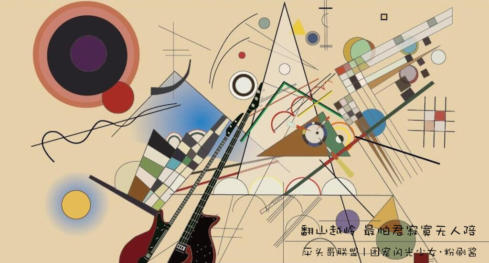
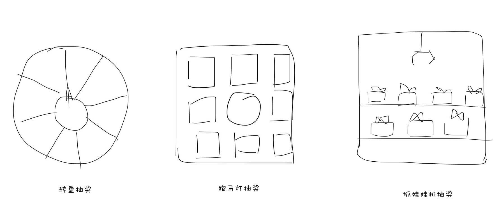

# 做过很多抽奖h5，依然过不好这一生



## 前言

　　大家好，这里是[平头哥联盟](https://honeybadger8.github.io/blog/ "平头哥联盟")，我是`团宠闪光少女`——[粉刷酱](https://github.com/cchah "团宠闪光少女")(粉刷酱)，其实我现在还不是团宠，我是觉得这样说的多了，也许团队的人就信了，就真的能成为团宠了。好了，今天要给大家分享的是工作中做的抽奖h5（都是在react框架下做的）的一些总结，愿你我都能中大奖～


## 正式开讲

   最近这段时间做了三种效果的抽奖，为了让大家有个直观印象，作为灵魂画手的我自然要大展身手～
   

#### 1.1 转盘抽奖

   转盘抽奖使用css3的transform旋转和setInterval搭配缓动算法。

   缓动算法就是利用一些函数，使变量y随着x的改变非线性的改变，从而使动画更符合现实情况，这个网上有很多很详细讲解，就不多说了。

```js
//Tween算法，并利用它做一些简单的缓动效果。 Quartic：四次方的缓动（t^4）；实现转盘由慢到快转动再缓慢停下的过程
//b、c、d三个参数（即初始值，变化量，持续时间） 当t从0递增（或递减）到d时，缓动就结束了。
QuartEaseOut(t, c, d){
    return -c * ((t = t / d - 1) * t * t * t - 1);
};

draw() {
    //change为转动的最终角度，计算抽奖之后转盘应该转动的角度，加上5400度是为了延长动画,是动画效果看起来好
    //distance是步长，这里乘以setInterval的间隔时间得到的是总的动画时长
    //使用setInterval设置每次计算之后转盘转动角度，同时奖品项向相反的方向转动同样的角度以保证奖品项的展示依然正对着用户
    let len = prizesVia.length;   //奖品项数量
    let rank = 2;  //抽到的奖品的index
    let change = -(360/len * rank - 180/len) + 5400;
    let time = 0;
    let distance = 300;
    this.timer = setInterval(()=>{
        if(time < distance){
            this.setState({
                angle: this.QuartEaseOut(time, change, distance)
            });
            // console.log(this.state.angle);
            time++;
        } else {
            clearInterval(this.timer);
        }
    },40);
}

```  

```html
<div className="draw-plate" style={{transform: 'rotate('+ angle + 'deg)'}}>
    {prizesVia.map((item, index) => {
        return (<div key={index} className="prize-item" style={{transform: 'rotate('+ (-angle) + 'deg)'}}>
        
        <p className="prize-name">{item.title}</p>
        </div>);
    })}
    <div className={classnames("draw-finger", {'draw': canDraw && !hasClicked})} style={{transform: 'rotate('+ (-angle) + 'deg)'}} onClick={this.draw.bind(this)}></div>
</div>
```

#### 1.2 跑马灯抽奖

   跑马灯抽奖实现比较简单
   
   1、奖品渲染到html页面

   2、点击抽奖时使用setInterval改变当前高亮的奖品项，因为抽奖的动画是环形，所以要注意奖品项的index和currentPrizeIdx的对应关系


```js
//将currentPrizeIdx和html中奖品项的index做一个映射
const prizeMap = {
    1: 1,
    2: 2,
    3: 3,
    4: 5,
    5: 8,
    6: 7,
    7: 6,
    8: 4
};

//渲染html
let prizeItem = [];
let len = prizes.length||1;
for(let i = 0;i<8;i++){
let index = i % len;
prizeItem.push(<div className={classnames("item",{"active": i+1 === prizeMap[currentPrizeIdx] })} key={i}>
    
    <p>{prizes[index]&&prizes[index].title}</p>
</div>
)
}
//将开始按钮插入到数组的第五个
prizeItem.splice(4,0,<div className="item" key="8" onClick={this.start.bind(this)}></div>)

//点击抽奖使用setInterval改变currentPrizeIdx当前高亮的奖品
this.timer = setInterval(()=>{
    let {currentPrizeIdx, drawedPrizeIdx=0} = this.state;
    //获取到抽奖的项的时候取出在数组中的位置赋值drawedPrizeIdx，当drawedPrizeIdx与currentPrizeIdx映射的奖品相同时clearInterval
    if(drawedPrizeIdx == prizeMap[currentPrizeIdx]){
        clearInterval(this.timer);
    }else{
        this.setState({
            currentPrizeIdx: currentPrizeIdx == 8 ? 1 : currentPrizeIdx + 1,
        });
    }
},100);
```

#### 1.3 抓娃娃抽奖

   这里分了两排放置奖品，抽奖时，第一排奖品向左移动，第二排奖品向右移动（第二排奖品只为展示，抽奖在第一排），停下的时候抓杆将奖品抓上去。

   1、奖品容器设置transform-style的值为preserve-3d，则子元素可以呈现3d展示，这里使用6个子元素即可，使用transform对每一个子元素进行3d偏移；

   2、奖品移动的时候，使用animation属性实现3d旋转，这里使用4s旋转720度；

   3、抽中奖之后，将初始时候的中间位置的奖品替换为所中的奖项，则动画停止的时候抓到的就是我们需要的奖项了。

```html
 <div class='prizes_pool'>
    <div class='piece piece-1'></div>
    <div class='piece piece-2'></div>
    <div class='piece piece-3'></div>
    <div class='piece piece-4'></div>
    <div class='piece piece-5'></div>
    <div class='piece piece-6'></div>
</div>
```

```css
.prizes_pool{
    width: 300px;
    height: 100px;
    position: relative;
    transform-style: preserve-3d;

    &.move{
        animation: trans 4s;
    }

    @keyframes trans{
        0%{
        transform: rotateY(0deg);
        }
        100% {transform: rotateY(720deg);}
    }
    .piece{
        position: absolute;
        width: 300px;
        height: 100px;
        backface-visibility: hidden;
        white-space: nowrap;
    }
    .piece-1{
        transform: rotateY(0deg) translateZ(300px);
    }
    .piece-2{
        transform: rotateY(60deg) translateZ(300px);
    }
    .piece-3{
        transform: rotateY(120deg) translateZ(300px);
    }
    .piece-4{
        transform: rotateY(180deg) translateZ(300px);
    }
    .piece-5{
        transform: rotateY(240deg) translateZ(300px);
    }
    .piece-6{
        transform: rotateY(300deg) translateZ(300px);
    }
}
```

   以上～

   新手上路，余生不用多多指教，技术还是需要，欢迎一起探讨～～

   peace&love

> 作者：粉刷酱 - [团宠闪光少女](https://github.com/cchah "团宠闪光少女")
>
> 来源：[平头哥联盟](https://honeybadger8.github.io/blog/ "平头哥联盟")
> 
> 链接：https://honeybadger8.github.io/blog/
> 
> 交流群：912594095[`资源获取/交流群`]、386485473(前端) 、260282062(测试)
>
> 本文原创，著作权归作者所有。商业转载请联系`平头哥联盟`获得授权，非商业转载请注明链接及出处。 
   