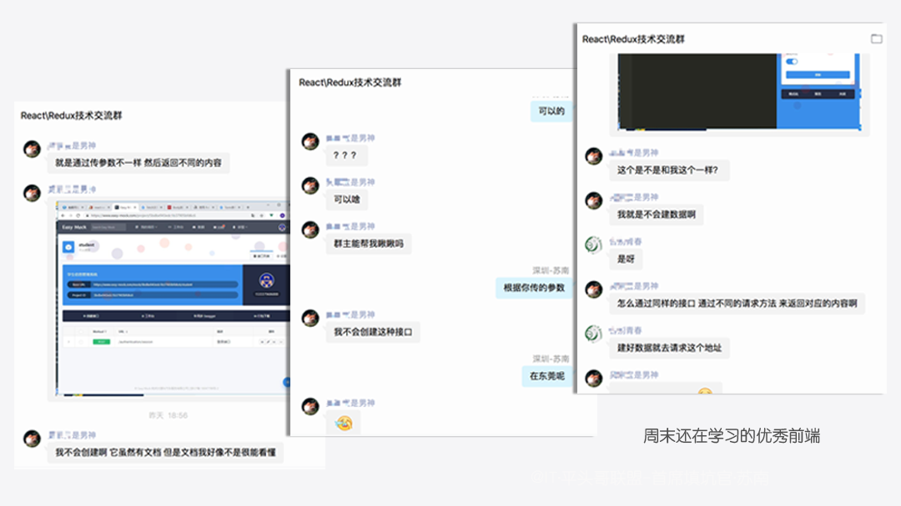
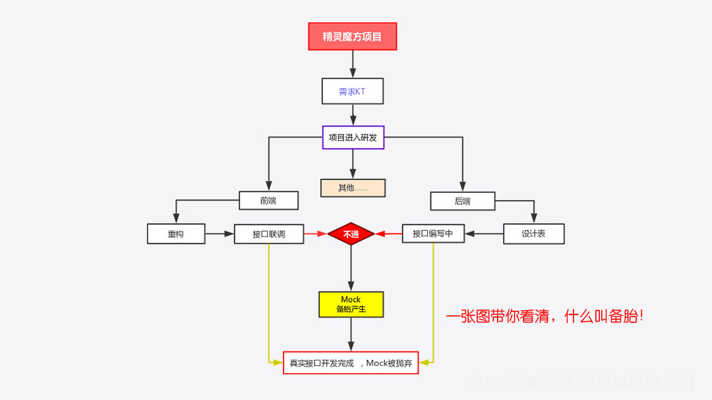
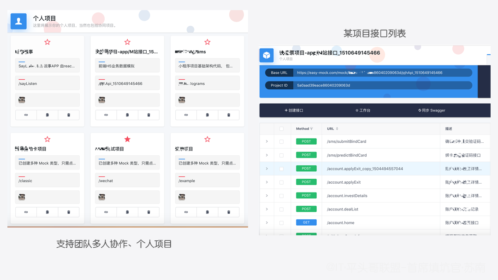
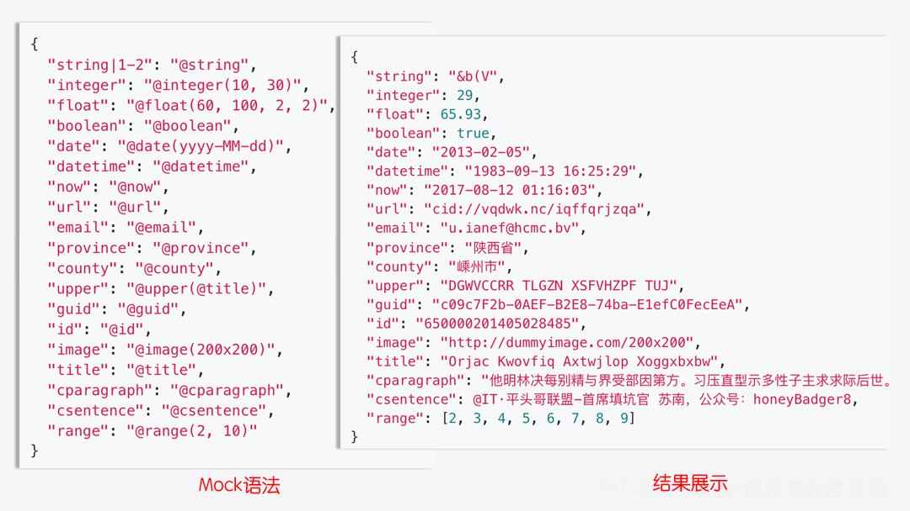
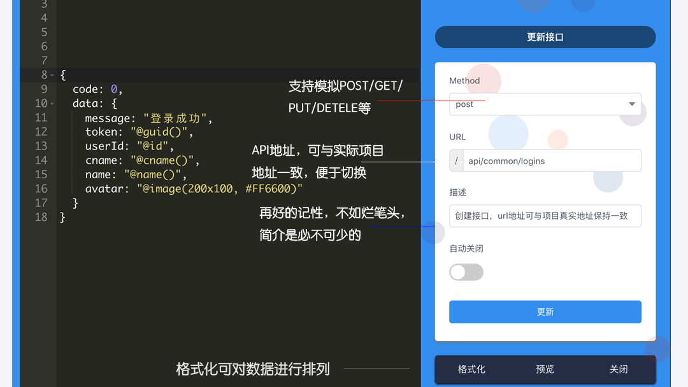
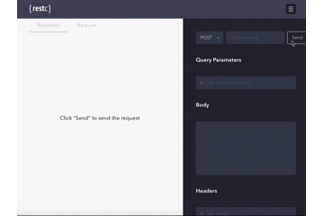

# 浅谈easy-mock 最好的备胎没有之一


## 引言

​　　今天我们来聊聊`Mock`，随着互联网发展，这两年前后端分离的开发模式兴起，Mock也从以住的幕后走上了台面，让更多的人而得知，以前传统的开发方式Mock大多局限在后端人员接触较多一些。

　　`Mock`已经是老生常谈了，网上一搜索就很多，各位前辈们都讲的很到位，但今天我只讲它——[easy-mock](https://easy-mock.com "一个你值得拥有且不可错过的平台")。

　　为什么会突然来聊它，这个就说来话长了，个人简介里就说过，专注于分享工作中遇到的坑，但这一次不是我的坑，来源于QQ群友（`#` 如果您有想知道的故事，而正好我也会，那么就由我为您讲出来吧，欢迎留言哦 `#` ），请看下图：



!> 这里是[@IT·平头哥联盟](https://honeybadger8.github.io/blog/ "@IT·平头哥联盟")，我是`首席填坑官`—[苏南](https://github.com/meibin08 "首席填坑官∙苏南"),用心分享 做有温度的攻城狮。


## 什么是Mock

　　什么是Mock?? `Mock`其实就是真实数据存在之前，即调试期间的代替品，是个虚拟的存在，用人话讲它就是个备胎，如女生长的好看，追她的人多，但又不是很满意但也不拒绝，在自己心仪的小哥哥出现之前，一直吊着你😂！


　　
## 如何Mock数据？
+ 不要告诉我 `new` 一个哦，对象可以 `new`，备胎可`new`不出来呢🤫；
+ 方法一：最low的方式将 Mock 数据写在代码里、json文件里；
+ 方法二：利用 `Charles` 、`Fiddler`等代理工具，将 URL 映射到本地文件；
+ 方法三：本地起 Mock Server，即mockjs，有点麻烦每次修改了后还要重启服务，`nodemon`能解决，但开的东西多了，电脑卡出翔，维护也麻烦；
+ 方法四：规范些的公司自己已经集成了一套mock数据体系；
+ **重点来了**：`easy-mock`一个在线 `Mock` 平台，活儿好又性感是你备胎的最佳选择。
+ 当然优秀的你可能还有很多其他的方式，欢迎补充。

```js
//mock 基本使用示例
import Mock from "mockjs";
Mock.mock({
	"code": 0,
	"message": "请求成功",
	"data|20": [{
		"name": "@cname",//cname 中文，name 英文
		"userId": "@id",
		"lastDate": "@datetime"
	}]
})

```

## 什么是easy-mock，能给我们带来什么？
+ Easy Mock 是一个可视化，并且能快速生成 模拟数据 的持久化服务，
+ Easy Mock 支持基于 `Swagger` 创建项目，以节省手动创建接口的时间；
+ 简单点说：Easy Mock就是一个在线创建mock的服务平台，帮你省去你 **配置**、**安装**、**起服务**、**维护**、**多人协作Mock数据不互通**等一系列繁琐的操作， 它能在不用1秒钟的时间内给你所要的一切，呼之即来、挥之即去的2018最优秀`备胎`没有之一，完全不用担心负任何责任哦。
+ 更多优点它在等你去发现哦……


## 深入浅出 - 简介
+ 就跟人一样长的再好看，了解过后才懂，一样东西也是如何，谁用谁知道；
+ Easy Mock支持`团队协作`，也可以是个人项目，
+ 以下以个人项目为例，与多人协作没有区别，只是少了成员邀请；



## 深入浅出 - Mock语法回顾
+ @ip -> 随机输出一个ip；
+ @id -> 随机输出长度18的字符，不接受参数；
+ "array|1-10" -> 随机输出1-10长度的数组，也可以直接是固定长度；
+ "object|2" -> 输出一个两个key值的对象，
+ "@image()" 返回一个占位图url，支持`size`, `background`, `foreground`, `format`, `text`；
+ 等等，这里就不再一一介绍。


## 深入浅出 - 创建一个接口
+ 它的写法，跟Mock.js一模一样,上面代码已经展示过，[更多示例](http://mockjs.com/)
+ 使用`Easy Mock`创建一个接口，请看下图：


## 深入浅出 - 高阶用法 Function
+ 在线编辑，它也能支持 **`function`** ，
+ 是不是很优秀，能获取到全部请求头，可以让我们像写在js里一样写逻辑，写运算，
+ 当然它肯定是还有很多局限性的，如并不支持`ES6`，
+ 有一点需要注意的是 `function` 里要写传出`Mock`对象，不能直接`@...`，
+ 来看示例：

| 对象     | 描述              |
| -------- | ----------------- |
| Mock     | Mock 对象         |
| _req.url | 获得请求 url 地址 |
| _req.method | 获取请求方法 |
| _req.params | 获取 url 参数对象 |
| _req.querystring | 获取查询参数字符串(url中?后面的部分)，不包含 ? |
| _req.query | 将查询参数字符串进行解析并以对象的形式返回，如果没有查询参数字字符串则返回一个空对象 |
| _req.body | 当 post 请求以 x-www-form-urlencoded 方式提交时，我们可以拿到请求的参数对象 |
| ... | _req.cookies、ip、host等等，`我只是一个代码的搬运`，更详细[请看这里](https://easy-mock.com/docs) |


```js
//简单模拟登录，根据用户传入的参数，返回不同逻辑数据
{
  defaultName:function({_req}){
    return _req.query.name;
  },
  code: function({_req}){
    return this.defaultName ? 0 : -97;
  },
  message: function({_req}) {
    return this.defaultName ? "登录成功" : "参数错误";
  },
  data: function({_req,Mock}){
    return this.defaultName ? {
      token: Mock.mock("@guid()"),
      userId: Mock.mock("@id(5)"),
      cname: Mock.mock("@cname()"),
      name: Mock.mock("@name()"),
      avatar: Mock.mock("@image(200x100, #FF6600)"),
      other:"@IT·平头哥联盟-首席填坑官∙苏南 带你再谈Mock数据之easy-mock"
    }:{}
  }
}


```
## 深入浅出 - 在线调试
+ 再优秀的工程师写出的代码也一样要测试，没有人敢说自己的代码无`Bug`，
+ `Easy Mock` 它是真的懂你的，已经为你准备好了，接口编写好后，立马就能让你测试，
+ 是不是觉得很棒棒呢？？如果是你自己本地写mock数据，你需要重启服务、手动写参数、可能还需要整个测试页，
+ 知道你已经非常饥渴迫切的想要知道，具体的调试方式了：
+ 看不清吗？？已经为你备好[在线调试链接](https://easy-mock.com/mock/5a0aad39eace86040209063d/pjhApi_1510649145466/api/common/logins#!method=post)，支持POST、GET、PUT等方式，因gif图加载比较大，就不一一演示了




#### 结尾：

　　天下无不散之宴席，又到说再见的时候了，以上就是今天`苏南`为大家带来的分享，您GET到了吗？`Easy Mock`更多强大之处自己去折腾吧，`#`用心分享 做有温度的攻城狮`#`，希望今天的分享能给您带来些许成长，如果觉得不错记得点个赞哦，，顺便关注下方**公众号**就更棒了呢，每周为您推最新分享👇👇。


> 作者：苏南 - [首席填坑官](https://github.com/meibin08/ "@IT·平头哥联盟-首席填坑官")
>
> 链接：https://blog.csdn.net/weixin_43254766
> 
> 交流群：912594095[`资源获取/交流群`]、公众号：`honeyBadger8`
>
> 本文原创，著作权归作者所有。商业转载请联系`@IT·平头哥联盟`获得授权，非商业转载请注明原链接及出处。 


