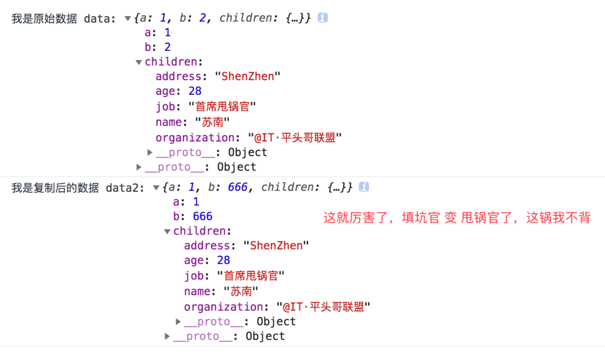

# immutability-helper因官方出镜，而被宠幸！


> 作者：[首席填坑官∙苏南](https://github.com/meibin08/ "首席填坑官∙苏南")<br/>
> 来源：[@IT·平头哥联盟](https://honeybadger8.github.io/blog/ "@IT·平头哥联盟")<br/>
> 公众号：`honeyBadger8`，群：[912594095](https://shang.qq.com/wpa/qunwpa?idkey=265166274bca82709718a0ae1fa9c55d65dd3608ebc780f9e6ea41e2761f5ec2 "@IT·平头哥联盟QQ交流群")，本文原创，著作权归作者所有，转载请注明原链接及出处。

## 引言

​　　相信大家在面试中都遇到过，面试官问你，js对象/数组的拷贝，你一般怎么做？？在现在ES6盛行的当下，不会一点ES6都不好意思说自己是前端(其实我一般都说自己是**攻城狮、切图崽**😝)，我们想的大多第一想法，如下：
+ `Object.assign` - 最方便;
+ `[...]` - 最有逼格;
+ `JSON.parse`、`JSON.stringify` - 完美组合;
+ `$.extend()` - jQuery时代的引领潮流时尚前沿的API;
+ 最后想到的才是自己递归实现一个;

　　但是通常我们使用的`Object.assign`属于浅拷贝，当数据嵌套层级较深时，就……呵呵了；而`JSON.parse、stringify`它应该是创建一个临时可能很大的字符串，然后又访问解析器，性能是比较慢的。于是后来发现了 `immutable`「不可变数据」，曾经我也一度特别喜欢它，但时间久了，慢慢发现，它过于有个性了些、凡事都都没有任何商量的余地，所有的数据，从创建、变更、插入、删除等操作，都要按它的套路来，对于我这种一生放荡不羁爱自由的人来说，长时间的约束，是不能忍的；都说两人如果三观不合，是无法长久下去的，可能也是缘份吧，在后来的某一天偶然的闲逛中邂逅了新欢 ————[Immutability Helpers](https://reactjs.org/docs/update.html)。
　　嗯，今天的主题就是给大家分享一下，`Immutability Helpers`的一些用法，会介绍一些官方API没有讲到的一些场景的操作和小技巧：
　　
> 太兴奋了，差点忘了，补充一下,一个简单的拷贝：

```js
  //简单的实现一下递归数据拷贝
  let customClone = (rawObj)=>{
    let copyObj = {};

    for (var key in rawObj) {
      if( typeof rawObj[key] === 'object'){
          copyObj[key] = customClone(copyObj[key]);
      }else{
          copyObj[key] = rawObj[key];
      };
    };
    return copyObj;
  };
  let objA =  {"name":"苏南","sex":"男","height":"176"};
  let objB =  customClone(objA);
      objB.signature = "宝剑锋从磨砺出，梅花香自苦寒来，做有温度的攻城狮";

  console.log(objA);
  console.log(objB);

```

* **补充一个** `Object.assign` 的坑 :

```
  let data = {
    a:1,
    b:2,
    children:{
      name:"苏南",
      organization:"@IT·平头哥联盟",
      job:"首席填坑官",
      address:"ShenZhen",
      age:18
    }
  };
  let data2 = Object.assign({},data);
  data2.children.age = 28;
  data2.children.job = "首席甩锅官";
  data2.b = 666;
  console.log("我是原始数据 data:",data);
  console.log("我是复制后的数据 data2:",data2);

```




## Immutability Helpers出场

!> gitHub上它对自己的介绍很简单：`Mutate a copy of data without changing the original source` —— 在不更改原始源的情况下改变数据副本。

　　与它结缘，是因为它在react官方文档中出镜，而被我所宠幸，真的 ，`只是因为在人群中多看了它一眼再也没能忘掉`， 它跟`immutable`不一样，不会有那么多条条框框约束你，给你自由、给你独立的空间、给你独立的思想，让你想用即用、用之即走～～(泥马,怎么有点像张小龙说它的小程序一样😬),但您放心，它的坑真的比小程序少，API也很简洁，接下来来看一下，它的基本用法：
+ `$push` —— 数组;
+ `$unshift` —— 数组;
+ `$splice` —— 数组;
+ `$set` —— 替换原数据;
+ `$toggle` —— array of strings
+ $unset —— remove the list of keys in array from the target object;
+ `$merge` —— 合并对象;
+ `$apply` ——  passes in the current value to the function and updates it with the new returned value
+ `$add` —— 新增;
+ `$remove` —— 删除。


> 作者：苏南 - [首席填坑官](https://github.com/meibin08/ "首席填坑官")
>
> 来源：[@IT·平头哥联盟](https://honeybadger8.github.io/blog/ "@IT·平头哥联盟")
> 
> 链接：https://honeybadger8.github.io/blog/
> 
> 交流群：912594095[`资源获取/交流群`]、386485473(前端) 、260282062(测试)
>
> 本文原创，著作权归作者所有。商业转载请联系`@IT·平头哥联盟`获得授权，非商业转载请注明原链接及出处。 


