# immutability-helper因官方出镜，而被宠幸！


> 作者：[首席填坑官∙苏南](https://github.com/meibin08/ "首席填坑官∙苏南")<br/>
> 来源：[@IT·平头哥联盟](https://honeybadger8.github.io/blog/ "@IT·平头哥联盟")<br/>
> 公众号：`honeyBadger8`，群：[912594095](https://shang.qq.com/wpa/qunwpa?idkey=265166274bca82709718a0ae1fa9c55d65dd3608ebc780f9e6ea41e2761f5ec2 "@IT·平头哥联盟QQ交流群")，本文原创，著作权归作者所有，转载请注明原链接及出处。

## 引言
　　之前项目中遇到数据拷贝、引用之间数据层级嵌套过深，拷贝的值相互之间影响的问题，后来引入了`immutability-helper`，使用过程中的一些总结，跟大家分享下，至于为什么不是`immutable`，请看下文分解，这里是[@IT·平头哥联盟](https://honeybadger8.github.io/blog/ "@IT·平头哥联盟")，我是`首席填坑官`——[苏南](https://github.com/meibin08 "首席填坑官∙苏南")。

​　　相信大家在面试中都遇到过，面试官问你，js对象/数组的拷贝，你一般怎么做？？在现在ES6盛行的当下，不会一点ES6都不好意思说自己是前端(其实我一般都说自己是**攻城狮、切图崽**😝)，我们想的大多第一想法，如下：
+ `Object.assign` - 最方便;
+ `[...]` - 最有逼格;
+ `JSON.parse`、`JSON.stringify` - 完美组合;
+ `$.extend()` - jQuery时代的引领潮流时尚前沿的API;
+ 最后想到的才是自己递归实现一个;

　　但是通常我们使用的`Object.assign`属于浅拷贝，当数据嵌套层级较深时，就……呵呵了；而`JSON.parse、stringify`它应该是创建一个临时可能很大的字符串，然后又访问解析器，性能是比较慢的。于是后来发现了 `immutable`「不可变数据」，曾经我也一度特别喜欢它，但时间久了，慢慢发现，它过于有个性了些、凡事都都没有任何商量的余地，所有的数据，从创建、变更、插入、删除等操作，都要按它的套路来，对于我这种一生放荡不羁爱自由的人来说，长时间的约束，是不能忍的；都说两人如果三观不合，是无法长久下去的，可能也是缘份吧，在后来的某一天偶然的闲逛中邂逅了新欢 ————[Immutability Helpers](https://reactjs.org/docs/update.html)。

　　嗯，今天的主题就是给大家分享一下，`Immutability Helpers`的一些用法，会介绍API的使用操作和小技巧，如有不理解不对，请纠正：
　　
> 太兴奋了，差点忘了，补充一下,一个简单的拷贝：

```js
  //实现一个简单的递归数据拷贝
  let customClone = (rawObj)=>{
    let copyObj = {};

    for (var key in rawObj) {
      if( typeof rawObj[key] === 'object' && Object.prototype.toString.call(rawObj[key]) !== '[object Array]'){
          copyObj[key] = customClone(rawObj[key]);
      }else{
          copyObj[key] = rawObj[key];
      };
    };
    return copyObj;
  };
  let objA =  {"name":"苏南","sex":"男","height":"176"};
  let objB =  customClone(objA);
      objB.signature = "宝剑锋从磨砺出，梅花香自苦寒来，做有温度的攻城狮";

  console.log(objA);
  console.log(objB);

```

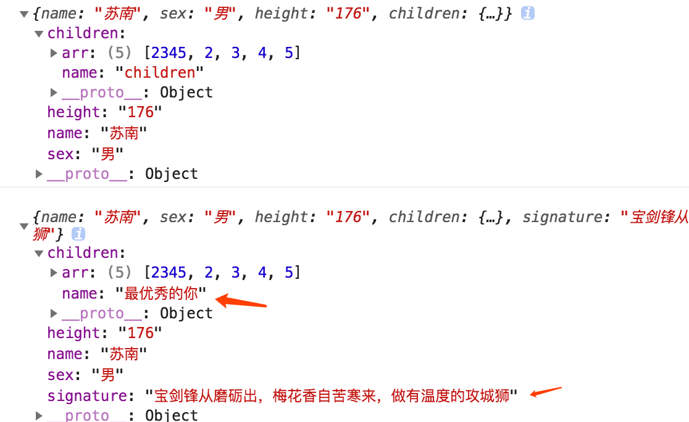

* **补充一个** `Object.assign` 的坑 :

```
  let data = {
    a:1,
    b:2,
    children:{
      name:"苏南",
      organization:"@IT·平头哥联盟",
      job:"首席填坑官",
      address:"ShenZhen",
      age:18
    }
  };
  let data2 = Object.assign({},data);
  data2.children.age = 28;
  data2.children.job = "首席甩锅官";
  data2.b = 666;
  console.log("我是原始数据 data:",data);
  console.log("我是复制后的数据 data2:",data2);

```


## immutable 最后的一次回顾

　　都说有了新欢，忘了旧爱，但我不是那种无情无义的人，最后正式介绍一下 `immutable`，为我俩的……画上一个圆满的句号：

　　再次强调，并不是觉得`immutable`不好，不够强大，只是自己个人观点，有些不喜欢而已，各位`immutable`粉勿喷，想了解更多的同学可以[点击这里](http://facebook.github.io/immutable-js/)

!> Immutable data encourages pure functions (data-in, data-out) and lends itself to much simpler application development and enabling techniques from functional programming such as lazy evaluation.

##### 使用示例：
```js
  
  const list1 = List([ 1, 2, 3 ]);
  const list2 = List([ 4, 5, 6 ]);
  const array = [ 7, 8, 9 ];
  const list3 = list1.concat(list2, array);
  console.log(list3) // List {size: 9, _origin: 0, _capacity: 9, _level: 5, _root: null, …} 是不能直接获取到数据的，须使用get,-- list3.get(0)


```

```js
  
  let data = fromJS({
    obj:{}
  });
  let data1 = {
    a:1,
    b:2,
    children:{
      name:"苏南",
    }
  };
  let data2 = data.mergeIn(['obj'],data1,{c:666});
  console.log("获取的数据：",data2.getIn(['obj','c']));
  console.log("这里是由formJS创建的数据：",data2.getIn(['obj','children','name']));//

```
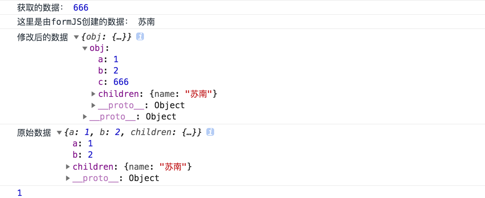

> 使用immutable后，所有数据都要类似选择器，一个一个往下选择，并不是说它不好、功能不够强大，只是自己有些不喜欢它类似JQuery选择器一样的语法,get、getIn、set、List等的使用方式，当然它也是可以使用 `toJS`方法转回来的。

## Immutability Helpers出场

!> gitHub上它对自己的介绍很简单：`Mutate a copy of data without changing the original source` —— 在不更改原始源的情况下改变数据副本。

　　与它结缘，是因为它在react官方文档中出镜，而被我所宠幸，真的 ，`只是因为在人群中多看了它一眼再也没能忘掉`， 它跟`immutable`不一样，不会有那么多条条框框约束你，给你自由、给你独立的空间、给你独立的思想，让你想用即用、用之即走～～(泥马,怎么有点像张小龙说它的小程序一样😬),但您放心，它的坑真的比小程序少，API也很简洁，接下来来看一下，它的基本用法：

+ `$push` —— 数组;
+ `$unshift` —— 数组;
+ `$splice` —— 数组;
+ `$set` —— 替换/覆盖/合并原数据;
+ `$toggle` —— array of strings ，toggles a list of boolean fields from the target object；
+ `$unset` —— remove the list of keys in array from the target object;
+ `$merge` —— 合并对象;
+ `$apply` ——  passes in the current value to the function and updates it with the new returned value；
+ `$add` —— 新增;
+ `$remove` —— 删除。

> 以上基本就是它全部的API了，下面一起来看看，具体用法吧：

#### $push 的使用 :
 + 看名字就知道它的作用了啦，跟原生的`push`一样，不过写法有一点点不一样;

```js
  let arr = [1,2,3,4,5,66];
  let arr2 = update(arr,{
    $push : ["a","b","c"], //一定要 []号的形式哦，不可以 "a";
    [4]:{ // ！！index ,可以指定修改下标的值
      $set:"我是替换过的"
    }
  });
  console.log(arr2);
```

#### $unshift 的使用 :
 + 一样，跟原生的`unshift`,在原数组开头处插入，同样写法是以一个数组的形式;

```js
  let arr = [1,2,3,4,5,66];
  let arr2 = update(arr,{
    $unshift : ["a","b","c"],
    [4]:{
      $set:"我是首席填坑官∙苏南"  //这里需要注意，它的操作是在 unshift之前执行的，也就是在原 arr 上查找 第4个下标
    }
  });
  console.log("原始数组",arr);// [1, 2, 3, 4, 5, 66] 相互之间并不会影响
  console.log(arr2); //["a", "b", "c", 1, 2, 3, 4, "我是首席填坑官∙苏南", 66]
```

#### $splice 的使用 :
 + **注意** ：数组套数组，start,end, 插入的数据……，;

```js

  let arr = [1,2,3,4,5,66];
  let arr2 = update(arr,{
    $splice : [[1,2,[66788,99],{a:123,b:"苏南"}]], // or [0,1,"从我开始是插入的内容",88,89,90,"后面可以很多，是数组、对象、字符串都行"]
  });
  console.log(arr2); 

  //复杂一些的用法：
  let obj={
    name:"immutable",
    list :[1,2,[90,55,44,3,22,55],3,4,6,7,8]
  };
  let obj2 = update(obj,{
    list:{
      [2]:value=>update(value,{
        $splice:[[0,2]]  // [90,55,44,3,22,55] => [44, 3, 22, 55]
      })
    }
  });

```

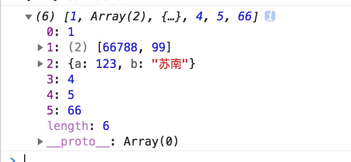
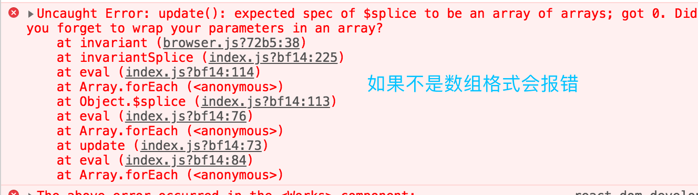


#### $set 的使用 :
 + 上面已经演示过了，其实有点替换的意思，当有重复的值时，就会覆盖，没有就新增,来展示复杂一点的场景,层级深的数据，也不会相互影响;

```js
  let obj={
    name:"immutable",
    children:{
      address:"ShenZhen",
      hobby:"@IT·平头哥联盟-前端开发"
    }
  };
  let obj2 = update(obj,{
    $set : {name:"immutability-helper",other:"其他字段,如微信公众号：honeyBadger8，每周为你带来最新分享"}
  });
  let obj3 = update(obj,{
    name:{
      $set : "苏南"
    },
    children:{
      hobby:{
        $set:"首席填坑官 - javascript"
      }
    }
  });
  console.log("原始数据:",obj); 
  console.log("obj2:",obj2); 
  console.log("obj3",obj3); 
```

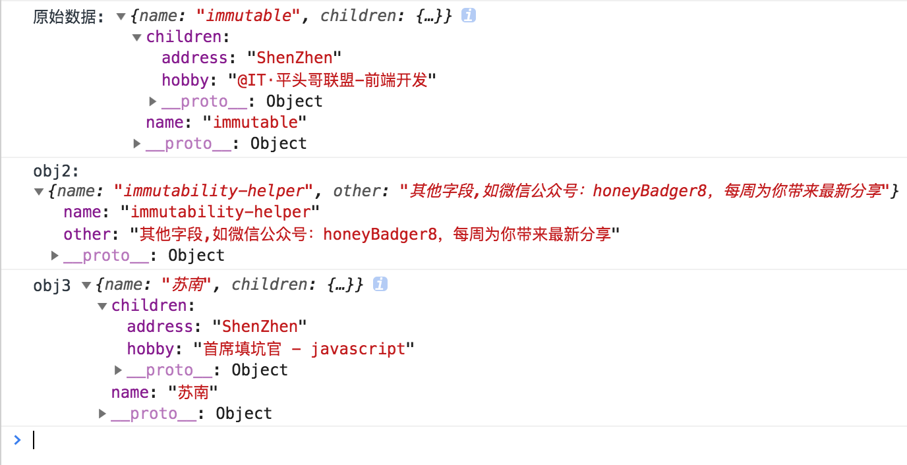

#### $toggle 的使用:
 + 听名字，应该就能猜出来，开关切换的意思;
 * Boolean 布尔值的切换，如果你是强制要 `Numbe`r 类型 的 0、1，那么使用引方法的时候就要注意了；

```js
  let obj={
    name:"immutable",
    a:false,
    b:true,
    c:1,
    d:0
  };
  let obj2 = update(obj,{
    $toggle:['b','a',"c","d"],
  });
  console.log("原始数据:",obj);
  console.log("obj2:",obj2);

```

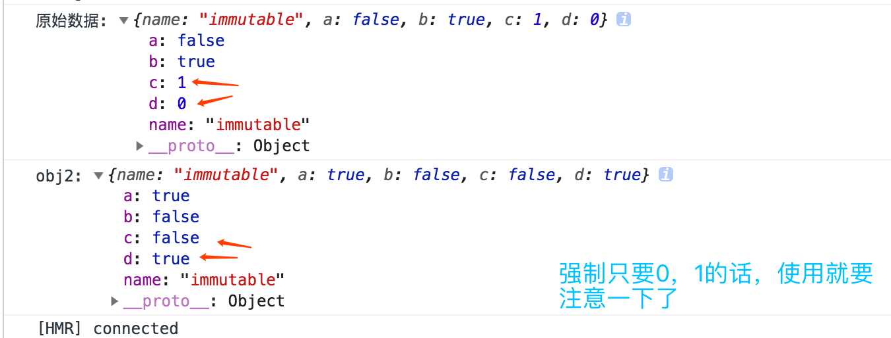

#### $unset 的使用:
 + 它跟$set相反，有点remove的味道，但又貌似有不同的之处，当操作的对象为`object`时key是删除了；而数组`array`中它的值没有了，却保留了`下标`，不改变数组的长度,删除数组建议还是用`$splice`；请看下图：

```js
  let arr = [1,2,3,4,5,6];
  let obj={
    name:"immutable",
    children:{
      address:"ShenZhen",
      hobby:"写博客"
    }
  };
  let obj2 = update(obj,{
    $unset : ["name"],
    children:{
      $unset:["address"]
    }
  });
  console.log("原始数据:",obj);
  console.log("obj2:",obj2);

  let arr2 = update(arr,{
    $unset : [1]
  });
  console.log("arr2:",arr2,arr2.length);

```


#### $merge 的使用:
+ `$merge` 跟我们最爱的`Object.assign`一样，做合并操作的，但它比`assign`优秀很多，深层次拷贝，不会相互影响 ：

```js
  let arr = [1,2,3,4,5,6];
  let obj={
    name:"immutable",
    children:{
      address:"ShenZhen",
      hobby:"写博客",
      array:["我不是程序员","切图崽了解一下"],
    }
  };
  let obj2 = update(obj,{
    $merge:{
      arr
    },
    children:{
      array:{
        $merge:{items:["从前有坐山","山里有个庙"]},
        $splice:[[3,0,"住着一个小和尚"]]
      }
    }
  });
  console.log("原始数据:",obj);
  console.log("obj2:",obj2);

```

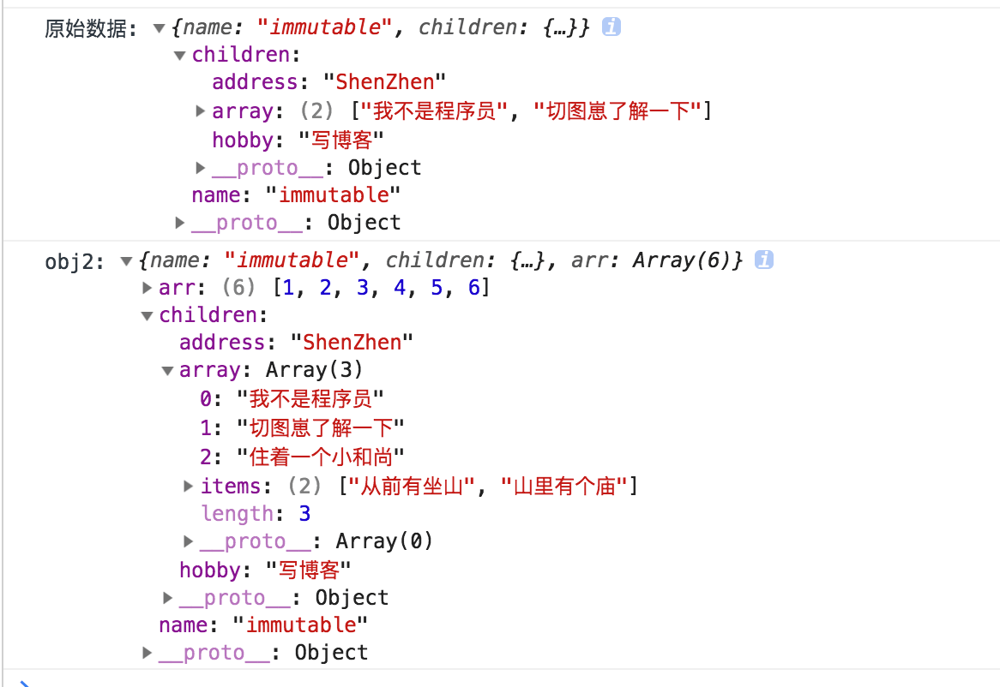

#### $apply 的使用:
+ `$apply` 基于当前值进行一个函数运算，从而得到新的值 ：
+ **注意** ：它必须是一个 `function` 哦！

```
  let obj={
    name:"immutable",
    children:{
      items:["从前有一坐山"],
      array: [1,2,3,4,5,6],
    }
  };
  let obj2 = update(obj,{
    name:{
      $apply:(val)=>("首席填坑官")
    },
    children:{
      items:{
        $apply:(val)=>{
          console.log("旧值",val);
          return [3,0,"住着一个小和尚"]
        }
      },
      array:{
        $apply:(val)=>(val.reverse()) //必须是一个函数
      }
    }
  });
  console.log("原始数据:",obj);
  console.log("obj2:",obj2);

```

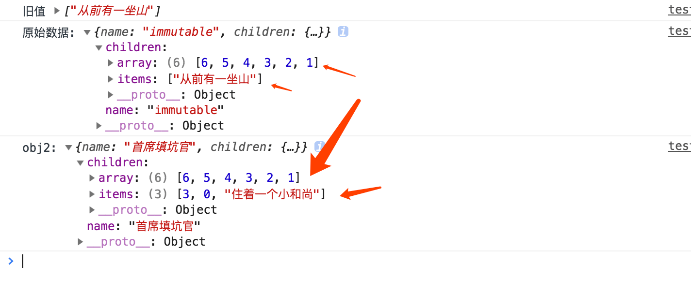
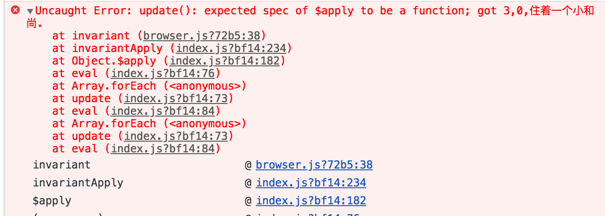

#### $remove 的使用:
+ `$remove` **一定一定** 要是使用`Set`、`Map` 创建的数组：
+ 要删除的值，必须是数组成存在的，如值不存在则忽略，`$remove:[2,666]`，2会删除，6则会被忽略;
+ 这个api有点奇怪，正常普通的数组 [],这样的删除不了！！；
+ 常见错误如下图：

```js
  let obj={
    name:"immutable",
    children:{
      array:new Set([1, 2, 3, 4, 4]),
    }
  };
  let obj2 = update(obj,{
    children:{
      array:{
        $remove:[2],
      },
    }
  });
  console.log("原始数据:",obj);
  console.log("obj2:",obj2);
```

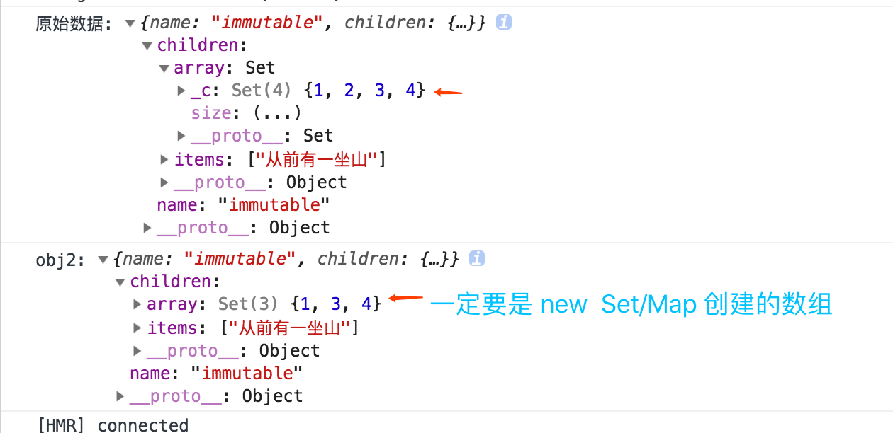
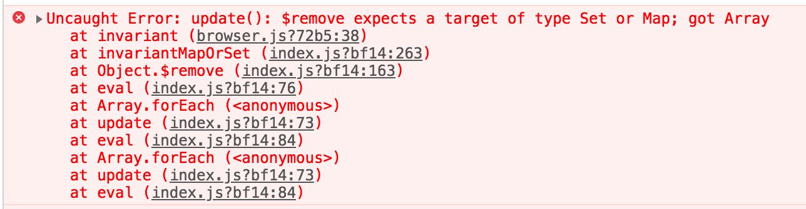

#### $add 的使用:
+ `$add` 跟刚才的 $remove 一样要使用Map/Set，$add方法也跟 `es6` `Map/Set`的 add方法一致：
+ 只是写的时候也要注意一些， [ [] ] ，嵌套！

```js
  let obj={
    name:"immutable",
    array:new Map([["a",1],["b",2]]),
  };
  let obj2 = update(obj,{
    array:{
      $add:[["66",56]],
    },
  });
  console.log("原始数据:",obj);
  console.log("obj2:",obj2);
  console.log("获取key a:",obj2.array.get('a'));

```

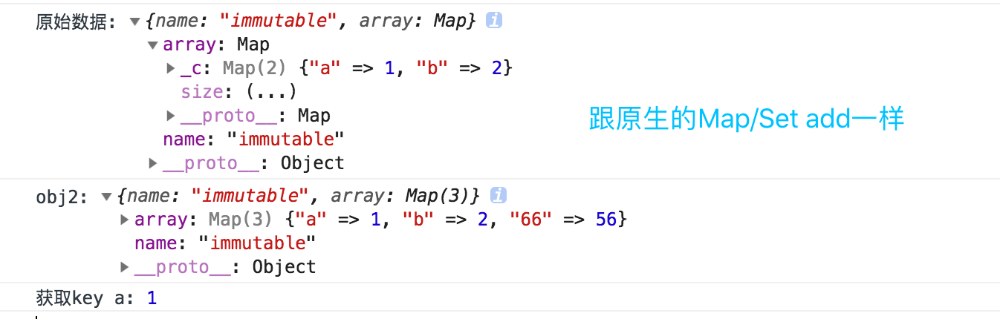

### Immutability Helpers的高阶用法：
 + 还可以自定义方法，如 定义一个 `$trinocular` 方法，来判断数组中的值；
 + 只是一个简单的示例，更多复杂的用法，可以自己去探索哦 [去官方 github 👈](https://github.com/kolodny/immutability-helper)
```
  update.extend('$trinocular', function(proportion, original) {
    return  original > 88 ? (original/proportion ): (proportion+original);
  });
  let array =[56,33,55,777,322,444,61,12,34,52,245];
  let array2 = array.map((k,v)=>update(k,{
    $trinocular:2
  }))
  console.log("原始数据:",array);
  console.log("array2:",array2);
```

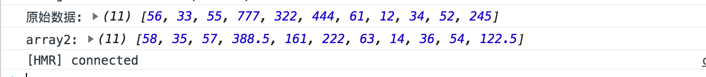

**总结** ：以上就是基础 API 的用法 ，添加了一些官方示例，没有讲到的组合使用，以及使用过程中，可能出现的一些错误，需要留意的地方，更多定制高级用法，有兴趣的同学可以自行了解一下。

　　以上就是今天为大家带来的分享，它可能没有 `immutable` 那么多功能，但贵在简洁，不会有太多的约束，如理解有误之处，欢迎各位大佬纠正，毕竟我还只是个宝宝——新手上路中！🤪。

　　下方是我弄的一个**公众号**，欢迎关注，以后文章会第一时间，在**公众号**上更新，原因是之前分享的有两篇文章，竟然被其他公众号抄袭了😭，前些天去更新发表的时候，微信提示我文章已经不是原创了检测到相同的文章，宝宝心里那个凉啊～，果断申诉告了对方(是一个培训学校公众号，好气哦)，补了掘金发布的链接和截图日期，万幸最后胜诉了🤗！


> 作者：苏南 - [首席填坑官](https://github.com/meibin08/ "首席填坑官")
>
> 来源：[@IT·平头哥联盟](https://honeybadger8.github.io/blog/ "@IT·平头哥联盟")
> 
> 链接：https://honeybadger8.github.io/blog/
> 
> 交流群：912594095[`资源获取/交流群`]、386485473(前端) 、260282062(测试)
>
> 本文原创，著作权归作者所有。商业转载请联系`@IT·平头哥联盟`获得授权，非商业转载请注明原链接及出处。 


