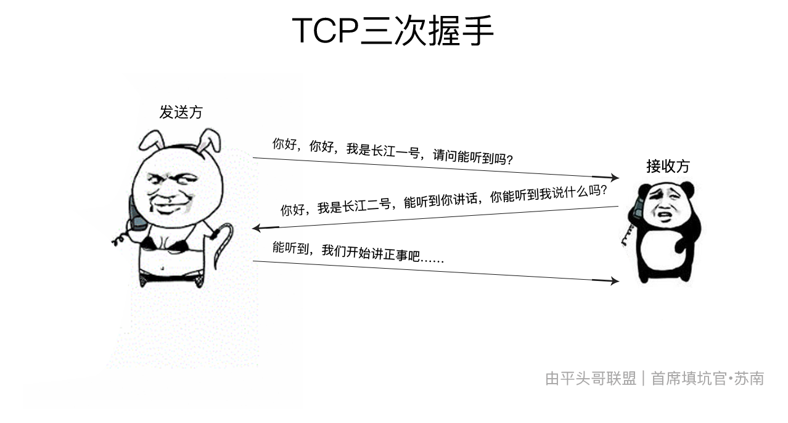
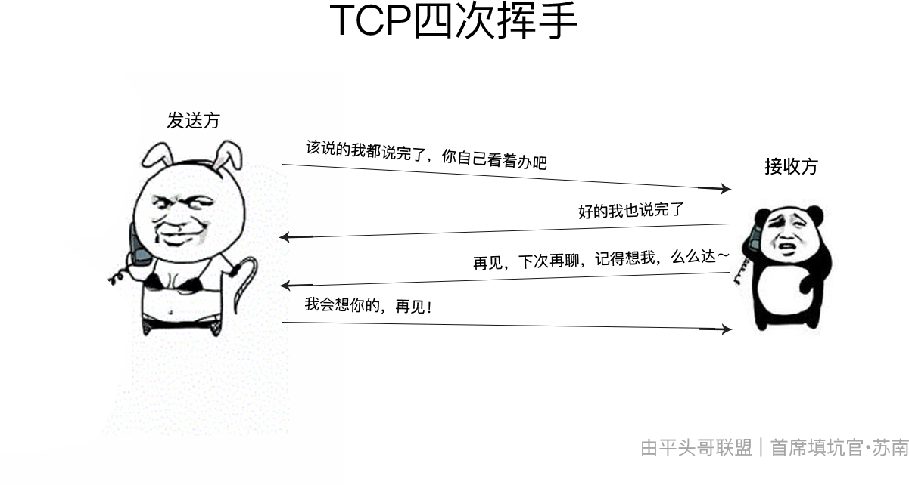
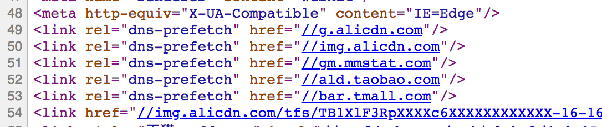
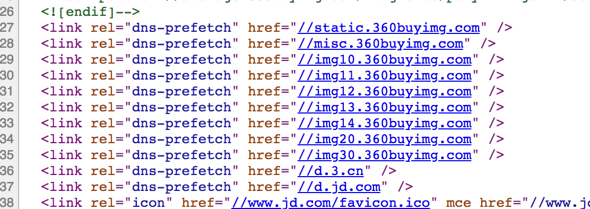
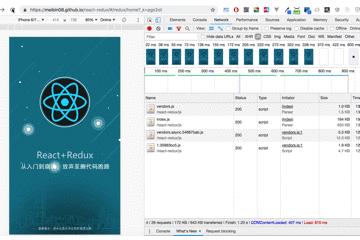

# 这些性能优化，你都做了吗？

> 作者：[首席填坑官∙苏南](https://github.com/meibin08/ "首席填坑官∙苏南") 
> 来源：[@IT·平头哥联盟](https://honeybadger8.github.io/blog/ "@IT·平头哥联盟") 
> 交流群：[912594095](https://shang.qq.com/wpa/qunwpa?idkey=265166274bca82709718a0ae1fa9c55d65dd3608ebc780f9e6ea41e2761f5ec2 "@IT·平头哥联盟QQ交流群")，本文原创，著作权归作者所有，转载请注明原链接及出处。

## 引言

​	大家好，这里是[@IT·平头哥联盟](https://honeybadger8.github.io/blog/ "@IT·平头哥联盟")，我是`首席填坑官`——[苏南](https://github.com/meibin08 "首席填坑官∙苏南")(South·Su)，今天是国庆节的第二天，这个假期没有外出(不要问我为什么，自己脑补～😭)，前些天分享了一篇[前端面试汇总](frontends/js/questions.md "那些年你踩过的坑，都在这里了～")的文章，有些同学在群里问了其中的一些细节，其中大家最关心的性能优化这块，今天整理了公司项目中的一些认为不错的点，跟大家一起分享，如有理解错误，请纠正。

## 优化概括

**1、**首先最基本的，`CSS`样式表放在页面头部Head内且`link`链式引入，javascript放在底部body结束标签前避免阻塞。

**2、**js/html/css/图片都做压缩合并，图片预加载、懒加载，也是老生常谈了，在这里推荐一个图片无损极限压缩的工具，能压小60～80%左右,比较麻烦的是每次要手动操作——[TinyPNG](https://tinypng.com/ "首席填坑官∙苏南")，有兴趣的同学了可以了解一下他们的API，自己封装一个服务调用压缩，不过免费次数有限制哦。

**3、**减少DOM元素数量，减少DOM的操作：
+ 减少 DOM 元素数量，合理利用:after、:before等伪类，避免页面过深的层级嵌套;
+ 优化javascript性能,减少DOM操作次数(或集中操作)，能有效规避页面`重绘/重排`;
+ 如何才算少？抱歉，这个没有办法给出一个标准精确的答案，只能说尽可能去做优化，如数据分页、首屏直出、按需加载等。

**4、**静态资源`CDN`分发：
+ CDN的意图就是尽可能的减少资源在转发、传输、链路抖动等情况下顺利保障信息的连贯性；
+ 通俗的讲就是`CDN`系统能够实时地根据网络流量和各节点的连接、负载状况以及到`用户的距离`和响应时间等综合信息将用户的请求重新导向离用户`最近的服务节点`上———曾经人们都说距离产生美，后来变了都说距离产生小三，在这里`距离产生的是用户跑路了`，所以足以说明CDN的`重要性`；
+ CDN采用各节点缓存的机制缓存很严重，当我们项目的静态资源(只是之前存放在cdn上的资源)修改后，如果CDN缓存没有做相应更新，则看到的还是旧的网页，解决的办法是刷新缓存，七牛云、腾讯云都可单独针对某个文件/目录进行刷新；
+ 广告常说：XX酒虽好，可不要贪杯哦，CDN托管也是如此，**合理**使用：图片、常用js组件、css重置样式等，即不常改动的文件即可走CDN，包括项目内的一些介绍页；
+ img标签要设置高宽,同样这么做它也能减少页面`重绘/重排`，使用 `WebP` 格式图片，它能对原图(png)做到近98%压缩，当然它也不是完美的：
> `WebP`最初在2010年发布，目标是减少文件大小，支持无损、有损压缩，动态、静态图片，压缩比率优于 GIF、JPEG、JPEG2000、PNG 等格式，非常适合用于网络等图片传输，现在开始已经被越来越多的浏览器支持，当然 WebP 格式也有它的缺点，算法相对其他格式更加复杂，会在节省流量资源的同时会占用计算资源，对计算机造成更大的负担,`WebP`支持的像素最大数量是16383x16383。有损压缩的WebP仅支持8-bit的`YUV4:2:0`格式。而无损压缩（可逆压缩）的WebP支持VP8L编码与8-bit之ARGB色彩空间。又无论是有损或无损压缩皆支持Alpha透明通道、ICC色彩配置、XMP诠释数据，更详细支持说明:[caniuse.com](https://caniuse.com/#search=webp) 
> 
> **优势**： 
 - **体积小**几乎可以毫不夸张的说，已经小的不能再小了； 
 - 小而美的同时，还质量好，几乎看不出来与原图差别； 
 - 曾经的动态图gif、jpeg压缩都会不清晰，但现在对它来说都是so easy～。 
>
> **缺点/困难**： 
 - 目前并不是所有浏览器都支持`WebP`，因此需要解决浏览器适配问题； 
 - 对于已上线的项目，采用`WebP`需要替换大量图片，工作量太大(不确定后台程序是否能搞定)。

**5、**域名拆分：
+ 什么叫拆分域名？很多公司初始项目搭建，都只申请了一个域名，站点的所有内容(html/php/jsp、js、css、img等都放在一个域名下)，域名拆分主要为了增加浏览器资源请求的并行度即并发问题，让浏览器能同时发起更多的请求，也解决了请求默认携带的cookie问题，减少了数据传输字节；
+ 如何拆分？以现在前后端分离式开发为例，建议分为三大类：
 - 前端类 - 项目业务本身的htm、css、js、图标/片等；
 - 静态类 - 即上述提到的CDN资源类；
 - 动态类 - 可归为后端API接口类；

!> 以下为各浏览器请求并发数，数据来源于`chorme搜索`，珍爱生命，远离某……🙏：

| 浏览器 | HTTP/1.1 | HTTP/1.0 |
| ------ | -------- | -------- |
| Chrome | 6        | 6        |
| 火狐   | 6        | 6        |
| Safari | 4        | 4        |
| IE11   | 6        | 6        |
| IE9    | 10       | 10       |
| ……     | ……       | ……       |

**6、** 减少http请求次数

+ 是的，你没有看错，就是减少http请求次数，节省网络请求时间，但你可能又会问，前面不是让拆分域名吗？？一个是部署拆分，一个是请求减少，没毛病哦；
+ 首先我们来了解一下http的请求过程（**简单通俗的阐述一下**）：
 - DNS 域名解析 - **`1.`** 拿出电话，找到某个接头人的号码；
 - 发起 TCP 的 3 次握手 - **`2.`** 接通后暗号：`A)`、你好，你好，我是长江一号，请问能听到吗？`B)`,你好，我是长江二号，能听到你讲话，你能听到我说什么吗？`A)`、能听到，我们开始讲正事吧……;
 - 正常数据传输中…… - **`3.`** 聊的很嗨；
 - 结束传输断链的 4 次挥手 - **`4.`** 聊完了，准备告别：`A)`、(可以是服务端，也可以是客户端)该说的我都说完了，你自己看着办吧；`B)`、好的我也说完了；`B)`、(B紧接着又跟A发了条信息)，再见；`A)`、然后A收到B的话，而B那边已经放下手机挂了，A等了一下听B没有再说啥，也就挂了(挂个毛啊，婊子无情，戏子无义，陪你唠嗑这么久，都不给个好评～😂)；
 - 当然，现在的`HTTP/2.0`的处理有所不同，2.0过程还有`TLS/SSL`的处理，HTTP是超文本传输协议，信息是明文传输，HTTPS则是具有安全性的SSL(Certificate Authority，申请证书)加密传输协议,HTTPS加密传输、身份认证的网络协议,内容传输经过完整性校验、内容经过对称加密，每个连接生成一个唯一的加密密钥、第三方无法伪造服务端(客户端)身份等众多优势，同时也有劣势因为做的事情多了中间对接的次数同样需要时间，这也是HTTPS更慢的根本原因。
 - **`上两图吧，这样大家看着清晰一些`**，但暂时只列了HTTP/1.0的，HTTP/2.0的图下次有时间再补，是有一个大佬指点我的哦，说这样看起来更骚气，大家会更喜欢，哈哈～：
 
 
> **结论**：从上面的这个过程可以看出，每一次请求都这么复杂，减少http的请求次数是不是很有必要呢？？答案是肯定的，我们会以以下几个维度来进行优化：
> - 合并 `JS、CSS` 文件；
> - 图片/图标 sprites 合并，或使用`iconfont`字体图标，或者`SVG Sprites`；[什么是Svg Sprites?](https://segmentfault.com/a/1190000016476981 "该如何以正确的姿势插入SVG Sprites?")；
> - 资源按需加载，即当前页面用到什么，就加载什么，避免加载与当前页面无关的事情，这一点现在的React/Vue/Angular等`MVVM`框架，基于webpack编译打包工具，做的很好；
> - 前端数据的缓存（如：一个列表页，进入详情，再返回，这个用户的交互行为是很频繁的，可以对列表的数据进度一个缓存，不用每次返回都进行加载，比如5分钟更新一次。

**7、** 数据设置缓存，好累写不动了，http缓存的设置，之前的面试汇总👉[如何设置http缓存？](frontends/js/questions.md?id=_11%e3%80%81%e5%a6%82%e4%bd%95%e8%ae%be%e7%bd%aehttp%e7%bc%93%e5%ad%98%ef%bc%9f )吧；
**8、** 站点服务端开启Gzip压缩，当然还可以了解一下Brotli 或 Zopfli ，据说 Brotli 比 Gzip 和 Deflate更有效，有兴趣的同学可以了解一下；
**8、** 避免重定向，尽量减少 iframe 使用，它会阻塞主页面的渲染;
**9、** 避免使用CSS Expression（css表达式)又称Dynamic properties(动态属性);
**10、** 合理使用dns-prefetch、prefetch、 preload、 defer、async：

 + `dns-prefetch`：使用dns-prefetch对项目中用到的域名进行 DNS 预解析，减少 DNS 查询，如： <link rel="dns-prefetch" href="//honeybadger8.github.io"/>；BAT各大巨头都是这么干的，请看下图，dns的详细解析过程今天先不讲了，码字码不动了，写分享比加班做项目还累，望体谅～；
 + `prefetch`： 它是一个优先级非常低的资源加载标识，浏览器会在空闲时(即主进程资源加载完成后)下载带有 `prefetch`标识的资源并缓存到disk，在后续模块使用到这个文件的时候，会直接从缓存读取；该功能webpack有个插件，配置后编译能自动插入到页面上;
 + `preload`：没错，它就是一个可以预加载资源的属性，详细说明请看官方[API](https://developer.mozilla.org/zh-CN/docs/Web/HTML/Preloading_content),一般情况下我们可能会对接下来的业务需要的audio、img、font、script等资源进行预先加载（甚至是下一个路由页面哦），这样能达到0秒打开页面的效果！
 
- 暂时就想到这么多了，欢迎补充……

## 总结：
+ 推荐几个工具：[WebPagetest](http://www.webpagetest.org/)、[Lighthouse](https://developers.google.com/web/tools/lighthouse/)、[SpeedCurve](https://speedcurve.com/)、[New Relic](https://newrelic.com/) 等主动/被动监测工具，都能高效帮助我们分析发现问题的所在，从而对症下药;
+ DNS预解析的是非重要的，它是一个url到解析IP，到查询根服务器的一个过程，可能会在下一次单独总结出来分享，有兴趣的同学也可以自行先了解一下，
+ `要把一个项目做好，每一个细节都很重要，希望今天的分享能给大家的工作带来些许帮助，谢谢！`

## 文章分享计划：
　　最近一直在思考，如何有规化的分享工作中的积累，国庆这些天也一直看了很多大神写的博客，最后综合自身的能力及时间，决定先尝试写一个**`# 动画 #`**系列文章，动画可能主要包含（`CSS/Canvas`）两部分，欢迎大家持续关注！ 
　　以上就是今天的分享，新手上路中，我会努力让自己变得更优秀、写出更好的文章，文章中有不对之处，烦请各位大神斧正。如果你觉得这篇文章对你有所帮助，请记得点赞哦～。

> 作者：苏南 - [首席填坑官](https://github.com/meibin08/ "首席填坑官")
>
> 来源：[@IT·平头哥联盟](https://honeybadger8.github.io/blog/ "@IT·平头哥联盟")
> 
> 链接：https://honeybadger8.github.io/blog/
> 
> 交流群：912594095[`资源获取/交流群`]、386485473(前端) 、260282062(测试)
>
> 本文原创，著作权归作者所有。商业转载请联系`@IT·平头哥联盟`获得授权，非商业转载请注明原链接及出处。 

