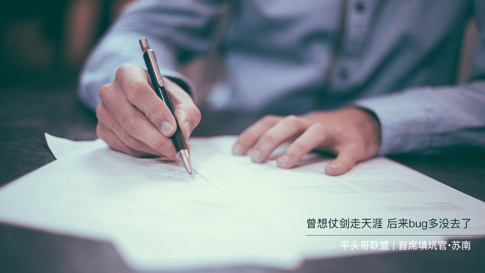

# 那些年你踩过的坑，都在这里了～

## 前言

　　前段时间面试(包括[阿里巴巴](https://segmentfault.com/u/susouth/articles "阿里巴巴")的电话面试)，遇到过一些试题，且面试中出现机率较高的提问/笔试，有些答的不是很好挂掉了，今天终于有时间整理出来分享给大家。

!> 内容主要分为两部分：`面试过程中遇到的`、`在复习过程中看到`认为值得加深巩固的; 如有理解的错误或不足之处，欢迎留言纠错、斧正，平头哥联盟∙首席填坑官，我是苏南(South·Su) ^_^～

大家好，这里是[平头哥联盟](https://honeybadger8.github.io/blog/ "平头哥联盟")，我是`首席填坑官`——[苏南](https://github.com/meibin08 "首席填坑官")(South·Su)，今天要给大家分享的是`SVG  Sprites`(也叫雪碧图)，所谓雪碧图，当然就不是我们常喝的雪碧饮料（Sprites）哦，哈哈～

> 作者：苏南 - [首席填坑官](https://github.com/meibin08/ "首席填坑官")
>
> 来源：[平头哥联盟](https://honeybadger8.github.io/blog/ "平头哥联盟")
>
> 交流群：386485473(前端) 、260282062(测试)
>
> 本文原创，著作权归作者所有。商业转载请联系作者获得授权，非商业转载请注明出处。

