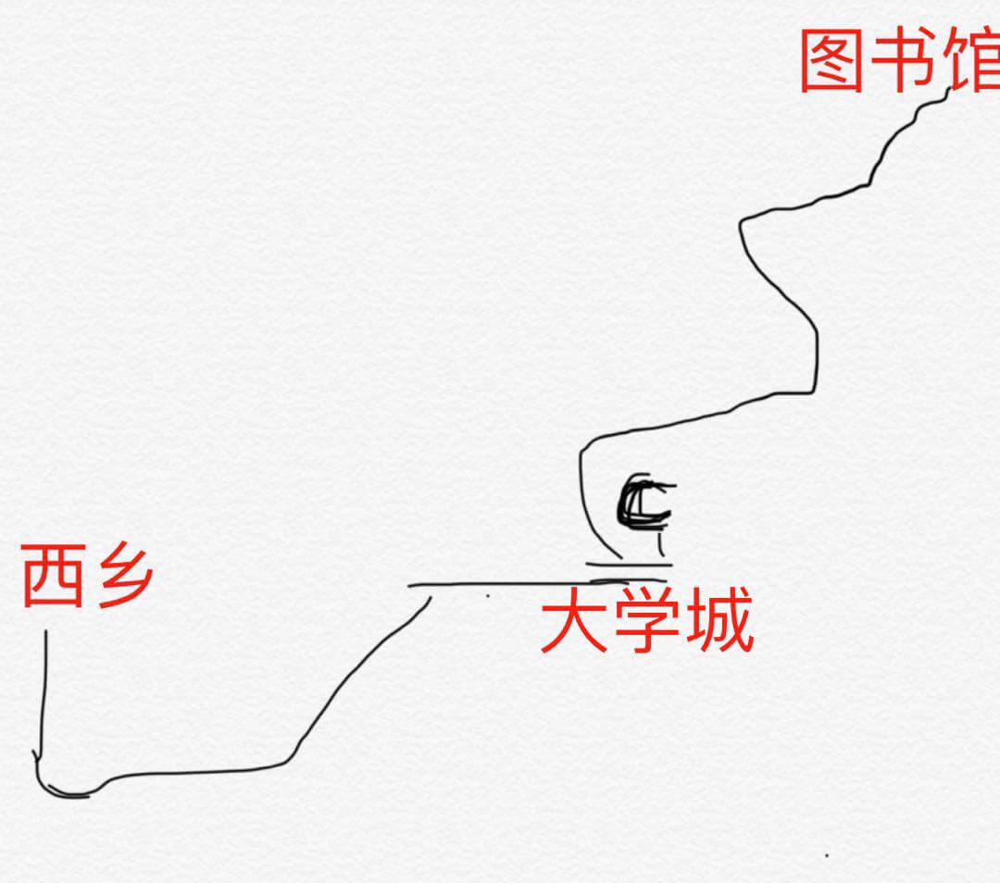

# 在图书馆学习红宝书的一天（一）· 你看那个Function好简单哦～


> 作者：[团宠闪光少女∙粉刷酱](https://github.com/cchah/ "团宠闪光少女∙粉刷酱")<br/>
> 来源：[@IT·平头哥联盟](https://honeybadger8.github.io/blog/ "@IT·平头哥联盟")<br/>
> 交流群：[912594095](https://shang.qq.com/wpa/qunwpa?idkey=265166274bca82709718a0ae1fa9c55d65dd3608ebc780f9e6ea41e2761f5ec2 "@IT·平头哥联盟QQ交流群")，本文原创，著作权归作者所有，转载请注明原链接及出处。

## 前言

　　大家好，这里是[@IT·平头哥联盟](https://honeybadger8.github.io/blog/ "@IT·平头哥联盟")，我是`团宠闪光少女`——[粉刷酱](https://github.com/cchah "团宠闪光少女")。今天去大学城看小哥哥们（哦，不 学习）了一天，深入了解了js中的Function函数，现在跟大家分享一下～


## 正式开讲
   
   不知道为什么正式开讲的时候，粉刷·灵魂画手·酱总觉得应该有个图，今天画点什么好呢，那就画一个去大学城的线路图吧～ 
   

#### 1.1 Fiction类型

   首先要明白函数的本质，明白了这一点，后面的一切都说的通了。每个函数都是Function类型的实例，函数其实就是一个对象，函数名实际上是一个指向函数对象的指针。所以说js中也没有重载就是这个原理。创建第二个函数时，实际上是将指向第一个函数的指针指向了第二个函数。

   函数定义的两种方式，函数声明和函数表达式。这两种方式又有什么区别呢？

```js
//函数声明
alert(sum(10, 10));
function sum (num1, num2) {
  return num1 + num2;
}
//正常弹出20

//函数表达式
alert(sum(10, 10));
var sum = function(num1, num2) {
  return num1 + num2;
}
//sum is not a function

```
   因为解析器有一个函数声明提升的过程，会率先读取函数声明，使其在执行之前可用。

   由于函数名本身就是变量，所以函数也可以作为值来使用。不仅可以作为参数一样传递给另一个函数，也可以作为另一个函数的返回结果。

```js
//例如扩展数组的sort()
function createComparisonFunction(propName) {
    return function(obj1, obj2){
        var value1 = obj1[propName];
        var value2 = obj2[propName];
            if (value1 < value2){
                  return -1;
            } else if (value1 > value2){
                 return 1;
            } else {
                return 0;
           }
      };
}            

var data = [{name: "Zachary", age: 28}, {name: "Nicholas", age: 29}];
data.sort(createComparisonFunction("name"));
alert(data[0].name); //Nicholas
data.sort(createComparisonFunction("age"));
alert(data[0].name); //Zachary

```


#### 1.2 函数内部属性

   函数内部的特殊对象：

   1、arguments：arguments保存函数参数；

   arguments有一个名叫callee的属性，指向拥有这个arguments对象的函数。

```js
//可以消除紧密耦合，例如使用阶乘函数时
function factorial(num){
  if (num <=1) {
    return 1;
  } else {
    return num * arguments.callee(num-1)
  }
}

```

   2、this引用的是函数据以执行的环境对象，全局作用域时，this对象引用的就是window

```js
window.color = "red";
var o = { color: "blue" };
function sayColor(){
  alert(this.color);
}

sayColor(); //red

o.sayColor = sayColor;
o.sayColor(); //blue

```

   3、caller: 这个属性中保存着调用当前函数的函数的引用，如果是在全局作用域中调用当前函数，它的值为 null .

```js
function outer(){
    inner();
}
function inner(){
    alert(arguments.callee.caller);
}
outer();
```

#### 1.3 函数属性和方法

   1、length：表示函数希望接受的明明参数的个数；
   
   2、call()和apply()：

   第一个参数是函数运行的作用域，apply()第二个参数可以是Array的实例，也可以是arguments对象，call()后面的参数必须是逐个列举出来的直接传递给函数；

   call()和apply()的真正强大的地方就是：扩充函数赖以运行的作用域。

```js
//扩充作用域栗子
window.color = "red";
var o = { color: "blue" };
function sayColor(){
  alert(this.color);
}

sayColor(); //red

sayColor.call(this);   //red
sayColor.call(window);   //red
sayColor.call(o);     //blue

//apply传参栗子
var values = [1, 2, 3, 4, 5, 6, 7, 8];
var max = Math.max.apply(Math, values);

```
   
   3、bind()：这个方法创建一个函数的实例，其this值会被绑定到传给bind()函数的值。

```js
//
window.color = "red";
var o = { color: "blue" };
function sayColor(){
  alert(this.color);
}

sayColor(); //red

sayColor.call(this);   //red
sayColor.call(window);   //red
sayColor.call(o);     //blue

```

   我们发现，这些函数都解除了对象与方法的耦合关系。js为了解耦合真的做了很多努力，这么让人感动，我想我以后不应该再面向工位编程了。

   以上～

   我成为团宠是靠的脸吗，当然不，还不是靠的妹纸少 hiahiahia~~
   
   喜欢我的话就关注我哟～～ 比心～～

   peace&love


> 作者：粉刷酱 - [团宠闪光少女](https://github.com/cchah "团宠闪光少女")
>
> 来源：[@IT·平头哥联盟](https://honeybadger8.github.io/blog/ "@IT·平头哥联盟")
> 
> 链接：https://honeybadger8.github.io/blog/
> 
> 交流群：912594095[`资源获取/交流群`]、386485473(前端) 、260282062(测试)
>
> 本文原创，著作权归作者所有。商业转载请联系`@IT·平头哥联盟`获得授权，非商业转载请注明链接及出处。 
   