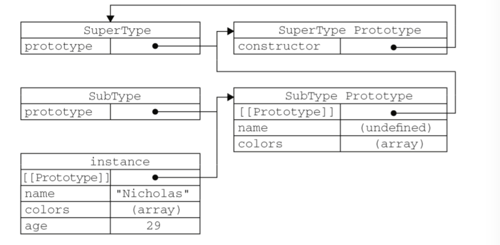

# 在图书馆学习红宝书的一天（三）· 没有对象面向也要学会继承～


> 作者：[团宠闪光少女∙粉刷酱](https://github.com/cchah/ "团宠闪光少女∙粉刷酱")<br/>
> 来源：[@IT·平头哥联盟](https://honeybadger8.github.io/blog/ "@IT·平头哥联盟")<br/>
> 交流群：[912594095](https://shang.qq.com/wpa/qunwpa?idkey=265166274bca82709718a0ae1fa9c55d65dd3608ebc780f9e6ea41e2761f5ec2 "@IT·平头哥联盟QQ交流群")，本文原创，著作权归作者所有，转载请注明原链接及出处。

## 前言

　　大家好，这里是[@IT·平头哥联盟](https://honeybadger8.github.io/blog/ "@IT·平头哥联盟")，我是`团宠闪光少女`——[粉刷酱](https://github.com/cchah "团宠闪光少女")。
    
   上次说原型和原型链的问题，后面还剩一点继承的问题，没有总结一下，所以坚持继续去图书馆看看书～～

## 正式开讲
   
   继承是面向对象的三大特征之一。继承就是让一个对象可以直接使用另一对象的属性和方法。js不是面向对象语言，但也有自己实现继承的方式。

#### 1.1 原型链

   原型链的基本思想是利用原型让一个引用类型继承另一个引用类型的属性和方法。让一个原型对象等于另一个类型的实例就可实现圆形链继承。

```js
function SuperType(){
    this.property = true;
}
SuperType.prototype.getSuperValue = function(){
    return this.property;
};
function SubType(){
    this.subproperty = false;
}

//继承了 SuperType，原来存在于SuperType的实例中的所有属性和方法，现在也存在于SubType.prototype
SubType.prototype = new SuperType();
var instance = new SubType();
alert(instance.getSuperValue());//true
```
   
   原型链继承存在两个问题。

   一、原型中的引用类型值的属性会被所有实例共享，通过原型来实现继承时，原型实际上会变成另一个类型的实例。于是，原先的实例属性就成了现在的原型属性。

   二、在创建子类型的实例时，不能向超类型的构造函数中传递参数。

#### 1.2 借用构造函数

   为解决原型中包含引用类型值所带来问题，可以使用一种叫做借用构造函数(constructor stealing)的技术(有时候也叫做伪造对象或经典继承)。

```js
function SuperType(){
    this.colors = ["red", "blue", "green"];
}
function SubType(){
//继承了 SuperType
    SuperType.call(this);
}
var instance1 = new SubType();
instance1.colors.push("black");
alert(instance1.colors);    //"red,blue,green,black"
var instance2 = new SubType();
alert(instance2.colors);    //"red,blue,green"
```

   使用 call()方法(或 apply()方法 也可以)，“借调”了超类型的构造函。在新创建的SubType实例的环境下调用了SuperType构造函数。这样就给实例赋予了自己的colors属性。

   借用构造函数有一个很大的优势，即可以在子类型构造函数中向超类型构造函数传递参数。

```js
function SuperType(name){
    this.name = name;
}
function SubType(){
//继承了 SuperType，同时还传递了参数 
    SuperType.call(this, "Nicholas");
//实例属性
    this.age = 29;
}
var instance = new SubType();
alert(instance.name);    //"Nicholas";
alert(instance.age);     //29
```

   借用构造函数的问题：无法避免构造函数模式存在的问题——方法都在构造函数中定义，因此函数复用就无从谈起了。而且，在超类型的原型中定义的方法，对子类型而言也是不可见的。

#### 1.3 组合继承

   组合继承(combination inheritance)，有时候也叫做伪经典继承，指的是将原型链和借用构造函数的技术组合到一起的一种继承模式。

   原型链实现对原型属性和方法的继承，借用构造函数来实现对实例属性的继承。

```js
function SuperType(name){
    this.name = name;
    this.colors = ["red", "blue", "green"];
}
SuperType.prototype.sayName = function(){
    alert(this.name);
}
        
function SubType(name, age){
    //继承属性 
    SuperType.call(this, name);   //第二次调用SuperType()
    this.age = age;
}
//继承方法
SubType.prototype = new SuperType();    //第一次调用SuperType()
SubType.prototype.constructor = SubType;  
SubType.prototype.sayAge = function(){
    alert(this.age);
};
var instance1 = new SubType("Nicholas", 29);
instance1.colors.push("black");
alert(instance1.colors);//"red,blue,green,black"
instance1.sayName();//"Nicholas";
instance1.sayAge();//29

var instance2 = new SubType("Greg", 27);
alert(instance2.colors);//"red,blue,green"
instance2.sayName();//"Greg";
instance2.sayAge();//27
```

   组合继承最大的问题就是无论什么情况下，都会调用两次超类型构造函数:一次是在创建子类型原型的时候，另一次是在子类型构造函数内部。但组合继承解决了上述两种继承的问题，依然是JavaScript中最常用的继承模式。
#### 1.4 原型式继承

```js 
function object(o){
    function F(){}
    F.prototype = o;
    return new F(); 
}
```

   上述代码相当于创建了o对象的一个浅拷贝副本。依然存在原型中的引用型值的共享问题。

   ECMAScript5通过新增Object.create()方法规范化了原型式继承。这个方法接收两个参数:一个用作新对象原型的对象和(可选的)一个为新对象定义额外属性的对象。在传入一个参数的情况下， Object.create()与 object()方法的行为相同。第二个参数指定属性，与Object.defineProperties()方法的第二个参数格式相同:每个属性都是通过自己的描述符定义的。这个属性覆盖原型对象上的同名属性。

```js 
var person = {
    name: "Nicholas",
    friends: ["Shelby", "Court", "Van"]
};
var anotherPerson = Object.create(person, {
    name: {
        value: "Greg"
    }
});
alert(anotherPerson.name); //"Greg"
```

#### 1.5 寄生式继承

   寄生式继承即创建一个仅用于封装继承过程的函数，该函数在内部以某种方式来增强对象，再样返回对象。

```js 
function createAnother(original){ 
    var clone=object(original); 
    clone.sayHi = function(){
        alert("hi");
    };
}
return clone;
```

   使用寄生式继承来为对象添加函数，会由于不能做到函数复用而降低效率。

#### 1.6 寄生组合式继承

   组合使用构造函数模式和原型模式

```js 
function inheritPrototype(subType, superType){
    var prototype = object(superType.prototype);
    prototype.constructor = subType;
    subType.prototype = prototype;
}

function SuperType(name){
    this.name = name;
    this.colors = ["red", "blue", "green"];
}
SuperType.prototype.sayName = function(){
    alert(this.name);
};
function SubType(name, age){
    SuperType.call(this, name);
    this.age = age;
}
inheritPrototype(SubType, SuperType);
SubType.prototype.sayAge = function(){
    alert(this.age);
};
```

   

   这个例子指定SubType的原型而为SuperType原型的一个副本，所以避免了在SubType.prototype上面创建不必要的、多余的属性。并且原型链还能保持不变。开发人员普遍认为寄生组合式继承是引用类型最理想的继承范式。

   以上～
   
   一起学习哟～～ 比心～～

   peace&love


> 作者：粉刷酱 - [团宠闪光少女](https://github.com/cchah "团宠闪光少女")
>
> 来源：[@IT·平头哥联盟](https://honeybadger8.github.io/blog/ "@IT·平头哥联盟")
> 
> 链接：https://honeybadger8.github.io/blog/
> 
> 交流群：912594095[`资源获取/交流群`]、386485473(前端) 、260282062(测试)
>
> 本文原创，著作权归作者所有。商业转载请联系`@IT·平头哥联盟`获得授权，非商业转载请注明链接及出处。 
   