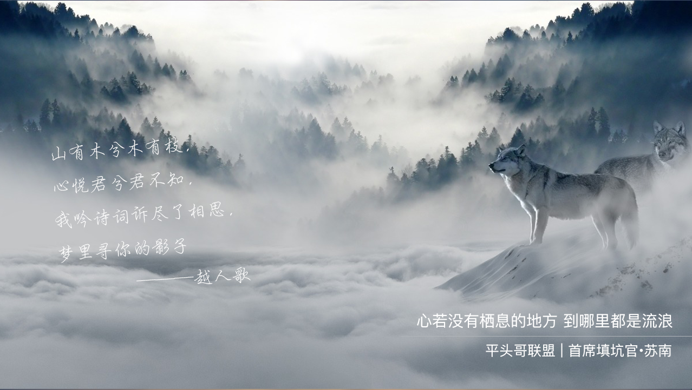

# 每周动画一点点——圆周运动时钟

　　大家好，这里是[平头哥联盟](https://honeybadger8.github.io/blog/ "平头哥联盟")，我是`首席填坑官`——[苏南](https://github.com/meibin08)(South·Su)，今天是国庆长假的最后一天，漫漫长假终于就这样混过去了，在朋友圈度过了一次`环球旅行`，收获颇多，领略了世界各国风情～

　　但对于心里只有工作,又热爱学习的我来说，再美好的风景也没有学习重要，于是就在家看起了canvas文档，虽然我热爱学习，但数学一直不好，折腾的我死去活来，最后还是慢慢查坚持下来也整了个clock ,在此与大家分享填坑记，并会持续学习下去，《`每周动画一点点`》是一个系列分享，这个过程并不会对canvas的API做过多的介绍，但也会讲一些哦，默认你已经有了一定javascrip基础并了解基本的canvas绘图API，并在此告诉你如何使用简单的数学与物理知识创建相当酷炫的动画，愿我们一起进步👍。

今天的分享就到这里，写了蛮久，最近才在开始尝试写博客，新手上路中，文章中有不对之处，烦请各位大神斧正。如果你觉得这篇文章对你有所帮助，请记得点赞哦～，想了解更多？[请猛戳这里！](https://github.com/meibin08/)

> 作者：苏南 - [首席填坑官](https://github.com/meibin08/ "首席填坑官")
>
> 来源：[平头哥联盟](https://honeybadger8.github.io/blog/ "平头哥联盟")
>
> 交流群：912594095[`资源获取/交流群`]、386485473(前端) 、260282062(测试)
>
> 本文原创，著作权归作者所有。商业转载请联系`平头哥联盟`获得授权，非商业转载请注明出处。 

