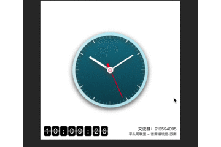
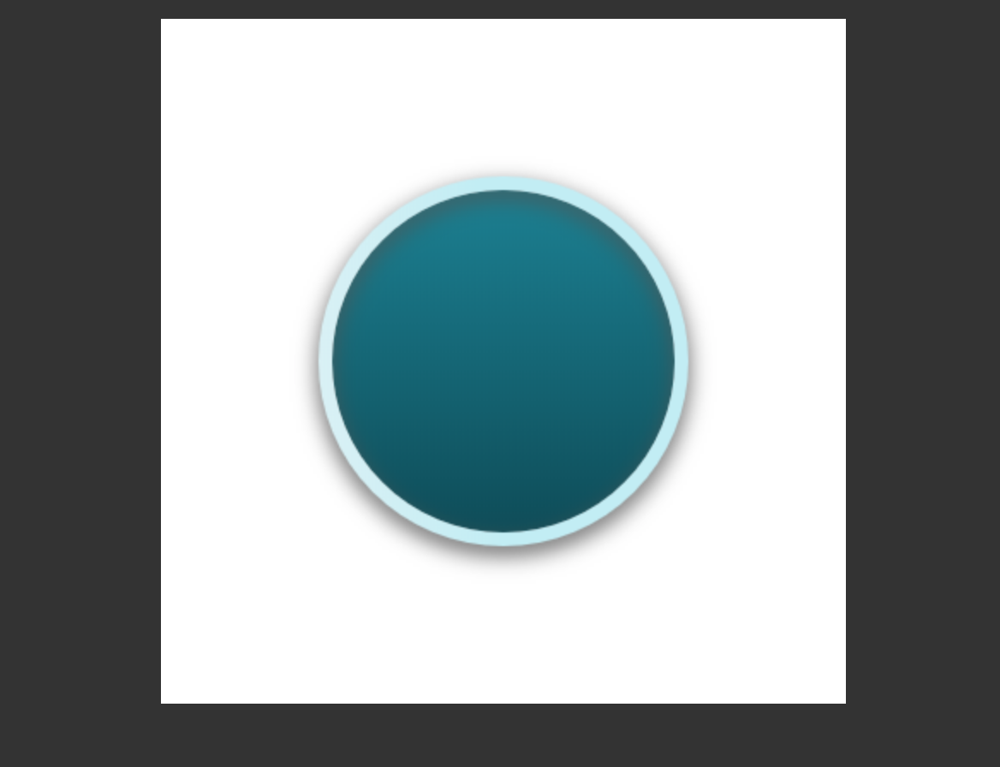
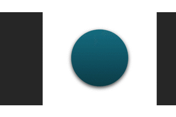
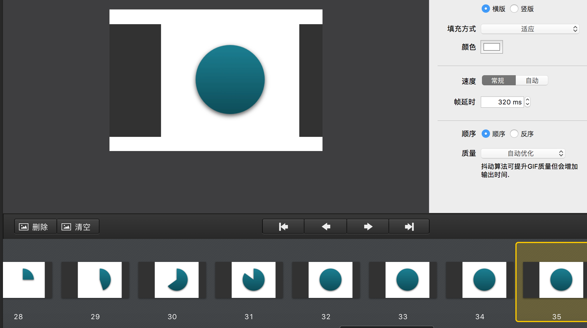
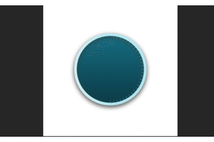
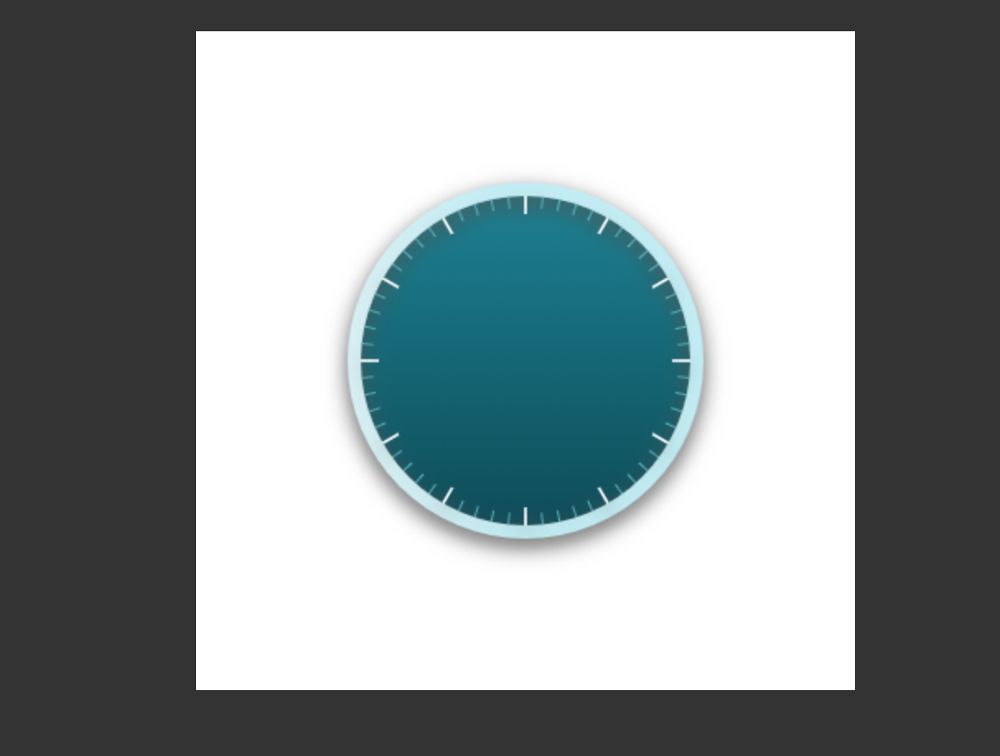

# 每周动画一点点——圆周运动时钟


　　大家好，这里是[平头哥联盟](https://honeybadger8.github.io/blog/ "平头哥联盟")，我是`首席填坑官`——[苏南](https://github.com/meibin08)(South·Su)，今天是国庆长假的最后一天，漫漫长假终于就这样混过去了，在朋友圈度过了一次`环球旅行`，收获颇多，领略了世界各国风情～


　　但对于心里只有工作,又热爱学习的我来说，再美好的风景也没有学习重要，于是就在家看起了canvas文档，虽然我热爱学习，但数学一直不好，折腾的我死去活来，最后还是慢慢查坚持下来也整了个clock ,在此与大家分享填坑记，并会持续学习下去，《`每周动画一点点`》是一个系列分享，这个过程并不会对canvas的API做过多的介绍，但也会讲一些哦，默认你已经有了一定javascrip基础并了解基本的canvas绘图API，并在此告诉你如何使用简单的数学与物理知识创建相当酷炫的动画，愿我们一起进步👍。以下就是效果：



　　从上图可以看出很简单，很普通的一个效果对不对？但它还是让我写的不少代码，可能是我方法不是很对，欢迎大佬们指正：

+ ### 画表盘：
　　canvas中文名中：画布，它就跟我们在纸上画画一样，画某样东西之前，我们要先学会构思、拆解你要思的东西，就跟汽车、手机等任务东西一样，一个成品都是由很多零件组成的，当你拆解开来，一点点完成再组装的，就会变的容易的多，
　　时钟在这里我的分解为如下：表盘、时针刻度、分/秒针刻度、时针、分针、秒针等大致6个部分组成，现在我们第一步要画的是表盘，
 + 把canvas的画笔的起点移动到当前画布的x/Y轴最中心点;
 + 为了效果炫酷一些，我们先加点阴影让它看起来不是那么平庸;
 + 大家都知道 `arc`这个API,画圆是的起点是从3点方向为起点的，时钟大多元素都是圆形、或围绕圆形组成的，那么为了方便计算，我们要把坐标旋转一下，让它从12点/0点为起点，这样会便于我们计算，这个时候要到rotate了，说到这个大家对CSS3里的rotate很熟悉吧？
 + 再给表盘加一个边框，嗯就8px的宽度吧，再粗就有点像暴发户了;
 + 准备工作做好，画一个表盘就很容易了，请看下图：

```js
    /**
    * 第一步 -- 绘制时钟的底盘：
    * @description：修正画布坐标,以画布中心为起点；并逆向旋转90度，因为圆是从3点钟方向为起点的，改为从12点方向为起始点;
    */
    this.ctx.save();
    this.ctx.clearRect(0, 0, this.W, this.H);
    this.ctx.translate(this.pointX,this.pointY);
    this.ctx.rotate(-Math.PI/2);//将坐标轴逆时针旋转90度，x轴正方向对准12点方向
    this.ctx.beginPath();
    this.ctx.shadowBlur=20;
    this.ctx.shadowColor="#555";
    this.ctx.shadowOffsetY=5;
    let gradientRound = this.ctx.createLinearGradient(90,0, -180,0);//createLinearGradient(x0,y0,x1,y1)
    gradientRound.addColorStop(0,"#117d90"); //从 0 ～ 1 两颜色过渡
    gradientRound.addColorStop(1, "#053842");
    this.ctx.fillStyle = gradientRound;
    this.ctx.arc(0,0,this.radius,0,Math.PI*2, false); 
    this.ctx.closePath();
    this.ctx.fill();

    //给时钟设置一个外边框
    this.ctx.beginPath();
    let linearGradient = this.ctx.createLinearGradient(0,-150,10,-10);
    linearGradient.addColorStop(0,"#e2f2f5");
    linearGradient.addColorStop(1, "#c1edf5");
    this.ctx.strokeStyle = linearGradient;
    this.ctx.lineWidth = 8;
    this.ctx.arc(0,0,this.radius+(this.ctx.lineWidth/2),0,Math.PI*2, false); 
    this.ctx.closePath();
    this.ctx.stroke();
```





!> 大家从最后一张图可以看出，它就是动画的分解，其实所谓的动画，也是由一张张静态图组成，然后快速过渡，让视觉形成了视差，最后欺骗了大脑，我看见动画了……


+ ### 时分秒刻度：
    看完画表盘的过程是不是觉得很简单呢？其实是的，只要我们能分析出它的难点，做起任何事来都非常简单，表盘画完，拉下来我们就要开始画`刻度`了，24小时：60分：60秒，其实有点扯了，分秒都是60，只画一个就好了😂，那么我们来看一下，该怎么画吧：

    + Math.PI = 3.14 = 180° ，2 * 180 也就是一个圆，那么一小时有60分;
    + Math.sin()和 Math.cos() 中的角度是弧度，弧度=弧长/半径;
    + 在这里，我用的是  2 * Math.PI / 60(秒) = 0.10471975511965977;每次旋转这个角度;

    + 以上就是分/秒的刻度，那么秒都画出来了，时的刻度还难吗？？当然是NO啦，60分/秒，24时但半圆也就是12个小时刻度，Math.PI / 6 = 0.5235987755982988;
    + 最后得出的结果：
```js
    /*
     * 第二步 -- 绘制时钟的刻度线：
     * @param {Number} singleAngle 每个刻度的角度;
     * @param {Number} markLen 刻度的数量
     * @param {Number} singleSize 每格刻度的尺寸，也是画笔的位置
     * @param {Number} singleLineW 每格刻度的大小宽度
     * @param {Number} singleColor 每格刻度颜色
     * @description：创建一个数组（秒针60、小时12）的数组;
     * π = 180°
     * Math.PI = 3.14 = 180°
     * 如上面的角度校正，要调整角度：-Math.PI/2 = -90;
     */
    let {singleAngle=30,markLen,singleSize=(this.radius*.93),singleLineW=.9,singleColor="#5dbaca"}=options;

    this.ctx.save();
    Array.from({length:markLen}).map((v,index)=>{
        let radian = Math.PI / singleAngle; //360 = 2 * Math.PI / singleAngle/2
        this.ctx.beginPath();
        this.ctx.strokeStyle=singleColor;
        this.ctx.lineWidth=singleLineW;
        this.ctx.rotate(radian);
        this.ctx.moveTo(singleSize,0);
        //开始的思路是用圆来画的，后来发现要多好几层遮罩，网上查了下资料，做了调整
        // this.ctx.arc(0,0, this.radius,(2*Math.PI / 360)*(index*singleAngle),(2*Math.PI / 360) *singleAngle*(index+1) , false);
        this.ctx.lineTo(Math.ceil(this.pointY/2),0);
        this.ctx.stroke();
        this.ctx.closePath();
    });
    this.ctx.restore();
```



今天的分享就到这里，写了蛮久，最近才在开始尝试写博客，新手上路中，文章中有不对之处，烦请各位大神斧正。如果你觉得这篇文章对你有所帮助，请记得点赞哦～，想了解更多？[请猛戳这里！](https://github.com/meibin08/)


> 作者：苏南 - [首席填坑官](https://github.com/meibin08/ "首席填坑官")
>
> 来源：[平头哥联盟](https://honeybadger8.github.io/blog/ "平头哥联盟")
>
> 交流群：912594095[`资源获取/交流群`]、386485473(前端) 、260282062(测试)
>
> 本文原创，著作权归作者所有。商业转载请联系`平头哥联盟`获得授权，非商业转载请注明出处。 


