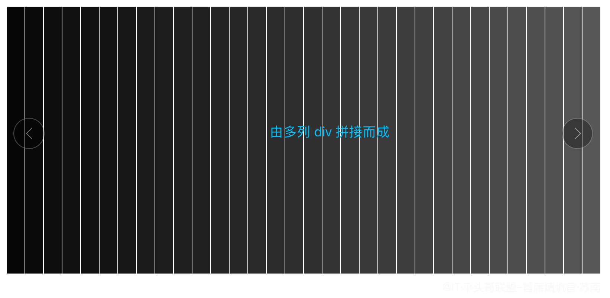
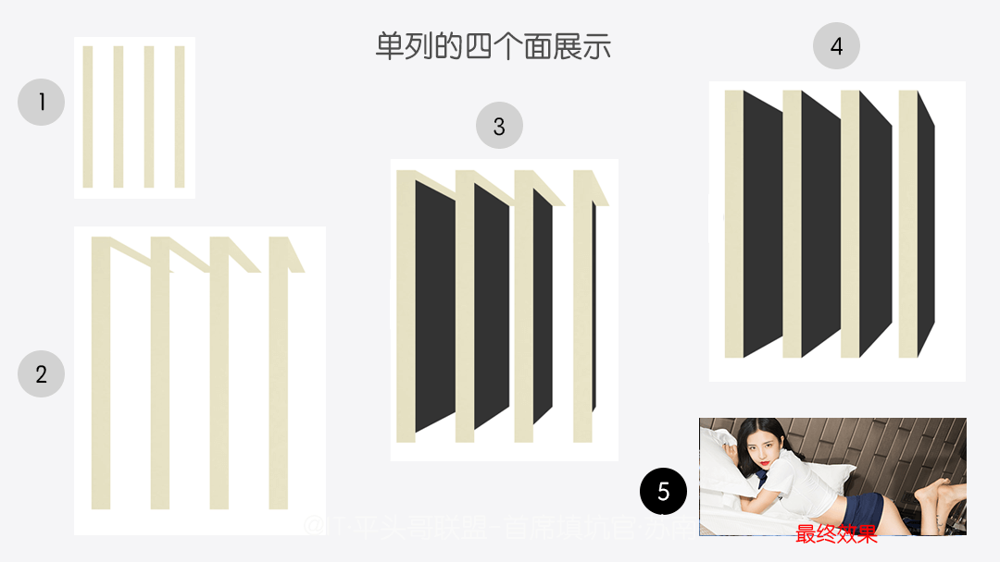
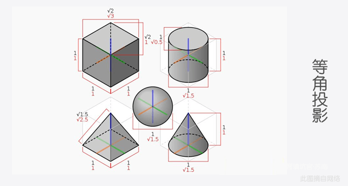
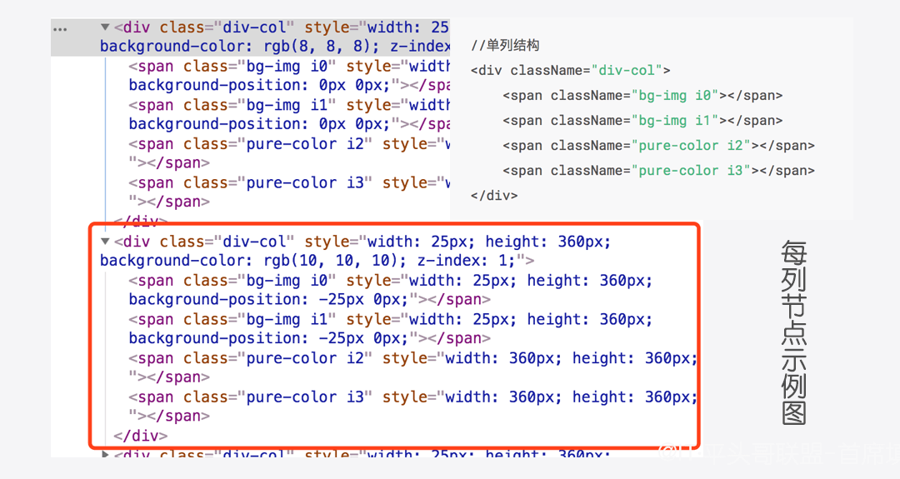

# 玩转3D Swiper性感秀之思路分析总结


## 前言

　　继一次的[3D魔方](https://blog.csdn.net/weixin_43254766 "如何用CSS3画出懂你的3D魔方？")之后，这次带你一起玩转性感美女秀，正常套路，请先一堵为快，有兴趣继续，没兴趣也可以看看美女养眼哦🤪！[想直接在线预览 👈](https://codepen.io/meibin08/pen/gBVggW "@IT·平头哥联盟-首席填坑官∙苏南分享，公众号：honeyBadger8")


## 回顾：
　　看过上次的`3D魔方`的同学对于本次的分析会有一定的帮助,当然如果大佬您本身就对`css3`就已经玩的很666了，那么对于下文的分解就请扮演`老师`的角色吧，小弟如有不足之处，欢迎斧正。
+ **[CSS3·画出最懂你的3D魔方](https://blog.csdn.net/weixin_43254766 "每周动画一点点之CSS3画出懂你的3D魔方")**
+ **[Canvas·手把手教你如何绘制一辆会跑车](https://blog.csdn.net/weixin_43254766/article/details/83267817 "每周动画一点点之手把手教你如何绘制一辆会跑车")** 

## 解析：

##### 创建列DIV ：
 + 从上图中我们能看出，每次旋转的动画是由多列小卡片组成的；
 + 每列根据它的下标，对背景进行位移，做到拼接的效果，整体看起来就成了一张图
 + 一起来看一下真像是啥样的：



```js

colNode(){
	//生成列的节点
	for (var i=0;i<this.colLen;i++){
		let iDivCol = document.createElement('div'); //列
		iDivCol.className = "div-col";
		iDivCol.style.width = this.colW+'px';
		iDivCol.style.height = this.cubeH+'px';
		iDivCol.style.zIndex = (i>this.colLen/2?this.colLen-i:i);
		this.swiperEle.appendChild(iDivCol);
	}
}

```

##### 立体感的构成 ：

 + 旋转的立体感是如何构成的呢？
 + 原理其实很简单，可以理解成每列都是一个`立体魔方`，它们都是相互独立的，
 + 每列 backgroundPosition：index*xcolW,进行一个位移，
 + 简单来说，即每列内部都有6个面组成，每个面都以父级为目标进行 position、transform等设置，
 + 一张图，让你看懂全世界：—— **图五为完成输出**



```js
//——[正、上、左、右]
for(var i = 0;i<4;i++){
	let dividingLine = i<2;
	let span = document.createElement('span');
	span.className = `${dividingLine?'bg-img':'pure-color'} i${i}`;
	span.style.width = `${dividingLine? this.colW:this.cubeH}px`;
	span.style.height = this.cubeH+'px';
	if(dividingLine){
		span.style.backgroundPosition = `-${index*this.colW}px 0`;
	};
	iDivCol.appendChild(span);
};
```

##### 单列的布局结构 ：
+ colNode方法中的 `zIndex`，需要注意一下，层级的调整，可以覆盖立体透视造成的影响，
+ 单列的html布局及重点样式，




```css
 /*四个面的样式*/
 ...省略N行
.div-col span.i1{
	/*top*/
	transform-origin:top;
	transform:translateZ(-360px) rotateX(90deg);
}
.div-col span.i2{
	/*left*/
	transform-origin: left;
	transform: rotateY(90deg);
}
.div-col span.i3{
	/*right*/
	transform-origin:left;
	transform:translateX(25px) rotateY(90deg);
}


```



##### 切换 ：
+ 布局完成后，我们只需要操控系列[`div-col`]来进行旋转即可，
+ 下图为 `transform-origin:50% 50% -180px`，即设置旋转的中心点：


+ 鼠标经过都实现了，上下页切换还远吗？
+ 之前创建结构的时候，我们已知div的列数，
+ 为了更好的装B，我们在旋转的时候，给每列都要添加一定延时`setTimeout`，得以达到缓冲的视差，
+ 然后`requestAnimationFrame`就该它出场了，`setInterval`已经成为过去式，
+ 同时旋转前，还要设置下一页，要显示的图片，
+ 当然记得旋转完成，后要重置角度哦。


```js

...省略N行
swiperAnimate(){
	const _requestAnimationFrame_ = window.requestAnimationFrame||window.WebkitRequestAnimationFrame;
	const iDivCol = this.swiperEle.querySelectorAll(".div-col");
	for(var i=0;i<iDivCol.length;i++){
		//让动画更逼真，给个过渡，当然也可以调整，requestAnimationFrame每次递增的值，
		iDivCol[i].style.WebkitTransition=`.8s -webkit-transform ease`;
		iDivCol[i].style.WebkitTransformOrigin=iDivCol[i].style.transformOrigin = "50% 50% -180px";
		this.animateMove(iDivCol[i],i,_requestAnimationFrame_);
	}
}
animateMove(Col,index,animationFrame){

	let ColNum =0;
	let spanSurface =  Col.querySelectorAll("span");
	//即将旋转到的面，展示的图片
	spanSurface[1].style.backgroundImage="url(./2.jpg)";
	setTimeout(()=>{
		//每列进行一个延时，以达到缓冲效果
		this.rotate(Col,0,spanSurface,animationFrame);

	},index*this.delayMilli);
}
...省略N行
```

##### 上下翻页 ：

+ 上面基本已实现了旋转的效果，再加一些修饰，
+ 上下点击切换的功能，注意的地方在于，防止重复点击，当前旋转中时不能点：
```js
pageDown(){
	if(this.status){
		console.log("下翻，不能点击")
		return ;
	};
	this.status = 1;
	this.pageNum = this.pageNum>=this.imageList.length ? 1 :++this.pageNum;
	this.swiperAnimate();
}
```


##### 预加载 ：
 + 因轮播图图片较多，且此示例的图片每次只加载了两张，故要对图片进行一个预加载，
 + 以及图片加载出错后的过滤，避免影响后续效果的呈现：

```js
preloadingImage(){
	this.imageList.map((k,v)=>{
		let imgNode = new Image();
		imgNode.onerror=err=>{
			this.imageList.splice(v,1);
		}
		imgNode.src = k;
	});
}

```


## 总结：

　　一个效果实现的方式有很多种，比如我们可以设置6个面，每设置一次，都是展示一张图，这样就不用每次旋转完后又去重置图片、角度等问题，包括`requestAnimationFrame`动画切换的过渡过程，也应该有更好的方式，新手上路中，欢迎各位大佬指点。以上就是今天为您带来的分享，你GET到了吗？如果觉得不错，记得给个赞哦，想第一时间获得最新分享，欢迎扫码关注我的个人`公众号`：honeyBadger8，👇！

 + [文章源码获取-> blog-resource 👈](https://github.com/honeybadger8/blog-resource "@IT·平头哥联盟")
 + [想直接在线预览 👈](https://codepen.io/meibin08/pen/gBVggW "@IT·平头哥联盟-首席填坑官∙苏南分享，公众号：honeyBadger8")

工作中积累的经验、填过的坑，希望能尽绵薄之力 助其他同学少走一些弯路")

> 作者：苏南 - [首席填坑官](https://github.com/meibin08/ "首席填坑官")
>
> 来源：[@IT·平头哥联盟](https://honeybadger8.github.io/blog/ "@IT·平头哥联盟")
> 
> 链接：https://blog.csdn.net/weixin_43254766
> 
> 交流：912594095、公众号：`honeyBadger8`
>
> 本文原创，著作权归作者所有。商业转载请联系`@IT·平头哥联盟`获得授权，非商业转载请注明原链接及出处。


