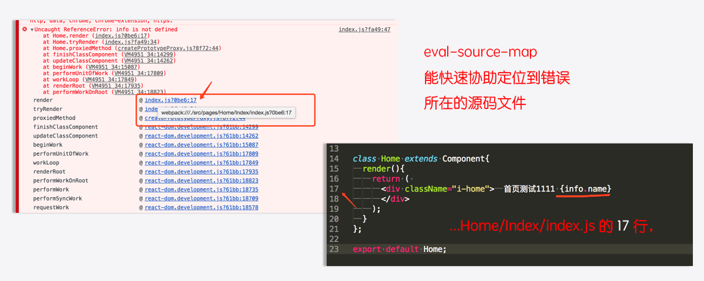

# webpack4配置详解之慢嚼细咽


## [前言](https://blog.csdn.net/weixin_43254766/article/details/83267838 "首席填坑官∙苏南的专栏,梅斌的专栏，webpack4，从0配置到项目搭建")

　　经常会有群友问起`webpack`、`react`、`redux`、甚至`create-react-app`配置等等方面的问题，有些是我也不懂的，慢慢从大家的相互交流中，也学到了不少。

​　　今天就尝试着一起来聊聊`Webpack`吧，旨在帮大家加深理解、新手更容易上路，都能从0到1搭建配置自定属于自己的脚手架，或对已封装好的脚手架有进一步的巩固，接下来苏南会详细讲解`webpack`中的每一个配置字段的作用(部分为`webpack4`新增)。

近两年，前端一直在以一个高速持续的过程发展，常常会有网友在调侃老了、学不动了，

虽是在调侃却又间接阐述着无奈，迫于生活的压力，不得不提速前行，

因为没有谁为你而停留，公司不会、社会不会、同伴不会……，停下可能将意味着淘汰 —— `理想很丰满，现实很骨感`，所以让我们一起进步，共同加薪，奋斗吧骚年，加油。。

～～吐槽过了，接着聊正事～～。
#### 　　原谅我控制不住自己，想问下各位，昨天刚刚过去的双十一你脱单了吗？


	
+ 人生若只如初见，何事秋风悲画扇； 
+ 等闲变却故人心，却道故人心易变； 
+ 骊山语罢清宵半，夜雨霖铃终不怨。

!> 各位大佬早安，这里是[@IT·平头哥联盟](https://honeybadger8.github.io/blog/ "@IT·平头哥联盟")，我是[首席填坑官∙苏南](https://github.com/meibin08 "首席填坑官∙苏南的专栏")，用心分享 做有温度的攻城狮。<br/>
公众号：`honeyBadger8`，群：912594095

## entry
+ 这个不用解释了，看名字就是知道，它就是通往天堂/地狱的`入口`，一切的苦难从这里开始，也从这里结束。
+ 简单介绍几种写法：

```javascript
//方式一：单文件写法
entry: {
	index: './src/pages/route.js',
	//about: './src/pages/about.js',
	//other:()=>{...}
}

//方式二：多文件写法
entry: {
	/*index:[
		'webpack-hot-middleware/client',
		'./src/root.js'
	],*/
	index: ['./src/root.js'],
	vendors : ['react','react-dom','redux','react-router','classnames'],
}
```


## output - 输出
+ 它位于对象最顶级键(非常重要)，如果说`entry`是一扇门，`output`就是审判官，决定着你是上天堂还是入地狱；
+ 指示 webpack 如何去输出、以及在哪里输出、输出的格式等；
+ `path`: 输出文件的目录，
+ `filename`:输出的文件名，它一般跟你`entry`配置相对应，如：`js/[name].js` name在这里表示的是[`index`、`vendors`]，
+ `chunkFilename`：块，配置了它，非入口`entry`的模块，会帮自动拆分文件，也就是大家常说的按需加载，与路由中的 `require.ensure`相互应
+ `publicPath`：文件输出的公共路径，
+ `pathinfo`：即保留相互依赖的包中的注释信息，这个基本不用主动设置它，它默认 `development` 模式时的默认值是 true，而在 `production` 模式时的默认值是 false，
+ 主要的就是这些，还有一些其他的`library`、`libraryTarget`、`auxiliaryComment`等,感兴趣的可自行了解，
```js
output: {
	path: path.resolve(__dirname, '../assets'),
	filename: 'js/[name].js',
	chunkFilename: 'js/[name].[chunkhash:8].js',
	publicPath: '/_static_/', //最终访问的路径就是：localhost:3000/_static_/js/*.js
	//pathinfo:true,
}
```

## hash
+ 常用的有三种：

| 模板     | 描述              |
| -------- | ----------------- |
| `hash`     | 模块标识符的hash,一般应用于`filename`：'[name].[hash].js'         |
| `chunkhash` | 按需分块内容的 hash，它是根据`chunk`自身的内容计算而来 |
| `contenthash` | 这个没有用过，看了下文档它是在提取css文件时根据内容计算而来的 hash ，结合`ExtractTextWebpackPlugin`插件使用 |
| hash长度 | 默认20，可自定:[hash:8]、[chunkhash:16] |

## mode 
+ 这个属于webpack4才新增的，4之前大家一般用`DefinePlugin`插件设置
+ mode：`development``，production`，`none`，
+ development : 开发模式，打包的代码不会被压缩，开启代码调试，
+ production : 生产模式，则正好反之。

```js 

//方法一
webpack --mode development/production

//方法二
……
mode:'development/production'
……

```

## devtool
+ 控制是否生成，以及如何生成 source map文件，开发环境下更有利于定位问题，默认 false,
+ 当然它的开启，也会影响编译的速度，所以**生产环境**一定一定记得关闭；
+ 常用的值：`cheap-eval-source-map`、`eval-source-map`、`cheap-module-eval-source-map`、`inline-cheap-module-source-map`等等，更详细的可以去[官方查看](https://webpack.js.org/concepts/ "webpack官方网站")；
+ 本人一般使用：`eval-source-map`较多，每个都有它不一样的特性，有兴趣的同学可以一一尝试，



## optimization
+ `optimization`是webpack4新增的，主要是用来让开发者根据需要自定义一些优化构建打包的策略配置，
+  `minimize`：true/false,告诉webpack是否开启代码最小化压缩，
+  `minimizer`：自定js优化配置，会覆盖默认的配置，结合`UglifyJsPlugin`插件使用，
+  `removeEmptyChunks`: bool 值，它检测并删除空的块。将设置为false将禁用此优化，
+  `removeEmptyChunks`: bool 值，它检测并删除空的块。将设置为false将禁用此优化，
+  `nodeEnv`：它并不是node里的环境变量，设置后可以在代码里使用 process.env.NODE_ENV === 'development'来判断一些逻辑，生产环境UglifyJsPlugin会自动删除无用代码，
+  `splitChunks` ：取代了`CommonsChunkPlugin`，自动分包拆分、代码拆分，详细默认配置：
+ 默认配置，只会作用于异步加载的代码块 —— chunks: 'async'，它有三个值：all,async,initial

```js
//环境变更也可以直接 在启动中设置
 //webpack --env.NODE_ENV=local --env.production --progress

//splitChunks 默认配置
splitChunks: {
  chunks: 'async',
  minSize: 30000,
  maxSize: 0,
  minChunks: 1,
  maxAsyncRequests: 5,
  maxInitialRequests: 3,
  automaticNameDelimiter: '~',
  name: true,
  cacheGroups: {
    vendors: {
      test: /[\\/]node_modules[\\/]/,
      priority: -10
    },
    default: {
      minChunks: 2,
      priority: -20,
      reuseExistingChunk: true
    }
  }
}
```
+ `runtimeChunk`: 提取 webpack 运行时代码,它可以设置为：boolean、Object
+ 该配置开启时，会覆盖 入口指定的名称！！！

```javascript

optimization: {
	runtimeChunk:true,//方式一
  runtimeChunk: {
    name: entrypoint => `runtimechunk~${entrypoint.name}` //方式二
  }
}

```


## resolve - 配置模块如何解析
+ `extensions`：自动解析确定的扩展,省去你引入组件时写后缀的麻烦，
+ `alias`：非常重要的一个配置，它可以配置一些短路径，
+ `modules`：webpack 解析模块时应该搜索的目录，
+ 其他 `plugins`、`unsafeCache`、`enforceExtension`，基本没有怎么用到，

```javascript

//extensions 后缀可以省略，
import Toast from 'src/components/toast'; 

// alias ,短路径
import Modal from '../../../components/modal' 
//简写
import Modal from 'src/components/modal' 


resolve: {
  extensions: ['.js', '.jsx','.ts','.tsx', '.scss','.json','.css'],
  alias: {
    src :path.resolve(__dirname, '../src'),
    components :path.resolve(__dirname, '../src/components'),
    utils :path.resolve(__dirname, '../src/utils'),
  },
  modules: ['node_modules'],
},

```

## module.rules - 编译规则，
+ `rules`：也就是之前的loaders，
+ `test` ： 正则表达式，匹配编译的文件，
+ `exclude`：排除特定条件，如通常会写`node_modules`，即把某些目录/文件过滤掉，
+ `include`：它正好与exclude相反，
+ use -`loader` ：必须要有它，它相当于是一个 `test` 匹配到的文件对应的解析器，`babel-loader`、`style-loader`、`sass-loader`、`url-loader`等等，
+ use - `options`：它与loader配合使用，可以是一个字符串或对象，它的配置可以直接简写在loader内一起，它下面还有`presets`、`plugins`等属性；
+ 具体来看一下示例：

```javascript

module: {
	rules: [
		{
			test: /\.(js|jsx)$/,
			exclude: /node_modules/,
			use: [
				{
					loader: 'babel-loader',
					options: {
						presets: [
							['env',
							{
								targets: {
								browsers: CSS_BROWSERS,
							},
						}],'react', 'es2015', 'stage-0'
						],
						plugins: [
							'transform-runtime',
							'add-module-exports',
						],
					},
				},
			],
		},
		{
			test: /\.(scss|css)$/,
			use: [
				'style-loader',
				{loader: 'css-loader',options:{plugins: [require('autoprefixer')({browsers: CSS_BROWSERS,}),],sourceMap: true}},
				{loader: 'postcss-loader',options:{plugins: [require('autoprefixer')({browsers: CSS_BROWSERS,}),],sourceMap: true}},
				{loader: 'sass-loader',options:{sourceMap: true}}
			]
		},
		{
			test: /\.(png|jpg|jpeg|gif)$/,
			exclude: /node_modules/,
			use: [
				{
					loader: 'url-loader?limit=12&name=images/[name].[hash:8].[ext]',
				},
			],
		},
		{
			test: /\.(woff|woff2|ttf|eot|svg)$/,
			exclude: /node_modules/,
			use: [
				{
					loader: 'file-loader?name=fonts/[name].[hash:8].[ext]',
				},
			],
		},
	],
},

```
## 项目中常用loader
+ babel-loader、awesome-typescript-loader js*/ts编译，
+ css-loader、postcss-loader、sass-loader、less-loader、style-loader 等css样式处理
+ file-loader、url-loader、html-loader等图片/svg/html等的处理，


## plugins - 插件
+ UglifyJsPlugin
+ HotModuleReplacementPlugin
+ NoEmitOnErrorsPlugin
+ HtmlWebPackPlugin
+ ExtractTextPlugin
+ PreloadWebpackPlugin
+ 等等，很多很多，插件的详解会留在下一章节详细介绍，欢迎持续关注。

## plugins/loader 区别
+ 新入门的一些同学可能会有些疑惑，不是有`loader`了吗？为什么还`plugins`呢，还要它做什么？
+ `loader`的作用在于解析文件，比如把`ES6`转换成`es5`,甚至`ES3`,毕竟还有万恶的`IE`嘛；把`Sass`、`Less`解析成`CSS`，给`CSS`自动加上兼容的前缀；对图片进行一个解析等等；
+ `plugins`呢？它在干啥？它在吹水、喝茶、嗑瓜子聊天，当然这是`loader`在没有把项目做完之前，`loader`下班时间就是`plugins`苦难的开始，它要对`loader`干的事情进行优化分类、提取精华(公共代码提取)、做压缩处理(js/css/html压缩)、输出指定的目录等……，反正也是很苦逼！

## webpack-dev-server
+ 这个有些老生常谈了，新手上路一般都有用它，
+ 公司因为现在是结合了 `微服务`，整套流程是结合：Dockerfile、nodejs、express等一起在线构建编译的，所以大部分项目都不会走`webpack-dev-server`；
+ 我们开发环境就是使用 `express` + `webpack-dev-middleware` + `webpack-hot-middleware`+ '...';
+ `contentBase` ：告诉服务(dev server)在哪里查找文件，默认不指定会在是当期项目根目录，
+ `historyApiFallback`:可以是`boolean`、 `object`，默认响应的入口文件，包括404都会指向这里，object见下面示例：
+ `compress`：启用 gzip 压缩，
+ `publicPath`：它其实就是 output.publicPath，当你改变了它，即会覆盖了`output`的配置，
+ `stats`： 可以自定控制要显示的编译细节信息，
+ `proxy`：它其实就是`http-proxy-middleware`，可以进行处理一些代理的请求。


```javascript

//方式一：不配置方式二的内容
 webpack-dev-server --config webpack/webpack.config.dev.js
//指定 端口： --port=8080 
//开启热更新：--hot
//gzip： --compress

//方式二
devServer : 
	contentBase:'./assets',
	host: '0.0.0.0',
	port: 9089,
	publicPath: '/assets/',
	historyApiFallback: {
		index: '/views/index.html'
	},
	/*
	匹配路径，进入不同的入口文件，
	rewrites: [
			{ from: /^\/$/, to: '/views/landing.html' },
			{ from: /^\/subpage/, to: '/views/subpage.html' },
			{ from: /./, to: '/views/404.html' }
		]
	}
	*/
	compress: true,
	noInfo: true,
	inline: true,
	hot: true,
	stats: {
		colors: true,
		chunks: false
	},
	proxy:{
		'/mockApi': 'https://easy-mock.com/project/5a0aad39eace86040263d' ,//请求可直接写成  /mockApi/api/login...
	}
}

```


## webpack4删除的点：
+ module.loaders
+ NoErrorsPlugin
+ CommonsChunkPlugin
+ DefinePlugin
+ OccurenceOrderPlugin
+ 欢迎补充……，平时用到的大概就是这些

## 尾声：

　　以上就是工作中react自定脚手架的配置总结，希望能对您有所帮助，webpack4的改动蛮大的，功能比之前强大了少，也简便了开发者很多的麻烦，效率大大提高，但同时也意味着我们对于底层的东西，了解的更少了，下一章节将为大家分享一些常用的插件/以及用法的分析，欢迎持续关注，记得点个赞哦，当然您能动动手指关注下方**公众号**就更棒了，谢谢支持！


> 作者：苏南 - [首席填坑官](https://github.com/meibin08/ "@IT·平头哥联盟-首席填坑官")
>
> 链接：https://blog.csdn.net/weixin_43254766/article/details/83758660
> 
> 交流：912594095、公众号：`honeyBadger8`
>
> 本文原创，著作权归作者所有。商业转载请联系`@IT·平头哥联盟`获得授权，非商业转载请注明原链接及出处。 


