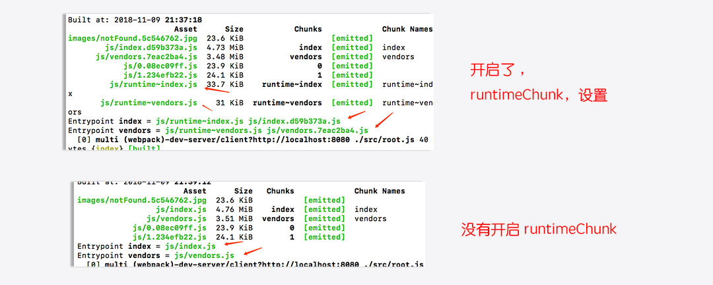

# webpack4配置详解之常用插件分享


## [前言](https://blog.csdn.net/weixin_43254766/article/details/83267838 "首席填坑官∙苏南的专栏,梅斌的专栏，webpack4，webpack：从入门到真实项目配置")

　　继上一次webpack的基础配置分享之后，本次将分享一些工作中项目常用的配置插件、也会包含一些自己了解过觉得不错的插件，如有分析不到位的，欢迎纠错，**嗯，这些东西文档都有，大佬可绕过**。

　　Wepack4之后废弃了很多的插件，这里只会讲解webpack4还支持的（`包含4之前插件`），已经废弃的交不再阐述。

　　上一次的分享之后，有部分网友留言质疑：骗小白的赞、是否原创、是否是抄别人等等，当然也有很多的网友支持和鼓励，不管褒贬，苏南都非常的感谢，是你们让我认识到自己的不足与优劣。

　　大家的留言，让我想起了自己刚入门前端初期的心酸，基本靠自己自学，没有人带，遇到问题像无头的苍蝇，到处乱撞网上一顿搜索，百度不曾欺我，在点了一个又一个的广告之后，翻过十页八页之后终于找到了问题的解决方案。

　　执着于对前端的热爱，常常一个问题卡到深夜，初入前端的我曾一度感叹在编辑器写一些东西，在网页上就能跑，甚至感叹 `js` 写上一个 `alert` hello world，浏览器就会自动弹出一个窗口，感觉全世界都在向你招手，当时的兴奋是难以形容的，甚至幻想着未来有一天，可能有千万、亿万的用户，在用你写的东西。

　　这几天一直在想，这篇插件的总结还是否要继续写下去？从写博客到今天，将近两个月吧，也算是一个新人，技术方面虽说工作了几年，但也不敢说多牛B，写博客的初衷是为了对自己工作中遇到的问题/心得等做一个总结，俗话说：好记性不如烂笔头；同时也希望能把自己遇到的问题、坑点分享给他人，让遇到同样问题的基友们能少走那么一点点弯路。

　　终于最后在想了很久之后明白，人无完人，百人百性、千人千面，不管你做总会有不同的声音，同样不管你分享什么，总会有人需要。所以走自己的路，让别人打车吧，坚持自己所想 努力成为自己想成为的样子，就是对自己最大的肯定 ———— **至曾经初入前端的我们**。


+ 去做想做的事，去爱值得的人； 
+ 去成为自己喜欢的模样， 
+ 去让自己发光！浑身充满力量，
+ 充实的日子最美好！

!> 各位早安，这里是[@IT·平头哥联盟](https://honeybadger8.github.io/blog/ "@IT·平头哥联盟")，我是[首席填坑官∙苏南](https://github.com/meibin08 "首席填坑官∙苏南的专栏")，用心分享 一起成长 做有温度的攻城狮。<br/>
公众号：`honeyBadger8`，群：912594095

## mini-css-extract-plugin

+ css-提取，看名字就懂提取css用的。
+ 在这之前我们可能会使用`extract-text-webpack-plugin`比较多一些，两者相比它有什么优势呢？
+ extract-text-webpack-plugin 它对css的提取，最终是根据你创建的实例、或者配置多个入口 chunk来的，
+ 比如你配置了一个入口文件，最终所有的css都会提取在一个样式文件里，
+ 如果你创建了多个`extract-text-webpack-plugin`实例，则会生成多个css的文件，
+ 而`mini-css-extract-plugin`，它默认就会对你的样式进行模块化拆分，嗯，有点跟`output`里的配置一个意思，异步按需加载，不再仅仅是js的特权;
+ 使用示例：
+ [插件地址](https://github.com/webpack-contrib/mini-css-extract-plugin "首席填坑官∙苏南的专栏分享")


```javascript
//extract-text-webpack-plugin 编译打包
config.module.rules.push({
  test: /\.(scss|css)$/,
  use: ExtractTextPlugin.extract({
	use: [
	  "css-loader",
	  { //首席填坑官∙苏南的专栏 交流：912594095、公众号：honeyBadger8
		loader: 'postcss-loader',
		options: {
		  plugins: [
			require('autoprefixer')({ //添加前缀
			  browsers: CSS_BROWSERS,
			}),
		  ],
		  minimize: true
		},
	  },
	  "sass-loader"
	]
  })
})
config.plugins.push(new ExtractTextPlugin({
  filename: 'css/[name].css',
  disable: false,
  allChunks: true,
}));


//mini-css-extract-plugin  编译打包
config.module.rules.push({
  test: /\.(scss|css)$/,//同时处理css/scss
	use: [
	  {
		loader: MiniCssExtractPlugin.loader,
	  },
	  "css-loader", //css处理器
	  {
		loader: 'postcss-loader',
		/*
			postcss 这个插件的作用在于，与已有的工具集成一起使用，很少有单独使用的情况，
			通用我们用的最多的，是配合 autoprefixer 来添加各浏览器的前缀，以达到更好的兼容，
			再深入一些就是 cssnext 就是允许开发者自定义属性和变量 ：     color:var(--theme-color,#42b983);
		*/
		options: {
		  plugins: [
			require('autoprefixer')({ 
			  browsers: CSS_BROWSERS,
			}),
		  ],
		},
	  },
	  "sass-loader" //sass处理器 、甚至还可以再加一个less的处理器
	]
})

config.plugins.push(new MiniCssExtractPlugin({
  filename: 'css/[name].css', //这里配置跟output写法一致
  chunkFilename: 'css/[id][chunkhash:8].css',
}));
config.plugins.push(new OptimizeCssAssetsPlugin({})); //压缩文件

```

## optimize-css-assets-webpack-plugin
+ 上面的示例里已经用到了，它的作用在于压缩css文件，
+ `assetNameRegExp`：默认是全部的css都会压缩，该字段可以进行指定某些要处理的文件，
+ `cssProcessor`：指定一个优化css的处理器，默认`cssnano`，
+ `cssProcessorPluginOptions`：cssProcessor后面可以跟一个process方法，会返回一个promise对象，而cssProcessorPluginOptions就是一个options参数选项！
+ `canPrint`：布尔，是否要将编译的消息显示在控制台，没发现有什么用！
+ **坑点** ：建议使用高版本的包，之前低版本有遇到样式丢失把各浏览器前缀干掉的问题，

```
new OptimizeCssAssetsPlugin({
  assetNameRegExp: /\.optimize\.css$/g,
  cssProcessor: require('cssnano'),
  cssProcessorPluginOptions: {
    preset: ['default', { discardComments: { removeAll: true } }],
    //autoprefixer: { browsers: CSS_BROWSERS }, 也是可以指定前缀的
  },
  canPrint: true
})
```


## SplitChunksPlugin、RuntimeChunkPlugin
+ 它们跟上一篇的`optimization`配置下的的`splitChunks`、`runtimeChunk`基本是一致的，；
+ SplitChunksPlugin、RuntimeChunkPlugin，其实就是webpack4之前`CommonsChunkPlugin`的替代品，用于提取一些公共模块；

```js
new webpack.optimize.SplitChunksPlugin({
		chunks: 'async', //要进行处理的类型，它有三个值：all,async,initial
	  minSize: 30000, //最少大小
	  maxSize: 0, //最大包的大小，超出生成新的包
  	minChunks: 1,  //至少要引用N次的模块，
	  maxAsyncRequests: 1,//最大的按需加载并行请求数量
		maxInitialRequests:1, //最大的初始化加载请求次数
    name: true, //可以指定
    ……,
    cacheGroups: { //配置缓存组，暂时项目没有配置过
    },
  }),
  new webpack.optimize.RuntimeChunkPlugin({
    name: 'manifest',
    name: entrypoint => `runtimechunk~${entrypoint.name}`
  })

```

## HotModuleReplacementPlugin
+ 热更新替换，在不刷新重载页面的情况下更换编辑修改后的代码：
+ 它只会更新改动过的内容，所以速度很快，几乎在自己刚改完，切到浏览器窗口内容就已经更新完了；
+ 使用 `HotModuleReplacementPlugin`插件后，它会暴露一个`module.hot`对象，它下面有很多的属性：
+ `accept`：它有两个参数，一个是授权模块(可以直接是单个文件路径、也可以是一个数组包含多个文件路径)，第二个参数，是回调函数，即更新后要做的逻辑处理。
+ `decline` 有点黑名单的意思，就是忽略一些模块，不更新它们，
+ `status` 当前更新的状态，idle、check、prepare、ready、dispose、apply、fail等；
+ 一般只用到 `accept` 最多，下面有个示例；


```js 

//webpack config
plugins:[
	new webpack.HotModuleReplacementPlugin()
]

//路由入口页
……
if (module.hot) {
	module
		.hot
		.accept([
			'./pages/routes'
		], (err) => {
			const NextRoute = require('./pages/routes')
			// 从DOM 中移除已经挂载的 React 组件 然后重装
			ReactDOM.unmountComponentAtNode(APP_DOM);
			ReactDOM.render(
				<Provider store={Store}>
					<Router routes={NextRoute} history={browserHistory}/>
				</Provider>, APP_DOM);
		});
}
……

```


## html-webpack-plugin
+ 这个插件相信大家都熟悉的不能再熟悉了,
+ 把编译后的文件（css/js）插入到入口文件中，可以只指定某些文件插入，可以对html进行压缩等
+ `filename`：输出文件名；
+ `template`：模板文件，不局限于html后缀哦；
+ `removeComments`：移除HTML中的注释；
+ `collapseWhitespace`：删除空白符与换行符，整个文件会压成一行；
+ `inlineSource`：插入到html的css、js文件都要内联，即不是以link、script的形式引入；
+ `inject`：是否能注入内容到 输出 的页面去；
+ `chunks`：指定插入某些模块；
+ `hash`：每次会在插入的文件后面加上hash ，用于处理缓存，如：<link href="/css/index.css?v=a6fc12dd5002c">；
+ 其他：favicon、meta、title ……；

```js

new HtmlWebPackPlugin({
  filename: path.resolve(__dirname, '../assets/index.html'), 
  template: path.resolve(__dirname,"../views/temp.html"),
  minify:{ //压缩HTML文件　
　　removeComments:true, 
　　collapseWhitespace:true 
	},
  inlineSource:  '.(js|css)',
  inject: false,
	chunks: ['vendors', 'index'], //首席填坑官∙苏南的专栏
	hash:true, 
	favicon、meta、title等都可以配置，页面内使用「<%= htmlWebpackPlugin.options.title %>」即可
	……
})

```

## uglifyjs-webpack-plugin
+ js代码压缩,默认会使用 optimization.minimizer，
+ `cache`: Boolean/String ,字符串即是缓存文件存放的路径；
+ `test`：正则表达式、字符串、数组都可以，用于只匹配某些文件，如：/\.js(\?.*)?$/i;
+ `parallel` : 启用多线程并行运行来提高编译速度，经常编译的时候听到电脑跑的呼呼响，可能就是它干的，哈哈～；
+ `output.comments` ： 删除所有注释，
+ `compress.warnings` ：插件在进行删除一些无用代码的时候，不提示警告，
+ `compress.drop_console`：喜欢打console的同学，它能自动帮你过滤掉，再也不用担心线上还打印日志了；
+ 等等，还有更多配置，想深入的同学可移步官方；

```js

//默认：
optimization:{
	minimizer:true
};

//自定义
minimizer: [
  new UglifyJsPlugin({
    cache: true,
    // cache: "assets", 
    parallel: true, //也可以指定 Number ,即最多并行运行数量
    sourceMap: true,
    uglifyOptions: {
      output: {
        comments: false,
        …… //首席填坑官∙苏南的专栏，QQ:912594095
      },
      compress: {
	      warnings: false,
	      drop_console:true,
	      …… 
	    }
    },
  }),
],

```

## BannerPlugin
+ 这个插件，它的作用在于某些时候，我们需要对文件添加一些说明，比如版本号，作者、日期等，
+ 它就可以帮到，每次编译，在头部插件一些注释；
+ 它可以直接是一个字符串，也可以是一个options;
+ 嗯，差点忘说了，它是webpack`自带`的一个插件，不用另外再安装依赖，

```js

//字符串：
new webpack.BannerPlugin('给文件添加一些信息，打包日期：'+ new Date());

//自定义
plugins: [
  new webpack.BannerPlugin({
  	{
		  banner: ' \n @item:苏南的项目 \n @author:suSouth \n @date:'+new Date()+' \n @description:苏南的项目 \n @version:'+package.version+'  \n', // 要输出的注释内容
		  test:string/正则/数组，//可用于匹配某些文件才输出，
		  entryOnly: boolean, // 即是否只在入口 模块 文件中添加注释；
		  ……
		}
  })
],

```


## 插件地址汇总：
+ [mini-css-extract-plugin](https://github.com/webpack-contrib/mini-css-extract-plugin "css处理插件")
+ [optimize-css-assets-webpack-plugin](https://github.com/NMFR/optimize-css-assets-webpack-plugin "首席填坑官∙苏南的专栏分享")
+ [html-webpack-plugin](https://github.com/jantimon/html-webpack-plugin "html处理，苏南的专栏")
+ [uglifyjs-webpack-plugin](https://github.com/webpack-contrib/uglifyjs-webpack-plugin "js压缩")
+ `runtimeChunk`: 提取 webpack 运行时代码,它可以设置为：boolean、Object
+ 该配置开启时，会覆盖 入口指定的名称！！！

```javascript

optimization: {
	runtimeChunk:true,//方式一
  runtimeChunk: {
	name: entrypoint => `runtimechunk~${entrypoint.name}` //方式二
  }
}

```



## resolve - 配置模块如何解析
+ `extensions`：自动解析确定的扩展,省去你引入组件时写后缀的麻烦，
+ `alias`：非常重要的一个配置，它可以配置一些短路径，
+ `modules`：webpack 解析模块时应该搜索的目录，
+ 其他 `plugins`、`unsafeCache`、`enforceExtension`，基本没有怎么用到，

```javascript

//extensions 后缀可以省略，
import Toast from 'src/components/toast'; 

// alias ,短路径
import Modal from '../../../components/modal' 
//简写
import Modal from 'src/components/modal' 


resolve: {
  extensions: ['.js', '.jsx','.ts','.tsx', '.scss','.json','.css'],
  alias: {
	src :path.resolve(__dirname, '../src'),
	components :path.resolve(__dirname, '../src/components'),
	utils :path.resolve(__dirname, '../src/utils'),
  },
  modules: ['node_modules'],
},

```

## module.rules - 编译规则，
+ `rules`：也就是之前的loaders，
+ `test` ： 正则表达式，匹配编译的文件，
+ `exclude`：排除特定条件，如通常会写`node_modules`，即把某些目录/文件过滤掉，
+ `include`：它正好与exclude相反，
+ use -`loader` ：必须要有它，它相当于是一个 `test` 匹配到的文件对应的解析器，`babel-loader`、`style-loader`、`sass-loader`、`url-loader`等等，
+ use - `options`：它与loader配合使用，可以是一个字符串或对象，它的配置可以直接简写在loader内一起，它下面还有`presets`、`plugins`等属性；
+ 具体来看一下示例：

```javascript

module: {
	rules: [
		{
			test: /\.(js|jsx)$/,
			exclude: /node_modules/,
			use: [
				{
					loader: 'babel-loader',
					options: {
						presets: [
							['env',
							{
								targets: {
								browsers: CSS_BROWSERS,
							},
						}],'react', 'es2015', 'stage-0'
						],
						plugins: [
							'transform-runtime',
							'add-module-exports',
						],
					},
				},
			],
		},
		{
			test: /\.(scss|css)$/,
			use: [
				'style-loader',
				{loader: 'css-loader',options:{plugins: [require('autoprefixer')({browsers: CSS_BROWSERS,}),],sourceMap: true}},
				{loader: 'postcss-loader',options:{plugins: [require('autoprefixer')({browsers: CSS_BROWSERS,}),],sourceMap: true}},
				{loader: 'sass-loader',options:{sourceMap: true}}
			]
		},
		{
			test: /\.(png|jpg|jpeg|gif)$/,
			exclude: /node_modules/,
			use: [
				{
					loader: 'url-loader?limit=12&name=images/[name].[hash:8].[ext]',
				},
			],
		},
		{
			test: /\.(woff|woff2|ttf|eot|svg)$/,
			exclude: /node_modules/,
			use: [
				{
					loader: 'file-loader?name=fonts/[name].[hash:8].[ext]',
				},
			],
		},
	],
},

```
## 项目中常用loader
+ babel-loader、awesome-typescript-loader js*/ts编译，
+ css-loader、postcss-loader、sass-loader、less-loader、style-loader 等css样式处理
+ file-loader、url-loader、html-loader等图片/svg/html等的处理，


## plugins - 插件
+ UglifyJsPlugin
+ HotModuleReplacementPlugin
+ NoEmitOnErrorsPlugin
+ HtmlWebPackPlugin
+ ExtractTextPlugin
+ PreloadWebpackPlugin
+ 等等，很多很多，插件的详解会留在下一章节详细介绍，欢迎持续关注。

## plugins/loader 区别
+ 新入门的一些同学可能会有些疑惑，不是有`loader`了吗？为什么还`plugins`呢，还要它做什么？
+ `loader`的作用在于解析文件，比如把`ES6`转换成`es5`,甚至`ES3`,毕竟还有万恶的`IE`嘛；把`Sass`、`Less`解析成`CSS`，给`CSS`自动加上兼容的前缀；对图片进行一个解析等等；
+ `plugins`呢？它在干啥？它在吹水、喝茶、嗑瓜子聊天，当然这是`loader`在没有把项目做完之前，`loader`下班时间就是`plugins`苦难的开始，它要对`loader`干的事情进行优化分类、提取精华(公共代码提取)、做压缩处理(js/css/html压缩)、输出指定的目录等……，反正也是很苦逼！

## webpack-dev-server
+ 这个有些老生常谈了，新手上路一般都有用它，
+ 公司因为现在是结合了 `微服务`，整套流程是结合：Dockerfile、nodejs、express等一起在线构建编译的，所以大部分项目都不会走`webpack-dev-server`；
+ 我们开发环境就是使用 `express` + `webpack-dev-middleware` + `webpack-hot-middleware`+ '...';
+ `contentBase` ：告诉服务(dev server)在哪里查找文件，默认不指定会在是当期项目根目录，
+ `historyApiFallback`:可以是`boolean`、 `object`，默认响应的入口文件，包括404都会指向这里，object见下面示例：
+ `compress`：启用 gzip 压缩，
+ `publicPath`：它其实就是 output.publicPath，当你改变了它，即会覆盖了`output`的配置，
+ `stats`： 可以自定控制要显示的编译细节信息，
+ `proxy`：它其实就是`http-proxy-middleware`，可以进行处理一些代理的请求。


```javascript

//方式一：不配置方式二的内容
 webpack-dev-server --config webpack/webpack.config.dev.js
//指定 端口： --port=8080 
//开启热更新：--hot
//gzip： --compress

//方式二
devServer : 
	contentBase:'./assets',
	host: '0.0.0.0',
	port: 9089,
	publicPath: '/assets/',
	historyApiFallback: {
		index: '/views/index.html'
	},
	/*
	匹配路径，进入不同的入口文件，
	rewrites: [
			{ from: /^\/$/, to: '/views/landing.html' },
			{ from: /^\/subpage/, to: '/views/subpage.html' },
			{ from: /./, to: '/views/404.html' }
		]
	}
	*/
	compress: true,
	noInfo: true,
	inline: true,
	hot: true,
	stats: {
		colors: true,
		chunks: false
	},
	proxy:{
		'/mockApi': 'https://easy-mock.com/project/5a0aad39eace86040263d' ,//请求可直接写成  /mockApi/api/login...
	}
}

```


## webpack4删除的点：
+ module.loaders
+ NoErrorsPlugin
+ CommonsChunkPlugin
+ DefinePlugin
+ OccurenceOrderPlugin
+ 欢迎补充……，平时用到的大概就是这些

## 尾声：

　　以上就是工作中react自定脚手架的配置总结，希望能对您有所帮助，webpack4的改动蛮大的，功能比之前强大了少，也简便了开发者很多的麻烦，效率大大提高，但同时也意味着我们对于底层的东西，了解的更少了，下一章节将为大家分享一些常用的插件/以及用法的分析，欢迎持续关注，记得点个赞哦，当然您能动动手指关注下方**公众号**就更棒了，谢谢支持！


> 作者：苏南 - [首席填坑官](https://github.com/meibin08/ "@IT·平头哥联盟-首席填坑官")
>
> 链接：https://blog.csdn.net/weixin_43254766/article/details/83758660
> 
> 交流：912594095、公众号：`honeyBadger8`
>
> 本文原创，著作权归作者所有。商业转载请联系`@IT·平头哥联盟`获得授权，非商业转载请注明原链接及出处。 


