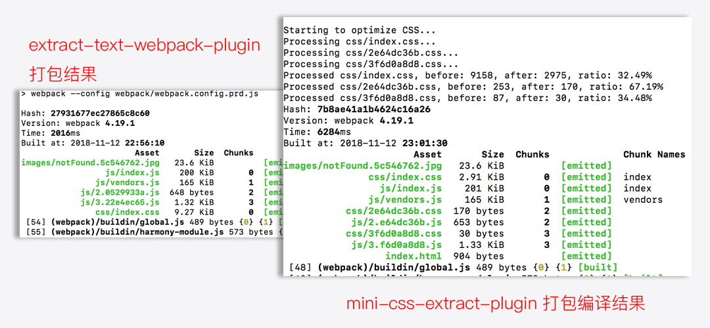
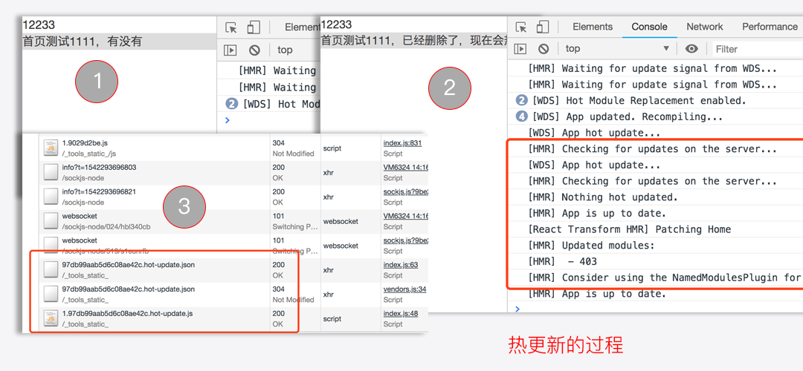
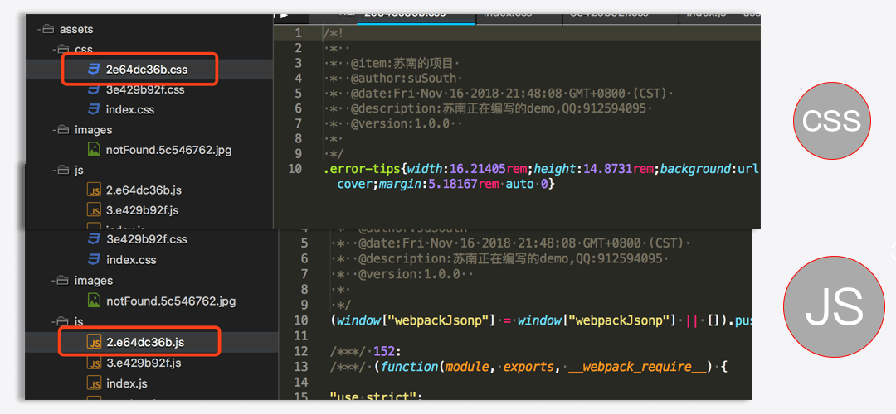
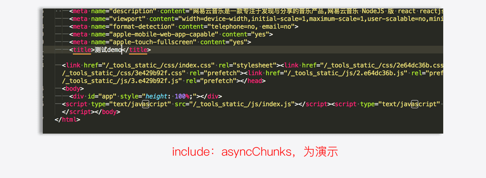
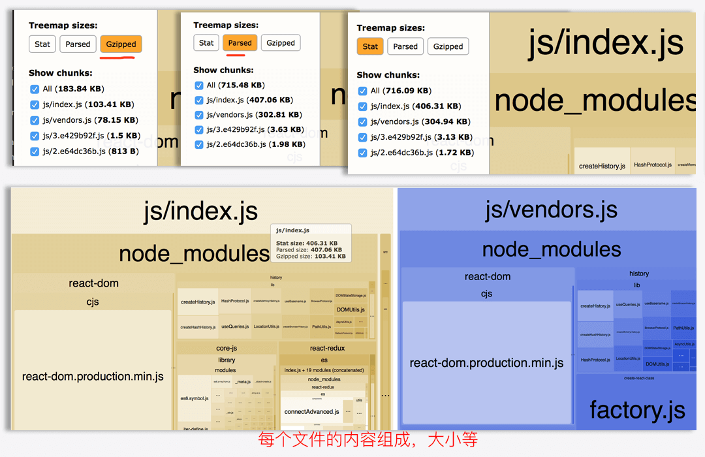

# webpack4配置详解之常用插件分享


## [前言](https://blog.csdn.net/weixin_43254766/article/details/83267838 "首席填坑官∙苏南的专栏,梅斌的专栏，webpack4，webpack：从入门到真实项目配置")

　　继上一次webpack的基础配置分享之后，本次将分享一些工作中项目常用的配置插件、也会包含一些自己了解过觉得不错的插件，如有分析不到位的，欢迎纠错，**嗯，这些东西文档都有，大佬可绕过**。

　　Wepack4之后废弃了很多的插件，这里只会讲解webpack4还支持的（`包含4之前插件`），已经废弃的将不再阐述。

　　上一次的分享之后，有部分网友留言质疑：骗小白的赞、是否原创、是否是抄别人等等，当然也有很多的网友支持和鼓励，不管褒贬，苏南都非常的感谢，是你们让我认识到自己的不足与优劣。

　　大家的留言，让我想起了自己刚入门前端初期的心酸，基本靠自己自学，没有人带，遇到问题像无头的苍蝇，到处乱撞网上一顿搜索，百度不曾欺我，在点了一个又一个的广告之后，翻过十页八页之后终于找到了问题的解决方案。

　　执着于对前端的热爱，常常一个问题卡到深夜，初入前端的我曾一度感叹在编辑器写一些东西，在网页上就能跑，甚至感叹 `js` 写上一个 `alert` hello world，浏览器就会自动弹出一个窗口，感觉全世界都在向你招手，当时的兴奋是难以形容的，甚至幻想着未来有一天，可能有千万、亿万的用户，在用你写的东西。

　　这几天一直在想，这篇插件的总结还是否要继续写下去？从写博客到今天，将近两个月吧，也算是一个新人，技术方面虽说工作了几年，但也不敢说多牛B，写博客的初衷是为了对自己工作中遇到的问题/心得等做一个总结，俗话说：好记性不如烂笔头；同时也希望能把自己遇到的问题、坑点分享给他人，让遇到同样问题的基友们能少走那么一点点弯路。

　　终于最后在想了很久之后明白，人无完人，百人百性、千人千面，不管你做总会有不同的声音，同样不管你分享什么，总会有人需要。所以走自己的路，让别人打车吧，坚持自己所想 努力成为自己想成为的样子，就是对自己最大的肯定 ———— **至曾经初入前端的我们**。


+ 去做想做的事，去爱值得的人； 
+ 去成为自己喜欢的模样， 
+ 去让自己发光！浑身充满力量，
+ 充实的日子最美好！

!> 各位早安，这里是[@IT·平头哥联盟](https://honeybadger8.github.io/blog/ "@IT·平头哥联盟")，我是[首席填坑官∙苏南](https://github.com/meibin08 "首席填坑官∙苏南的专栏")，用心分享 一起成长 做有温度的攻城狮。<br/>
公众号：`honeyBadger8`，群：912594095

## mini-css-extract-plugin

+ css-提取，看名字就懂提取css用的。
+ 在这之前我们可能会使用`extract-text-webpack-plugin`比较多一些，两者相比它有什么优势呢？
+ extract-text-webpack-plugin 它对css的提取，最终是根据你创建的实例、或者配置多个入口 chunk来的，
+ 比如你配置了一个入口文件，最终所有的css都会提取在一个样式文件里，
+ 如果你创建了多个`extract-text-webpack-plugin`实例，则会生成多个css的文件，
+ 而`mini-css-extract-plugin`，它默认就会对你的样式进行模块化拆分，嗯，有点跟`output`里的配置一个意思，异步按需加载，不再仅仅是js的特权;


```javascript
//extract-text-webpack-plugin 编译打包
config.module.rules.push({
  test: /\.(scss|css)$/,
  use: ExtractTextPlugin.extract({
	use: [
	  "css-loader",
	  { //首席填坑官∙苏南的专栏 交流：912594095、公众号：honeyBadger8
		loader: 'postcss-loader',
		options: {
		  plugins: [
			require('autoprefixer')({ //添加前缀
			  browsers: CSS_BROWSERS,
			}),
		  ],
		  minimize: true
		},
	  },
	  "sass-loader"
	]
  })
})
config.plugins.push(new ExtractTextPlugin({
  filename: 'css/[name].css',
  disable: false,
  allChunks: true,
}));


//mini-css-extract-plugin  编译打包
config.module.rules.push({
  test: /\.(scss|css)$/,//同时处理css/scss
	use: [
	  {
		loader: MiniCssExtractPlugin.loader,
	  },
	  "css-loader", //css处理器
	  {
		loader: 'postcss-loader',
		/*
			postcss 这个插件的作用在于，与已有的工具集成一起使用，很少有单独使用的情况，
			通用我们用的最多的，是配合 autoprefixer 来添加各浏览器的前缀，以达到更好的兼容，
			再深入一些就是 cssnext 就是允许开发者自定义属性和变量 ：     color:var(--theme-color,#42b983);
		*/
		options: {
		  plugins: [
			require('autoprefixer')({ 
			  browsers: CSS_BROWSERS,
			}),
		  ],
		},
	  },
	  "sass-loader" //sass处理器 、甚至还可以再加一个less的处理器
	]
})

config.plugins.push(new MiniCssExtractPlugin({
  filename: 'css/[name].css', //这里配置跟output写法一致
  chunkFilename: 'css/[id][chunkhash:8].css',
}));
config.plugins.push(new OptimizeCssAssetsPlugin({})); //压缩文件

```

## optimize-css-assets-webpack-plugin
+ 上面的示例里已经用到了，它的作用在于压缩css文件，
+ `assetNameRegExp`：默认是全部的css都会压缩，该字段可以进行指定某些要处理的文件，
+ `cssProcessor`：指定一个优化css的处理器，默认`cssnano`，
+ `cssProcessorPluginOptions`：cssProcessor后面可以跟一个process方法，会返回一个promise对象，而cssProcessorPluginOptions就是一个options参数选项！
+ `canPrint`：布尔，是否要将编译的消息显示在控制台，没发现有什么用！
+ **坑点** ：建议使用高版本的包，之前低版本有遇到样式丢失把各浏览器前缀干掉的问题，

```
new OptimizeCssAssetsPlugin({
  assetNameRegExp: /\.optimize\.css$/g,
  cssProcessor: require('cssnano'),
  cssProcessorPluginOptions: {
    preset: ['default', { discardComments: { removeAll: true } }],
    //autoprefixer: { browsers: CSS_BROWSERS }, 也是可以指定前缀的
  },
  canPrint: true
})
```


## SplitChunksPlugin、RuntimeChunkPlugin
+ 它们跟上一篇的`optimization`配置下的的`splitChunks`、`runtimeChunk`基本是一致的，；
+ SplitChunksPlugin、RuntimeChunkPlugin，其实就是webpack4之前`CommonsChunkPlugin`的替代品，用于提取一些公共模块；
+ `chunks`：要进行处理的类型，它有三个值：all,async,initial
+ `minSize`：最少大小
+ `maxSize`：最大包的大小，超出生成新的包
+ `minChunks`：至少要引用N次的模块，
+ `maxAsyncRequests`：最大的按需加载并行请求数量
+ `maxInitialRequests`：最大的初始化加载请求次数


```js
new webpack.optimize.SplitChunksPlugin({
		chunks: 'async', 
	  minSize: 30000, 
	  maxSize: 0, 
  	minChunks: 1,  
	  maxAsyncRequests: 1,
		maxInitialRequests:1, 
    name: true, //可以指定
    ……,

  }),
  new webpack.optimize.RuntimeChunkPlugin({
    name: 'manifest',
    name: entrypoint => `runtimechunk~${entrypoint.name}` //动态文件名
  })

```

## HotModuleReplacementPlugin
+ 热更新替换，在不刷新重载页面的情况下更换编辑修改后的代码：
+ 它只会更新改动过的内容，所以速度很快，几乎在自己刚改完，切到浏览器窗口内容就已经更新完了；
+ 使用 `HotModuleReplacementPlugin`插件后，它会暴露一个`module.hot`对象，它下面有很多的属性：
+ `accept`：它有两个参数，一个是授权模块(可以直接是单个文件路径、也可以是一个数组包含多个文件路径)，第二个参数，是回调函数，即更新后要做的逻辑处理。
+ `decline` 有点黑名单的意思，就是忽略一些模块，不更新它们，
+ `status` 当前更新的状态，idle、check、prepare、ready、dispose、apply、fail等；
+ 一般只用到 `accept` 最多，下面有个示例；



```js 

//webpack config
plugins:[
	new webpack.HotModuleReplacementPlugin()
]

//路由入口页
……
if (module.hot) {
	module
		.hot
		.accept([
			'./pages/routes'
		], (err) => {
			const NextRoute = require('./pages/routes')
			// 从DOM 中移除已经挂载的 React 组件 然后重装
			ReactDOM.unmountComponentAtNode(APP_DOM);
			ReactDOM.render(
				<Provider store={Store}>
					<Router routes={NextRoute} history={browserHistory}/>
				</Provider>, APP_DOM);
		});
}
……

```


## html-webpack-plugin
+ 这个插件相信大家都熟悉的不能再熟悉了,
+ 把编译后的文件（css/js）插入到入口文件中，可以只指定某些文件插入，可以对html进行压缩等
+ `filename`：输出文件名；
+ `template`：模板文件，不局限于html后缀哦；
+ `removeComments`：移除HTML中的注释；
+ `collapseWhitespace`：删除空白符与换行符，整个文件会压成一行；
+ `inlineSource`：插入到html的css、js文件都要内联，即不是以link、script的形式引入；
+ `inject`：是否能注入内容到 输出 的页面去；
+ `chunks`：指定插入某些模块；
+ `hash`：每次会在插入的文件后面加上hash ，用于处理缓存，如：<link href="/css/index.css?v=a6fc12dd5002c">；
+ 其他：favicon、meta、title ……；

```js

new HtmlWebPackPlugin({
  filename: path.resolve(__dirname, '../assets/index.html'), 
  template: path.resolve(__dirname,"../views/temp.html"),
  minify:{ //压缩HTML文件　
　　removeComments:true, 
　　collapseWhitespace:true 
	},
  inlineSource:  '.(js|css)',
  inject: false,
	chunks: ['vendors', 'index'], //首席填坑官∙苏南的专栏
	hash:true, 
	favicon、meta、title等都可以配置，页面内使用「<%= htmlWebpackPlugin.options.title %>」即可
	……
})

```

## uglifyjs-webpack-plugin
+ js代码压缩,默认会使用 optimization.minimizer，
+ `cache`: Boolean/String ,字符串即是缓存文件存放的路径；
+ `test`：正则表达式、字符串、数组都可以，用于只匹配某些文件，如：/\.js(\?.*)?$/i;
+ `parallel` : 启用多线程并行运行来提高编译速度，经常编译的时候听到电脑跑的呼呼响，可能就是它干的，哈哈～；
+ `output.comments` ： 删除所有注释，
+ `compress.warnings` ：插件在进行删除一些无用代码的时候，不提示警告，
+ `compress.drop_console`：喜欢打console的同学，它能自动帮你过滤掉，再也不用担心线上还打印日志了；
+ 等等还有一些如：定义压缩的程度、提出多次出现但没有变量的值的配置，想深入的同学可移步官方；

```js

//默认：
optimization:{
	minimizer:true
};

//自定义
minimizer: [
  new UglifyJsPlugin({
    cache: true,
    // cache: "assets", 
    parallel: true, //也可以指定 Number ,即最多并行运行数量
    sourceMap: true,
    uglifyOptions: {
      output: {
        comments: false,
        …… //首席填坑官∙苏南的专栏，QQ:912594095
      },
      compress: {
	      warnings: false,
	      drop_console:true,
	      …… 
	    }
    },
  }),
],

```

## BannerPlugin
+ 这个插件，它的作用在于某些时候，我们需要对文件添加一些说明，比如版本号，作者、日期等，
+ 它就可以帮到，每次编译，在头部插件一些注释；
+ 它可以直接是一个字符串，也可以是一个options;
+ 嗯，差点忘说了，它是webpack`自带`的一个插件，不用另外再安装依赖，



```js

//字符串：
new webpack.BannerPlugin('给文件添加一些信息，打包日期：'+ new Date());

//自定义
plugins: [
  new webpack.BannerPlugin({
  	{
		  banner: ' \n @item:苏南的项目 \n @author:suSouth \n @date:'+new Date()+' \n @description:苏南的项目 \n @version:'+package.version+'  \n', // 要输出的注释内容
		  test:string/正则/数组，//可用于匹配某些文件才输出，
		  entryOnly: boolean, // 即是否只在入口 模块 文件中添加注释；
		  ……
		}
  })
],

```

## preload-webpack-plugin
+ 在使用这个插件之前，我们需要先了解一下 `preload`、`prefetch`，从字面意思上讲：`预加载`，
+ 不难理解，就是提前加载资源(**匹配其他页面可能用到的资源进行预先，从而达到无loading ，用户无感知的跳转**)，它的使用也非常的简单，在你要进行预加载的资源上添加 rel="preload"标签即可；
+ 示例：<link rel="preload" href="index.css" as="style" />
+ 而`preload-webpack-plugin`它的作用就是在编译打包的时候，帮我们把以上的操作都做了，
+ 编译完成后，你可以（指定某些/全部）文件动态插入到 `HtmlWebPackPlugin` 配置输出的文件内，
+ `as`： 表示你预加载的资源类型；可以有有先多：script、font、image、style、video等等，更多详细请查看[API](https://developer.mozilla.org/zh-CN/docs/Web/HTML/Preloading_content)，它还可以返回function；
+ `include`：要插入，进行预加载的文件，它有：allChunks、initial、asyncChunks、数组等选项，数组即表示指定插入某些文件
+ `fileBlacklist`:即文件黑名单，可以指定某个文件，也可以使用正则来匹配；



```javascript

//注意点1：请把配置一定写在HtmlWebPackPlugin插件之后，否则会报`HtmlWebpackPlugin.getHooks is not a function`错误，
//注意点2：webpack4之后，请使用最新版本 npm install --save-dev preload-webpack-plugin@next，

new PreloadWebpackPlugin({
  rel: 'prefetch',
  as: 'script',
  // as(entry) {
  //   if (/\.css$/.test(entry)) return 'style';
  //   return 'script';//首席填坑官∙苏南的专栏，QQ:912594095
  // },
  include: 'asyncChunks',
  // fileBlacklist: ["index.css"]
  fileBlacklist: [/\index.css|index.js|vendors.js/, /\.whatever/]
})


```

## webpack-bundle-analyzer
+ 这个插件还是蛮棒的，强烈推荐可以看看，也是本次分享的最后一个插件
+ 它的作用在于能帮我们很清晰直观的看到，你编译后的每一个、每一个文件哦，内容的分布组成，有利于我们快速查找包过大、内容是否重复、问题定位优化等；
+ 它会在编译完成后，自动启动一个服务、也可以自定义配置，打开一个可视化窗口，鼠标移动到对应的模块上，都可以显示出，该模块在某文件内占比的大小及stat、parsed、gzipped等的状态；
+ `analyzerHost`、`analyzerPort`：自定配置打开的地址、端口，默认使用：127.0.0.1:8888
+ `reportFilename`： 报告生成的路径，默认以项目的output.path输出；
+ `openAnalyzer`：是否要自动打开分析窗口，
+ 其他还有很多属性，官网也有，这里只是引导简介，请大佬们勿喷；




```javascript
plugins:[
	new BundleAnalyzerPlugin({...}) //默认配置就很好了，能满足我们的要求
]


```

## 常用的几个插件地址汇总：
+ [mini-css-extract-plugin](https://github.com/webpack-contrib/mini-css-extract-plugin "css处理插件") 样式提取插件
+ [optimize-css-assets-webpack-plugin](https://github.com/NMFR/optimize-css-assets-webpack-plugin "首席填坑官∙苏南的专栏分享") 样式优化压缩/配合添加前缀等
+ [html-webpack-plugin](https://github.com/jantimon/html-webpack-plugin "html处理，苏南的专栏") 生成入口文件，并注入依赖
+ [uglifyjs-webpack-plugin](https://github.com/webpack-contrib/uglifyjs-webpack-plugin "js压缩") js压缩
+ [preload-webpack-plugin](https://github.com/GoogleChromeLabs/preload-webpack-plugin "资源预加载") 资源预加载
+ [webpack-bundle-analyzer](https://github.com/webpack-contrib/webpack-bundle-analyzer "可视化分析工具") 可视化编译分析
+ [copy-webpack-plugin](https://github.com/webpack-contrib/webpack-bundle-analyzer "文件拷贝") 文件拷贝
+ [BannerPlugin](https://blog.csdn.net/weixin_43254766/article/details/83758660 "webpack自带的注释添加") 给文件开头处添加注释
+ [typings-for-css-modules-loader](https://github.com/Jimdo/typings-for-css-modules-loader)
+ [awesome-typescript-loader](https://github.com/Jimdo/typings-for-css-modules-loader)


## 结尾：
+ [完整配置示例](https://github.com/honeybadger8/blog-resource "首席填坑官∙苏南的专栏")

　　以上就是今天为大家整理的几个项目中常用的插件，可能有些地方理解的不是特别到位，欢迎大家补充，同时我也给大家准备了一个整合后完整的webpack配置的示例，如有兴趣可自行测试，如果觉得不错记得点个赞哦，当然您能动动手指关注下方**公众号**就更棒了，谢谢支持！


> 作者：[苏南 - 首席填坑官](https://github.com/meibin08/ "@IT·平头哥联盟-首席填坑官")
>
> 链接：https://blog.csdn.net/weixin_43254766/article/details/83758660
> 
> 交流：912594095、公众号：`honeyBadger8`
>
> 本文原创，著作权归作者所有。商业转载请联系`@IT·平头哥联盟`获得授权，非商业转载请注明原链接及出处。 


