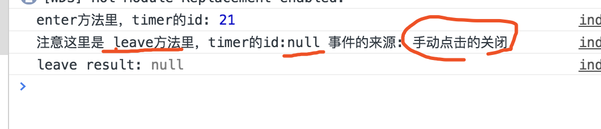
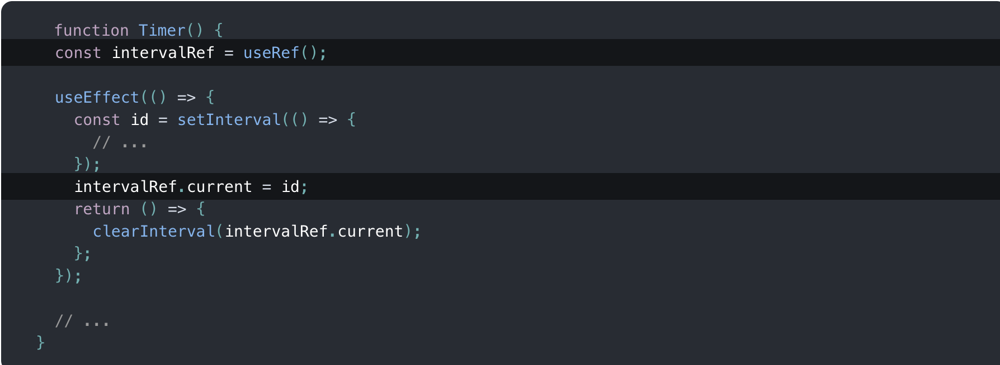
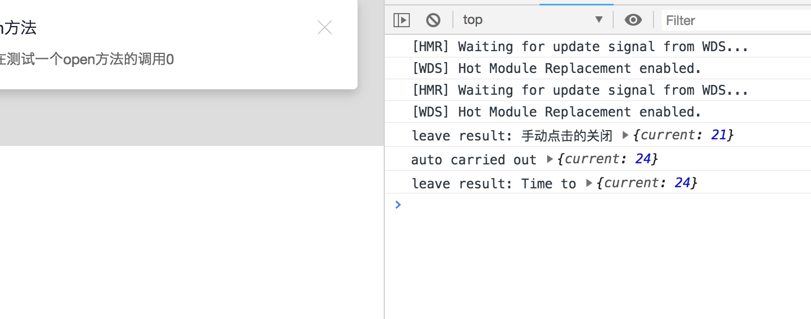

# React16.7初探之定时器引发的问题


## [前言](https://blog.csdn.net/weixin_43254766/article/details/83267838 "首席填坑官∙苏南的专栏,梅斌的专栏，webpack4，webpack：从入门到真实项目配置，react组件封装")


　　周末尝试了一下React新的hooks功能,来封装一个组件，遇到一个bug，所以记录一下过程！

### 报错如下：

> Warning: Can't perform a React state update on an unmounted component. This is a no-op, but it indicates a memory leak in your application. To fix, cancel all subscriptions and asynchronous tasks in a useEffect cleanup function.in Notification

大概意思是组件已经卸载了，但在卸载之后还执行了一个对组件更新的操作，这是一个无效的操作，但它表示应用程序中存在内存泄漏。要修复，请取消useEffect cleanup function.in Notification 中的所有订阅和异步任务

### 组件核心代码如下：

```js

function Notification(props){
  var timer = null;
  const [visible, setVisible] = useState(false);
  let {title,description,duration,theme,onClose,}= props;
  let leave = (source='') => {
    clearTimeout(timer);
    setVisible(false);
    console.log("注意这里是 leave方法里，timer的id:"+timer,"事件的来源:",source);
    console.log("leave result:",timer);
    onClose&&onClose();
  }
  
  let enter = () => {
    setVisible(true);
    if( duration > 0 ){
      let timer = setTimeout(() => {
        console.log(`auto carried out`,timer) //timer Number Id 
        leave(`Time to`);
      }, duration*1000);
      console.log(`enter方法里，timer的id:`,timer) //timer Number Id 
    }
  }

  useEffect(()=>{
    enter();
  },[])

  return (
    <div className={`${prefixCls}-notice`} style={{display:`${visible?'':'none'}`}}>
      {!!theme&&<p className={`${prefixCls}-notice-icon`}><Svg iconId={`svg-${theme}`} /></p>}
      <div className={`${prefixCls}-notice-content`}>
      ……//首席填坑官∙苏南的专栏 交流：912594095、公众号：honeyBadger8
      </div>
      <p className={`${prefixCls}-notice-colse`} title="关闭" onClick={()=>leave("手动点击的关闭")}><Svg/></p>
    </div>
  );
};

```

### 简单分析：

+ 首先`useEffect`方法，是react新增的，它是`componentDidMount`，`componentDidUpdate`、`componentWillUnmount`三个生命周期的合集，
+ 也就是之前的写法，上面三生命周期里会执行到的操作，useEffect都会去做；

##### enter、leave方法
+ 很好理解，`进场`、`出场`两函数，
+ 进场：加了个定时器，在N秒后执行`出场`即leave方法，这个逻辑是正常的，
+ 问题就出在手动执行`leave`，也就是onclick事件上，

##### 问题原因：

+ 其实就是在点击事件的时候，没有获取到 timer的id,导致了定时器没有清除掉；
**！！看图说话：**



##### 解决思路：
+ 当然是看官方文档，hooks对我来说也是个新玩意，不会～
+ 1、`useEffect`方法里return 一个方法，它是可以在组件卸载时执行的，
+ 2、清除定时器它有自己的方式，`const intervalRef = useRef()`;指定赋值后能同步更新，之前的timer手动执行没有拿到timer所以没有清除掉；



##### 参考链接：
[英文的没有找到](https://react.docschina.org/docs/hooks-faq.html#is-there-something-like-instance-variables "react hooks，苏南的专栏")
[英文的也补一下吧](https://reactjs.org/docs/hooks-reference.html#useref "react.docschina，苏南的专栏")
[github也有人提到这个问题，学习了](https://github.com/facebook/react/issues/14227)


### 完美解决：


```js

function Notification(props){
  var timer = null;
  const [visible, setVisible] = useState(false);
  let {title,description,duration,theme,onClose,}= props;
  const intervalRef = useRef(null);
  let leave = (source='') => {
    clearTimeout(intervalRef.current);
    setVisible(false);
    console.log("leave result:",source,intervalRef);
    onClose&&onClose();
  }
  
  let enter = () => {
    setVisible(true);
    if( duration > 0 ){
      let id = setTimeout(() => {
        console.log(`auto carried out`,intervalRef) //timer Number Id 
        leave(`Time to`);
      }, duration*1000);//首席填坑官∙苏南的专栏 交流：912594095、公众号：honeyBadger8
      intervalRef.current = id;
    }
  }

  useEffect(()=>{
    enter();
    return ()=>clearTimeout(intervalRef.current);
  },[])

  return (
    <div className={`${prefixCls}-notice`} style={{display:`${visible?'':'none'}`}}>
      {!!theme&&<p className={`${prefixCls}-notice-icon`}><Svg iconId={`svg-${theme}`} /></p>}
      <div className={`${prefixCls}-notice-content`}>
        ……//首席填坑官∙苏南的专栏 交流：912594095、公众号：honeyBadger8
      </div>
      <p className={`${prefixCls}-notice-colse`} title="关闭" onClick={()=>leave("手动点击的关闭")}><Svg/></p>
    </div>
  );
};

```


> 作者：[苏南 - 首席填坑官](https://github.com/meibin08/ "@IT·平头哥联盟-首席填坑官")
>
> 链接：https://blog.csdn.net/weixin_43254766/article/details/83758660
> 
> 交流：912594095、公众号：`honeyBadger8`
>
> 本文原创，著作权归作者所有。商业转载请联系`@IT·平头哥联盟`获得授权，非商业转载请注明原链接及出处。 


