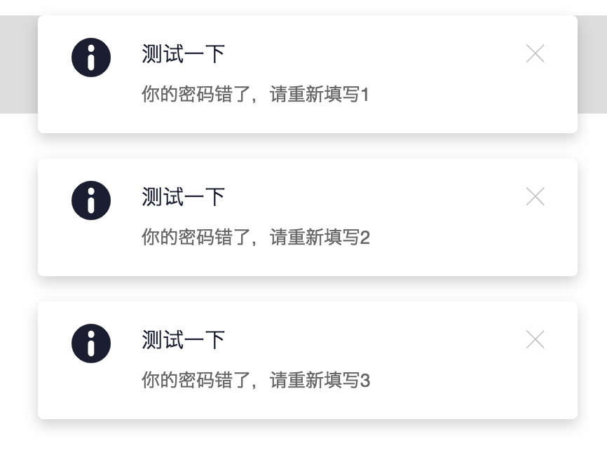
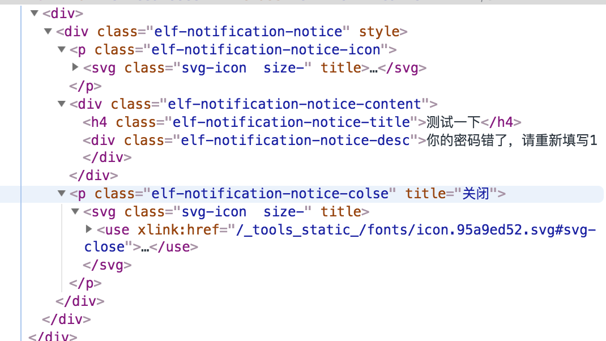
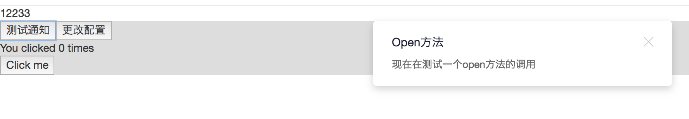
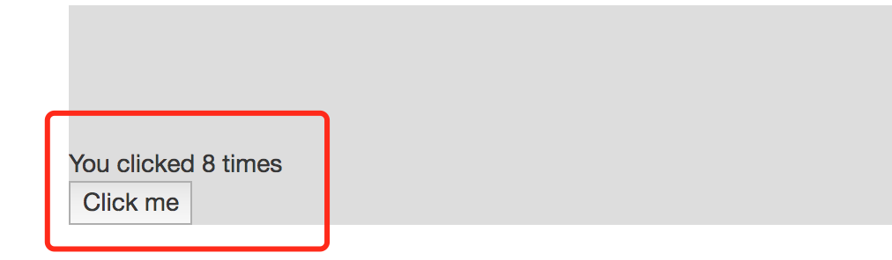

# React组件封装之初试hooks


## [前言](https://blog.csdn.net/weixin_43254766/article/details/83267838 "首席填坑官∙苏南的专栏,梅斌的专栏，webpack4，webpack：从入门到真实项目配置，react组件封装")


　　最近React更新到16.7.0+了，Vue3.0也已发布了，小程序的天天迭代、月月更新，angular……，功能一直在增加，你是否已在感叹：老了、老了，学不动了呢？从曾经的的激情满满，到现在的心有余而力不足，车速过快跟不上，然而并没有卵用，IT是一条没有尽头的路，一旦发车就停不下来，所以努力学习吧。

　　前两篇跟大家分享了一下Webpack的配置，那么配置讲完了，今天就来聊聊React吧，分享一下如何封装一个组件。

### 甚至传说vue4.0已经在开发了，哈哈～

#### 尤大大的回应也是相当搞笑，附上截图补了一刀：“这个谁P的你站出来，我保证不打死你... ”

　　哈哈，开心一笑，让技术不再这么枯燥、乏味～


+ 于多情处最无情，
+ 荣辱轻馀生死轻。
+ 寂寞春归空观冷，
+ 清风独扫乱花平。

> 各位早安，这里是[@IT·平头哥联盟](https://honeybadger8.github.io/blog/ "@IT·平头哥联盟")，我是[首席填坑官∙苏南](https://github.com/meibin08 "首席填坑官∙苏南的专栏")，用心分享 让我们一起成长 做有温度的攻城狮。<br/>
公众号：`honeyBadger8`，群：912594095

## 没吃过猪肉 还没见过猪跑？

　　没吃过猪肉 还没见过猪跑？说到组件，大家肯定都用过不少，甚至很多公司都有自己的组件库，更甚至自己项目中很多功能都需要封装成组件来调用，周末写了一个简单的实例让我们一起了解一下react 16.7.0-alpha.0 中 hooks的不一样。

## 配置：
```
"react": "^16.7.0-alpha.0",
"react-dom": "^16.7.0-alpha.0"
```

## 正常套路
+ 先来看看最终的效果吧，很简单，就是一个`Notification`，提示的组件；
+ 最终效果跟 [ant.design](https://ant.design/components/notification-cn/ "苏南的专栏") 的`notification`组件一致：


## 组件结构：
+ 因为React已经出来很久了，不会讲太多的很基础用法，
+ 从上面的展示图中能看出是左右两列布局，左则为`ICON`、右则为内容展示部分，外加了一个关闭按钮，基本也就满足了这个组件的全部条件，

```js
<div className={`${prefixCls}-notice`} style={{display:`${visible?'':'none'}`}}>
  {!!theme&&<p className={`${prefixCls}-notice-icon`}><Svg iconId={`svg-${theme}`} /></p>}
  <div className={`${prefixCls}-notice-content`}>
    <h4 className={`${prefixCls}-notice-title`}>{title}</h4>
    <div className={`${prefixCls}-notice-desc`}>{description}</div>
  </div>
  <p className={`${prefixCls}-notice-colse`} title="关闭" onClick={()=>{leave(timer)}}><Svg/></p>
</div>

```


## 图标：
+ 细心点的同学可能已经发现了，有个`SVG`的组件，
+ 嗯，图标我就是用的svg，当然图片、字体icon都可以，
+ 当一个完整项目的时候使用字体icon是比较好的，svg也是一个不错的选择，也能跟使用css sprites雪碧图一个使用图标，用起来更顺心
+ 来看一下svg组件的源码（`其实也就是svg symbol的组合`），更多详细细节可以看之前分享的文章[该如何以正确的姿势插入SVG Sprites？](https://www.susouth.com/css/2018/09/21/svg-sprites/)：


```js

function Svg(props={}){
  const { iconId="svg-close",size='',customLink="",title="", className='' } = props;
  const cls = classnames("svg-icon",{
    [`${className}`]:true,
    [`size-${size}`]:true
  });//首席填坑官∙苏南的专栏，QQ:912594095
  const link = (customLink?customLink:(require(`./images/icon.svg`)+`#${iconId}`));
  return (
    <svg className={cls} title={title} >
      <use xlinkHref={link}  />
    </svg>
  )
}

//调用：
<Svg iconId={`svg-${theme}`} />

```
## 组件逻辑部分：
+ 首先我们来分析，`Notification`是一个提示组件，也就是延时一段时间后就在隐藏的，
+ 那么自然少了定时器`setTimeout`，
+ reactjs里，既然有定时，那么`componentWillUnmount`方法里，肯定要做清除操作，不然当组件销毁时，组件的逻辑还在执行，肯定会报错
+ 从下面示例中能看出，每次组件初始时会调用`enter`方法，让组件显示，
+ 同时添加一个定时器，后面自动删除销毁；

```js
constructor(props) {
  super(props);
  this.timer = null;
  this.state = {
    visible: false,
  };
}
componentDidMount(){
  this.enter();
}
componentWillUnmount(){
  clearTimeout(this.timer);
}
enter = () => {
  clearTimeout(this.timer);
  this.setState({visible: true});
  if( duration > 0 ){
    this.timer = setTimeout(() => {
      this.leave();
    }, duration*1000);
  }
}
leave = () => {
  this.setState({
    visible: false,
  },()=>{//首席填坑官∙苏南的专栏，QQ:912594095
    let {onClose}=this.props;
    clearTimeout(this.timer);
    onClose&&onClose();
  });
}

```

## 实例化：
+ 从上面的分析中，已经实现了组件的全部功能，
+ 那么该如何在项目中调用呢？

```
<Notification
  visible={ true }
  title={title}
  description={description}
  duration={duration}
  theme={theme}
/>
```

## 函数试调用：
+ 上面的调用方式也是可以的，但ant.design里都是以函数的方式调用的，如：notification.success(config)
+ 该如何实现呢？
+ 其实也很简单，我们项目中`ReactDOM.render`，也就是组件最后都会指定一个输出根节点，
+ 但那个节点是事先指定好的，项目中的业务我们不能预知需要用到些什么，所以可以使用动态生成插入即原生js里的`appendChild`，
+ 一起来看看具体的实现：

```js
open: (options) => {
  StaticNotice.config();
  let opt = Object.assign({},option,options);
  let {title,description,theme, callback, duration} = opt;
  let div = document.createElement('div');
  const parentNode = document.querySelector(`#${ StaticNotice.isConfig? StaticNotice.noticeId:'body'}`);
  parentNode.appendChild(div);

  ReactDOM.render((
    <Notification
      visible={ true }
      title={title}
      description={description}
      duration={duration}
      theme={theme}//首席填坑官∙苏南的专栏，QQ:912594095
      onClose={ () => {
        callback && callback();
        div&&parentNode.removeChild(div);
        div&&ReactDOM.unmountComponentAtNode(div);
      }}>
    </Notification>), div);
}

```
##### 调用实例：

```js
test=()=>{
  Notification.open({
    title:"Open方法",
    description:"现在在测试一个open方法的调用"
  })
}

```


> 小结：以上就是一个组件的封装，并实现了函数式的调用，但现在 React 16.7+都出了，新推出的`hooks`又该如何实现呢？一起来看看吧

## 官方示例
+ 说实话，hooks相关的资料网上翻烂了，基本都是在贴这个示例，
+ 所以我也不是特别懂，就尝试着实现了一下，

+ 先看看官方示例吧

```js

import { useState } from 'react';
//react 官方示例
function Example() {
  // Declare a new state variable, which we'll call "count"
  const [count, setCount] = useState(0);

  return (
    <div>
      <p>You clicked {count} times</p>
      <button onClick={() => setCount(count + 1)}>
        Click me
      </button>
    </div>
  );
}

```



## Effect Hooks会怎么写？
+ 16.7之前，我们封装组件 可能要处理 componentDidMount，componentDidUpdate、componentWillUnmount等多个生命周期函数；
+ 16.7新增的Hooks，useState 、useEffect没有了class的概念

```js

function Notification(props){
  let timer = null;
  const [visible, setVisible] = useState(false);
  let {title,description,duration,theme,onClose,}= props;
  let leave = () => {

    clearTimeout(timer);
    setVisible(false);
    onClose&&onClose();
  }
  
  let enter = () => {
    // clearTimeout(timer);
    setVisible(true);
    if( duration > 0 ){
      timer = setTimeout(() => {
        console.log(123456,timer)
        leave(timer);
      }, duration*1000);
      timer = timer;
    }
  }
  useEffect(()=>{
    return enter();
  },[])
};

```


## 结尾：
是不是很简单，去掉`class`,直接函数的方式写组件就好了，useState相当于声明一个state，useEffect则是componentDidMount，componentDidUpdate、componentWillUnmount三生命周期组件的集合；

以上就是今天为大家分享的一个小组件的实现，以及尝试使用 hooks的方式修改组件的写法，你get到了没？有兴趣的尝试一下下面的示例吧。
　　
+ [完整示例](https://github.com/honeybadger8/blog-resource "首席填坑官∙苏南的专栏")


> 作者：[苏南 - 首席填坑官](https://github.com/meibin08/ "@IT·平头哥联盟-首席填坑官")
>
> 链接：https://blog.csdn.net/weixin_43254766/article/details/83758660
> 
> 交流：912594095、公众号：`honeyBadger8`
>
> 本文原创，著作权归作者所有。商业转载请联系`@IT·平头哥联盟`获得授权，非商业转载请注明原链接及出处。 


