# D&G滚出中国，程序员的爱国情怀

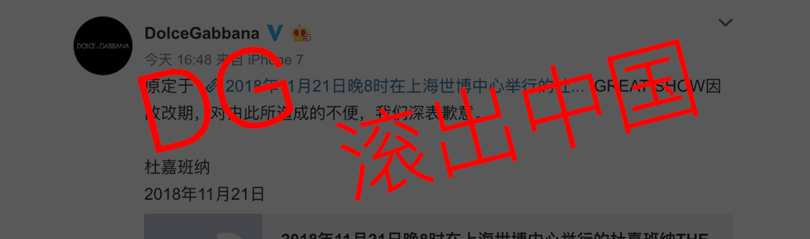
   
　　就在今天下午，有网友爆出知名品牌 Dolce&Gabbana（杜嘉班纳）的设计师兼创始人Stefano Gabbana在ins上公然发表辱华言论。

　　下面截图 可以看出 `country of 💩💩💩 is China`的字样，虽然我英文不太好，但是China还是能看懂的。

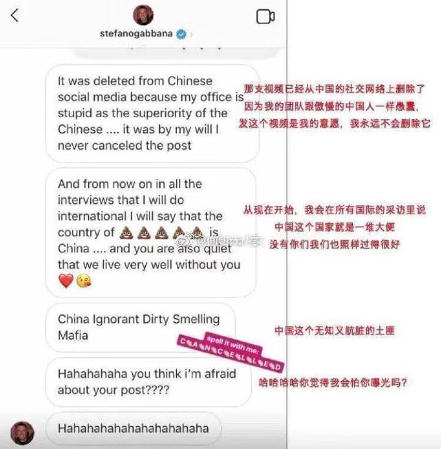

　　是个中国人看了都来气，该新闻一出引起了大众的广泛热议，全国人民的愤怒，他更是出言不逊说“中国才是‘狗屎’的国家”等辱骂,事后此次大秀会的受邀明星：`木子洋`、`章子怡`、`李冰冰`、`陈坤`、`王俊凯`等等均纷纷发表微博：“`我爱我的祖国`”、“`祖国高于一切`”，火箭少女101官博更是明确表明“`任何成员均不会出席今晚Docle&Gabbana上海大秀活动`”。

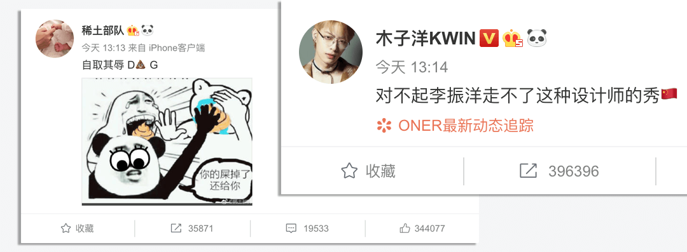
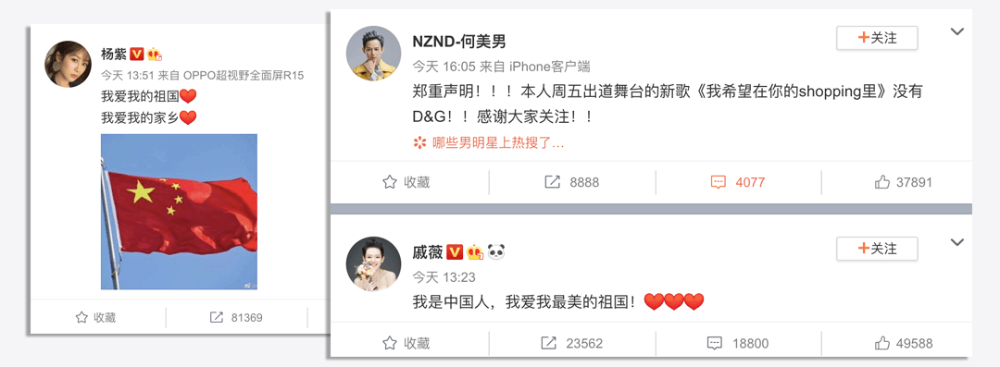
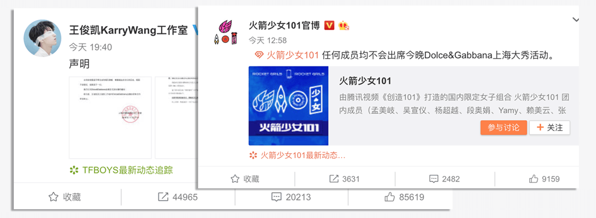

### 程序员也爱国

　　虽说作为一名程序员，娱乐圈的新闻我并不是太关心，也不追星，每天心里想的就是`如何用一行代码`，只用一行哦～ 就能改变世界，但这一次真心为他们点赞。

　　首先我是一名中国人，其次才是一个程序员，就跟你骂我可以，但不能骂我家人是一个道理，骂了怎么办呢？？怎么办？？不服就干啊，打回来～，这也是我`IT平头哥`的一惯作风（`蜜獾`(huan)，`平头哥` 被称为最无所畏惧的动物）。

　　前段时间国内知名艺人@赵丽颖 、@冯绍峰 在微博宣布婚讯，引发媒体和社会各界的关注，#赵丽颖冯绍峰结婚#迅速登上微博热搜榜，微博也因为瞬间流量过大，热搜功能出现了短暂故障. ——`程序员不背锅`，只支持离婚并发

　　鹿晗和关晓彤微博互圈“宣布恋情”了,微博摊了 ——`程序员不背锅`，也不是离婚哦
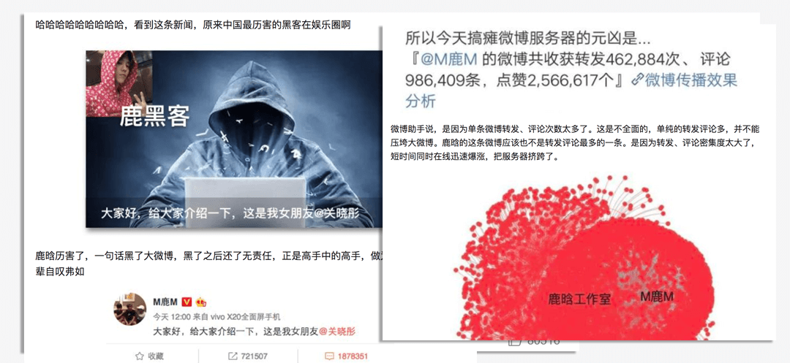

### 但是这一次如果还挂了，相信程序员是愿意背锅的，这种人渣～要让全国人民，大街小巷都知道。

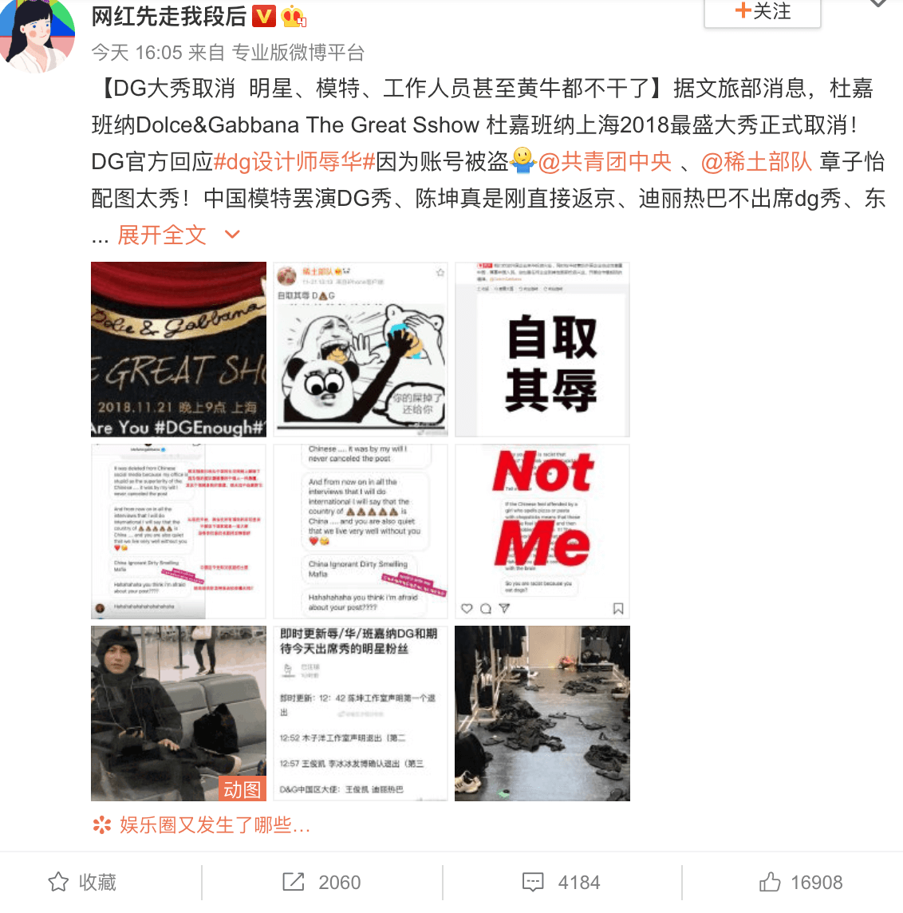

### 甩锅了

　　虽然事后D&G大傻发现事情的严重性，开始甩锅了：“D&G设计师在下午1时许在Ins上对此回应称：我的ins 账号被盗了。我的律师事务所正在处理这件事，我爱中国和中国文化，对于发生的事我感到非常抱歉”。

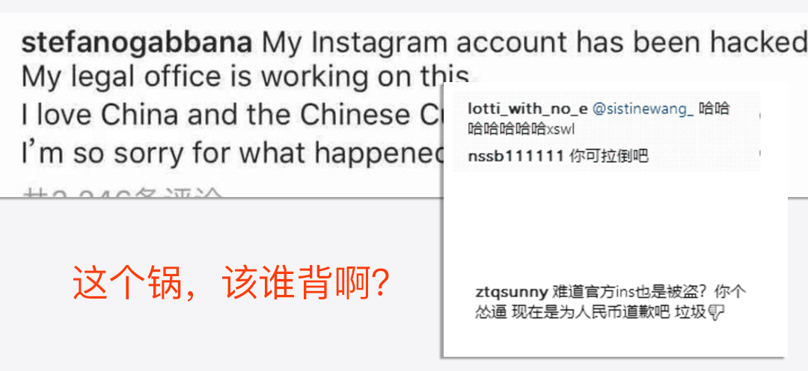

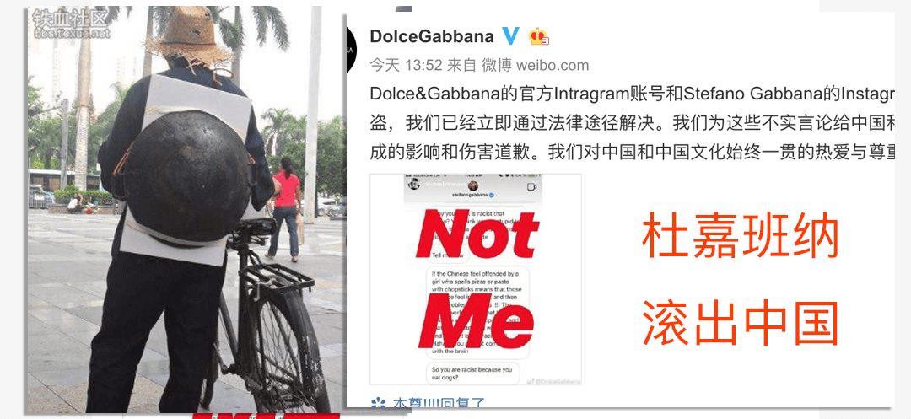

　　随后官方也赶紧出来澄清：“Dolce&Gabbana的官方Intragram账号和Stefano Gabbana的Instagram账号被盗，我们已经立即通过法律途径解决。我们为这些不实言论给中国和中国人民造成的影响和伤害道歉。我们对中国和中国文化始终一贯的热爱与尊重。”

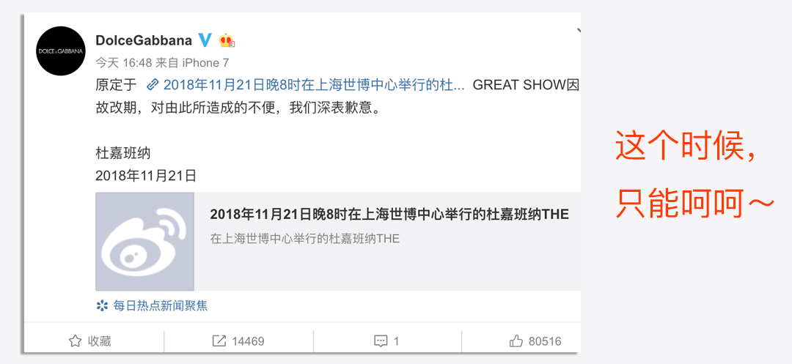

### 结尾

　　最后共青团中央在官方账号回应了“Dolce&Gabbana设计师发表辱华言论”事件：我们欢迎外国企业来华投资兴业，同时在华经营的外国企业也应当尊重中国，尊重中国人民。这也是任何企业到其他国家投资兴业、开展合作最起码的遵循，

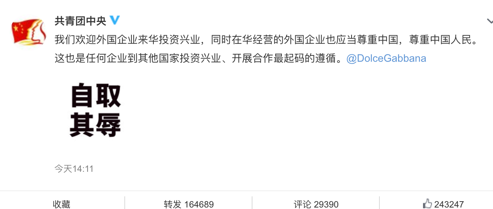

　　你敬我一尺我还你一丈，不管是谁，如果你自己都不尊重自己，又怎么能要求别人来尊重你呢？？

　　好吧，事情讲完了，作为一名小小的程序员，还是努力学习吧，期待着一行代码就能改变世界的梦想早日实现，努力学习吧，关注下面这个`公众号`，与您一起进步，努力成为你想成为的样子。

   