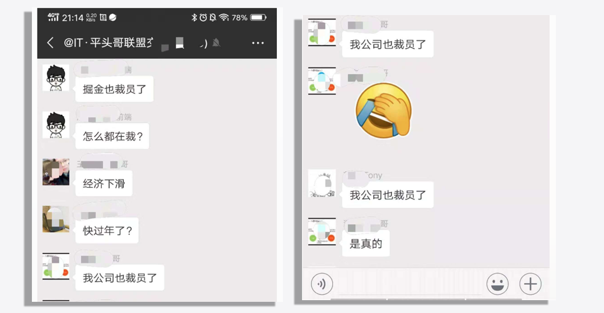

## 面对裁员，我们能做些什么？
听说京东裁员了……

就在刚才，下班回家的路上，看到群信息，说：`京东裁员了～`，

就在上月，也一度被传的沸沸扬扬的：`阿里`、`京东`、`华为`相继被曝停止社招，新闻也是满天飞舞，不管是裁员，还是停止社招，这些事情没有落在亲身经历，没有落在自己身上我们都会觉得`不痛不痒`，毕竟一个旁观者，永远无法感受当事人的喜怒哀乐～。

俗话说：**人无远虑 必有近忧**，假如当你遇上裁员，又该如何面对~

今天看到这个新闻，第一时间想到的是自己，当然啦，大家别慌，**我没有被裁**，不用紧张，相信大家或多或少要么自己、要么身边的朋友、同事，都有过一些欠薪、公司倒闭、团队解散甚至**裁员**，

### 嗯，还有刚刚过去的掘金

### 往事不堪回首

为什么说想到自己呢？我没有被裁过，但**`团队解散过`**，这个事情得从去年说起：

从毕业到现在，工作也有些年头了，这些年多多少少也遇到过一些机会，

+ 2014年中旬，一个阿里PHP大佬，自己创业，做婚庆的电子请柬，记得那个时候特别流行`H5移动微场景制作`，某企秀、兔*，之类的公司应风而起，包括到现在好像也还做的不错，当时是兼职业余时间帮做一些前端工作，一直持维了近一年时间合作的都很不错，后面更是亲自邀请我让去他公司玩一下，来回车票都包销（公司在湖南），再后来提出让全职去他公司(合伙性质)，基础保底年薪是`20W`，但最近因为不在深圳、觉得项目并不是特别看好等原因放弃了～

+ 15年左右，当时是在个游戏公司，有个领导出去创业，当时拉了几个团队的同事，其中也有我，是的，结果你已经猜到了，我最后没有去，主要受当时所在的游戏公司部门的产品经理特别变态、真的特别变态，天天加班到12点，早上晚到一会，开会点名批评(公司是有这个福利的，加班晚第二天能晚到)，说我们部门不能搞特殊，要按时上班，当时一度特别烦躁，想着去了创业公司……。

+ …… 中途也有小米公司，某部门新组件的研发负责人的邀请，

+ 这些都是后话了，就在去年、对去年，今天都还清楚的记得`2018-07-26`，这天去了前面提到的解散的公司报到，当时也是之前某公司的领导找到我，说他将出任某公司`研发总监职位`，新成立的子公司，问我是否有兴趣一起，在考虑过综合因素后最后决定去了，主要是公司也在深圳、薪资是有涨幅的，更重要的是了解了一下母公司的背景资金方面不会出问题，钱都不是问题了，未来`钱`途还是问题吗？

回头想想这些年，因为种种原因，错过了很多机遇，随着年龄的增涨，是时候博一下了，跟几个不错的朋友也讨论过后，也认为觉得一次不错的机会，所以就欣然前往了，

#### 公司是从0开始的，

### 一切都是从0开始的，

包括第一行代码都是从0开始写的，每一天都是从早到晚的在忙，赶着把产品上线，几乎每天都在加班，但团队的每个同事们都毫无怨言，因为这些都是在已知的预料之中。

日复一日，产品迭代了又迭代、APP、PC端、小程序等都陆续上线，慢慢走上正轨，业务也开始接入，团队成员都感觉看到了胜利的曙光。

然而，人在家中坐、锅从天人上来，暴风雨来临的总是显得特别的宁静，在3月初中旬左右(`往事不堪回首～`)，周末还约了同事一起穿越了`南澳东西涌`。

新一周周一，一如往常的去公司上班，刚坐来，准备大显身手，开始元气满满的一天，领导发来消息让去他办公室一趟，后面说了些公司的情况：
+ 大概意思是总部对于子公司业务、管理层的不满，做采取一些措施，但这个不会影响到下面员工等等之类的，他可能也会有所变动等，提前跟我说一下。
+ 然后又过了没有几天，领导叫去了全部leader，说总部出于某些原因，子公司可能不会再投资了～～，是不是很棒棒？？晴天霹雷～、刺激不？？第一反应是先来让几个深呼吸、再呼吸，然后轻轻的扶住墙、嗯，扶住墙～

事情已经这样了，后面也就不用再继续讲了，我没有遇到过裁员，但我经历了**团队解散**，是不是很优秀？？

看到这里，可能有些同学会认为我的经历的些扯了，合伙是假，压榨、利用、……等是真的；但我想说：如果你遇到这样的事情，应该值得高兴，至少还有被压榨、利用的价值。

如果你连利用的价值都没有，那么恭喜你，`裁员`标签，可能就要落在你身上了，

### 前路在何方？

不管是裁员、欠薪、还是团队解散，当这样的问题发生时？我们该怎么做、怎么做、怎么做呢？？
我只能说送上四个字：## **`未雨绸缪`** ##

+ 首先，好好跟公司沟通，维护好自己应有的权益，哪怕仲裁，这点不可妥协～；

+ 其次 ，不要因为这种`小意外`，而否定了自己能力，自信的人最美（**你永远是最棒的**），此处不留爷 自有留爷处。

+ 然后 好好静下心来，好好复习准备下一份工作，只要你活好，走到哪里都不怕，条条大路通罗马，你的星光大道就在前方；
+ 最后，也是最重要的，工作之余，我们也应该多关注一些技术的发展趋势，不断的学习，强化自己的专业技能，才能不会被时代的洪水淹没。

+ 特别是近两年，互联网一直处理一个高速持续的过程发展，前端更是如此：`React`、`Vue`、`Angular`等，甚至还有衍生出的 `React Navite` 、H5的新特性`dialog`、`showModal()`等等，常常会有网友在调侃老了、学不动了，调侃的同时却又阐述着无奈，迫于生活的压力，不得不提速前行。

一入IT深似海，从此妹子是路人，最近不是React、Vue都发布了新版本吗？好好学吧🤪。

#### 以上来自一个年近30的码农心声，给自己一点危机感。

> 作者：[苏南 - 首席填坑官](http://susouth.com/ "@IT·平头哥联盟-首席填坑官")
>
> 链接：http://susouth.com/
> 
> 交流：912594095、公众号：`honeyBadger8`
>
> 本文原创，著作权归作者所有。商业转载请联系`@IT·平头哥联盟`获得授权，非商业转载请注明原链接及出处。 
