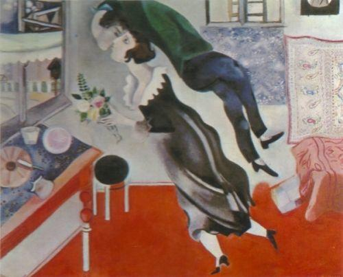

# 沉重就掉下去 开心就飞起来

    “人是不可以飞起来的”    “不是啊，每次我见到你的时候，我都觉得自己开心的飞起来了”

> 作者：[团宠闪光少女∙粉刷酱](https://github.com/cchah/ "团宠闪光少女∙粉刷酱") 
> 来源：[@IT·平头哥联盟](https://honeybadger8.github.io/blog/ "@IT·平头哥联盟") 
> 交流群：[912594095](https://shang.qq.com/wpa/qunwpa?idkey=265166274bca82709718a0ae1fa9c55d65dd3608ebc780f9e6ea41e2761f5ec2 "@IT·平头哥联盟QQ交流群")，本文原创，著作权归作者所有，转载请注明原链接及出处。

    “最近想吃啥？”老沈这样问我的时候，我就知道我又要持着我的情感咨询证去赚去外快了。

    而我每次只需要说三句话：她没眼光、不值得、天涯何处无芳草。

    老沈跟我的革命友谊开始于小时候我们都沉迷于火影忍者，而他家有电脑。那时候我们都梦想做伟大的漫画家，后来，他梦想靠嘴遁维护世界和平，我梦想是靠查克拉永葆青春。

    和老沈在熟悉的烧烤店碰面，老沈今天看起来好像有点不一样。

    “你不是总说想写点东西却没有素材吗，我给你讲了那么多故事，你就写我呗，记得给我的人设写得优秀一点。” 哦～，真是一个让人意外的开头。

    我说我坚持这么久都没有写文章，就是因为我是一个要做严肃文学的人，而不是写什么长篇段子连载。

    老沈说你得曲线救国，先练习写作，多写写，然后发现自己根本不是这块料，你就放弃了，走上正途。

    我说那我们还是聊聊妹纸吧。

    不不不，我今天不想聊这么肤浅的话题。老沈今天真的和平时不一样。我有点后悔了，探讨人生哲学的问题话我想吃海底捞。

    我最近感到很难过，我觉得没有人对我真实，我也对周围人不真实。不开心也要表现得开心。开心也好像没有能让自己欢呼雀跃的开心。你知道我最怀念的是她的什么吗？有一天陪她一起逛街，商场里有那种叫陀螺椅的东西，她坐在上面转啊转啊，特别开心，周围都是一群小孩子，那时候我就很中二的在想，我要好好守护这个幼稚鬼的笑容。

    所以，这不还是在聊妹纸的话题吗。

    你没听出来这是真善美的话题吗。

    好吧。说认真的。我们不敢表现真实的自我，不就是因为害怕别人不喜欢，不就是因为他们总说成年人应该怎么样怎么样吗。在社交平台分享段子，努力抖机灵，为了几个哈哈哈哈，为了被称为有趣的灵魂。其实我就想像个小孩子一样，沉重就掉下去，开心就飞起来。我十分坦诚的跟老沈讲。

    很多人说的那些成功、追求、安稳、幸福，我也没觉得有多好，最后我都不知道究竟是我在逃避，还是真的他们灌输给我的观点就有问题。老沈喝了一口啤酒很认真的说。

    我觉得还是要思考明白自己想要什么。不过我现在就觉得如果能一辈子写代码就挺棒的。不开心的时候坐在工位上一整天，可以不发一语，沉浸在自己的代码中；开心的时候坐在工位上一整天，可以不发一语，沉浸在自己的代码中，幻想自己能改变世界。我想这大概也是我们热爱编程的原因。

    那我也跟你写代码去。

    等的就是老沈的这句话。我神秘的拿出手机，打开微信。成年人应该不动声色地打广告，你看这个公众号和小程序～

    （这里是广告。。。）

    有小姐姐手把手带你入门，更有无缝对接到大佬手上在知识的海洋里遨游哦～
   
   
    以上～

    愿大家出走半生，归来仍是少年。

    peace&love

> 作者：粉刷酱 - [团宠闪光少女](https://github.com/cchah "团宠闪光少女")
>
> 来源：[@IT·平头哥联盟](https://honeybadger8.github.io/blog/ "@IT·平头哥联盟")
> 
> 链接：https://honeybadger8.github.io/blog/
> 
> 交流群：912594095[`资源获取/交流群`]、386485473(前端) 、260282062(测试)
>
> 本文原创，著作权归作者所有。商业转载请联系`@IT·平头哥联盟`获得授权，非商业转载请注明链接及出处。 
   