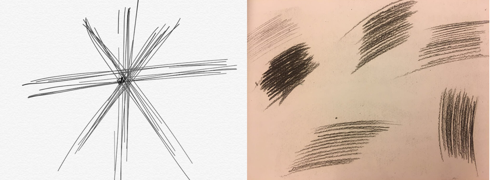
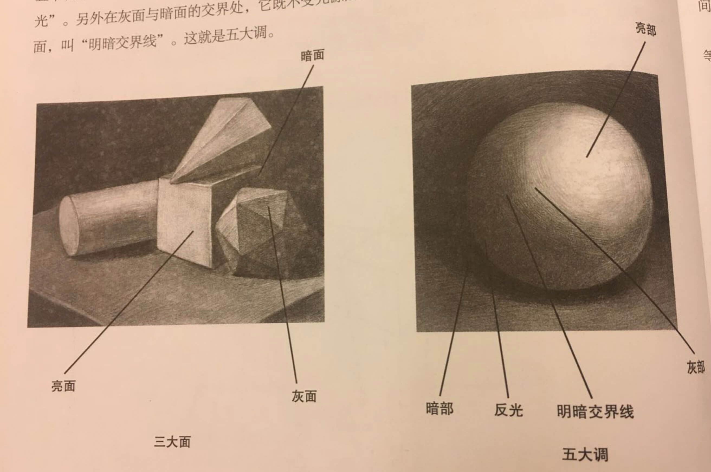

# 素描没那么难也没那么枯燥（一）· 不用手把手都能入门的入门教程

> 作者：[团宠闪光少女∙粉刷酱](https://github.com/cchah/ "团宠闪光少女∙粉刷酱") 
> 来源：[@IT·平头哥联盟](https://honeybadger8.github.io/blog/ "@IT·平头哥联盟") 
> 交流群：[912594095](https://shang.qq.com/wpa/qunwpa?idkey=265166274bca82709718a0ae1fa9c55d65dd3608ebc780f9e6ea41e2761f5ec2 "@IT·平头哥联盟QQ交流群")，本文原创，著作权归作者所有，转载请注明原链接及出处。

## 前言

　　大家好，这里是[@IT·平头哥联盟](https://honeybadger8.github.io/blog/ "@IT·平头哥联盟")，我是`团宠闪光少女`——[粉刷酱](https://github.com/cchah "团宠闪光少女")。最近在票圈发了几张自己画的素描装装逼，就有小哥哥小姐姐表示也想要学要怎么学呢，于是我粉刷·野路子·酱就分享一下～～

## 正式开讲
   所有的故事都起源于看似平凡的一天，小时候的一天，上课无聊又中二的我惊讶的发现我随手一画的佐助是那么的帅，得到了周围很多人的夸奖，我想不能浪费了我的天份，于是我走上了一条画画的不归路～～ 我是真的会画画的，请看到最后～～
   

#### 1.1 准备工作
   野路子知识：

   1、排线：画素描的过程其实就是排线的过程，不熟练的时候画画之前排15分钟就够，排15分钟就够，排15分钟就够

   2、透视：透视的体现就是近大远小，近实远虚，至于本质可以慢慢悟道

   专业知识：

   1、铅笔：2h hb 2b 4b 6b 8b 等，从硬到软，从浅到黑。h: hard, b: black, 我常用2h hb 2b 4b

   2、素描纸、画架、橡皮等等随便买就好，橡皮切三角形 尖尖块，笔要削尖尖。

   3、素描书：我用的《素描基础30日速成》，可以去看看网上推荐，主要是按照书上的图画。

   速成是不可能速成的，一周画一天才能勉强维持的下去的样子，当然如果你天天画的画我觉得一周就能有飞跃的进步。

#### 1.2 素描硬道理

   1、握笔姿势：

   

   请大家自动把圆珠笔脑补为铅笔

   刚开始会不习惯，但是后面熟悉之后这个姿势真的是画的最顺手的，也可以小拇指抵在画板上

   2、排线：

   长直线：定点排线，手腕不动，手臂带动手画线

   短直线：排各个方向，手臂不动，手腕动

   

   速度要快，姿势要帅，开始排的不整齐没关系，不用排太久，来日方长，每一幅画都有大量的线的要排，全是排线，一定会排整齐的～～

   2、三面五调

   三面：物体在受光的照射后，呈现出不同的明暗，受光的一面叫亮面，侧受光的一面叫灰面，背光的一面叫暗面。这就是三面。

   五调：除了亮面的亮调子，灰面的灰调和暗面的暗调之外，暗面由于环境的影响又出现了“反光”。另外在灰面与暗面的交界的地方，它既不受光源的照射，又不受反光的影响，因此挤出了一条最暗的面，叫“明暗交界”。

   

#### 1.3 一个正方体栗子

   1、定大小、倾斜度，画轮廓

   用铅笔测量，然后在纸上做个标记

   然后用长直线画出正方体轮廓：下笔要轻，速度要快，即使内心风起云涌表面也要云淡风轻的那种～～

   2、上调子：分清物体的三面五调，从明暗交界线到、暗面、投影开始排线，方向先按最顺手的来，一层一层的铺，可以三个方向交叉，暗的用软的笔，4b即可，越亮的面用越硬的笔，注意明暗交界线和暗部的过渡，大胆的画就好～ 
   
   提供一个书上的栗子～～

   
   
   最后，

   拿起笔，管住嘴，迈开腿，哎 不好意思 一不小心扯到减肥的话题上了

   减肥是不可能的减肥的 肥宅是多么的快乐～～

   给大家看看我第一次画的和后来的静物啦～～ 分享才使我快乐～～

   
   

   以上～
   
   生活不易，多才多艺。

   有问题欢迎找我交流哦～～知无不言，言无不尽～～

   喜欢我的话就关注我哟～～ 比心～～

   peace&love

> 作者：粉刷酱 - [团宠闪光少女](https://github.com/cchah "团宠闪光少女")
>
> 来源：[@IT·平头哥联盟](https://honeybadger8.github.io/blog/ "@IT·平头哥联盟")
> 
> 链接：https://honeybadger8.github.io/blog/
> 
> 交流群：912594095[`资源获取/交流群`]、386485473(前端) 、260282062(测试)
>
> 本文原创，著作权归作者所有。商业转载请联系`@IT·平头哥联盟`获得授权，非商业转载请注明链接及出处。 
   