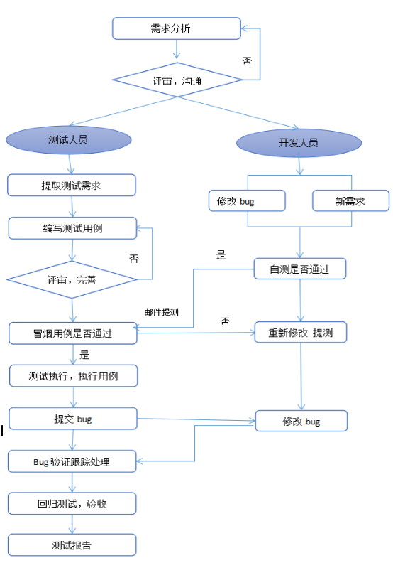

# 如何规范化测试流程，看这篇就够了～

> 作者：[首席背锅官∙松鼠](https://github.com/vicent0326/ "首席背锅官∙松鼠") 
> 交流群：912594095[`资源获取/交流群`]、公众号：`honeyBadger8`，本文原创，著作权归作者所有，转载请注明原链接及出处。

## 引言

- 什么是软件测试？

  1、利用人工或自动化的手段对软件进行测试，找出bug，从而降低商业风险;

  2、**正向思维**：软件测试是一系列的活动来验证程序是否正常运行，以及是否达到了用户预期的需求；

  3、**逆向思维**：软件测试是为了发现程序的错误或者缺陷而进行的一系列活动；

  4、一个软件/应用是由文档需求、数据、程序等部分组成，所以软件测试就不仅仅是对程序进行测试，而是多方位的验证;

  **小结**：测试工程师大概可以归纳为在规定的条件下对程序进行测试操作，了解程序项目需求/正常流程，发现程序的错误、不合格的流程及表现，对项目程序进行评估。

- 测试的好处？

  1、发现程序的错误行为;

  2、定位程序的错误表现(UI展示);

  3、确认程序的逻辑与产品需求的一致性;

  4、确保呈现给用户的是完美无误的程序应用，给用户更好的体验。

- 测试的目的？

  1、寻找项目的缺陷;

  2、跟踪修正项目的缺陷;

  3、验证修正的项目缺陷;

  4、没有完美的代码，也没有完美的应用，那么测试只有通过测试，发现问题才能提升应用程序的完美。

## 环境说明

- **dev**(测试环境):根据开发人员提测的功能块:
  - 按照测试用例优先级，卓条进行测试验证，
  - 发现问题录入禅道系统并知会对应开发人员,
  - 修复完成后再验证;
- **uat**(预发环境)：dev测试通过后发送测试通过邮件并抄送各组leader知会;且发布预发(uat)环境;
- uat发布完成后，进行第二轮流程验证测试，反馈发现的bug，修复验证通过后;<u>确认需求不会变更，代码不再提交的前提下</u>，进行回归测试验证(即对整个业务流程进行上线前的再次确认);
- **prd**(生产环境)：uat确认后，可根据项目要求输出测试报告 ，并发送邮件给各组负责人，项目测试完成可上线。

> **bug状态标准**：提交bug ->  待处理 -> 已确认 -> 已处理 -> 测试验证 -> 已修复(关闭)

​	**需要注意的:**有的小公司只有测试环境和生产环境,

## bug等级划分

- bug一般可分为4个等级，根据问题的实际影响正确填写，严禁不区分问题的实际影响随意填写，**对应级别如下**：

  - **致命**bug：ID值5分，
    - 关键功能/性能不符合产品需求，或阻碍测试工作（如：项目运行死循环、程序导致的数据库数据丢失）;
  - **严重**bug：ID值 3分，
    - 部分模块功能缺失遗漏、项目无法测试、接口稳定性(60%)、数据保存后数据库显示错误/未存入、程序接口调用错误、界面严重错乱等;
  - **一般**bug：ID值2分，
    - 功能没有完全实现但不影响使用、操作/查询等待时间过长、格式错误、边界条件错误等;
  - **提示**bug：ID值0.5分。
    - 界面错乱/重叠、错别字、描述提示语与需求不符;

  - **建议**：
    - 测试人员觉得体验不好,但流程符合需求的,可以提出建议;

## 测试流程(目前公司的流程)

+ 1.**测试基本流程图** 

#### **二.测试开始条件**

1. 项目需求阶段，产品提相应的jira，需要召开响应的需求评审会议，测试开始介入，熟悉项目需求，着手设计系统测试用例；

1. 当所有的模块都开发完毕，研发人员对各个模块进行合成进行自测，自测通过后才可以发布测试版本，接口测试开发需要提供对应的接口文档，测试人员根据需求进行系统测试；

1. 当新增功能或者版本升级，需要对新增功能及升级模块进行测试，对其他关联模块进行回归测试。

#### **三.测试流程**

+ **1.测试启动阶段**

​     产品，项目管理者，测试人员参，研发人员以及和项目有关联的其他人共同参与需求会议，需求评审中需要评估本次需求是否需要性能测试，明确需求及任务完成时间，产品需提供详细的需求文档，产品功能清单，研发人员需向测试人员提供产品项目需求文档、接口文档等，明确测试任务，确定测试周期。需求评审完后由项目经理发出项目计划表，后续项目进展时间节点按照此项目计划表来执行。

​     测试人员根据项目工作量大小及项目进度编写测试计划书，对本次测试的范围、测试进度、测试策略等内容进行把控。

​     研发人员在功能开发完成且自测通过后发布测试版本，提交测试申请单，发送提测邮件给测试人员，测试人员进行冒烟测试，冒烟测试通过，进入测试阶段，否则打回测试。测试人员在测试阶段，要做好版本控制，研发人员在这一版本中修复的bug，需要下一个版本中再次验证。

​    临时新增的紧急需求和改动点，产品需要提供对应的jira,研发需要新增提测单并且填写测试注意点。

+ **2.设计用例阶段**

​    在拿到需求文档，产品功能列表之后，测试人员就开始着手设计测试用例了。测试人员根据产品功能列表后尽量多的设计测试用例，尽可能多的覆盖所有的测试需求。测试用例完成后需进行用例评审，产品和对应的研发人员必须参加，评审会上发现的问题需要及时补充和完善。

 

+ **3.用例执行阶段**

​    开发提测后，进行冒烟测试用例，冒烟通过率低于80%，测试有权力打回测试，冒烟通过后进入正式测试阶段，测试过程中发现的bug需要记录在jira中，测试人员要争取每个bug都能够重现，便于开发修改；测试人员将bug反馈给相关开发人员，开发人员进行修复，测试人员对已修复的bug进行再次验证，直到bug解决为止，把状态置为关闭，并将测试结果记录。

 

+ **4.提交测试总结报告**

​    在约定的测试周期内，在所有的用例都执行完，一般及以上的bug都修复完，遗留bug需要记录在jira中便于后续版本的回归，测试人员需要针对本次测试项目编写测试总结报告，将测试结果反馈，以及容易出现bug的模块给予建议，相关负责人在下次开发中予以借鉴，避免类似错误的出现，测试报告可通过邮件形式，让相关研发人员知晓。

 

#### **四.测试结束**

1. 当所有的用例都被执行完，所有一般及以上的bug都被修复，产品验收通过，测试编写完测试总结报告；

1. 基本功能都已实现，一些遗留bug可以再下一版本中修复；

1. 如遇项目紧张，急于上线，测试基本功能没问题，对于用户后续发现的bug可以进行跟踪，并且后续发现的问题记录在jira中。

!> 如果觉得不错，请记得关注我们`公众号`哦，第一时间获得最新分享～👇

> 作者：松鼠 - 首席背锅官
> 
> 链接：https://honeybadger8.github.io/blog/
> 
> 交流群：912594095[`资源获取/交流群`]、公众号：`honeyBadger8`
>
> 本文原创，著作权归作者所有。商业转载请联系`@IT·平头哥联盟`获得授权，非商业转载请注明原链接及出处。 

